## AdaLoRA作用
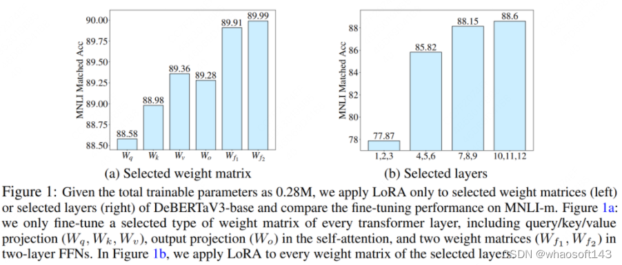
实验（a）对应着左图，作者使用LoRA，在模型的每个layer中微调特定的某个模块，然后去评估模型的效果。可以直观发现，微调不同模块时效果差异显著。

实验（b）对应着右图，作者使用LoRA，对模型不同layer的所有模块做微调。例如1，2，3表示对模型前三层的所有模块做lora微调。可以发现，微调不同layer时模型效果差异显著，微调最后三层的效果最好。

这些实验都证明了一件事：**在使用LoRA微调时，对模型的不同模块使用相同的秩，显然是不合理的。**

AdaLoRA的总体改进目标：
找到一种办法，让模型在微调过程中，去学习每个模块参数对训练结果（以loss衡量）的重要性。然后，根据重要性，动态地调整不同模块的秩。

## AdaLoRA算法

### SVD
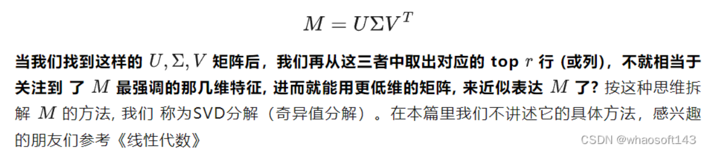

### AdaLoRA变秩过程
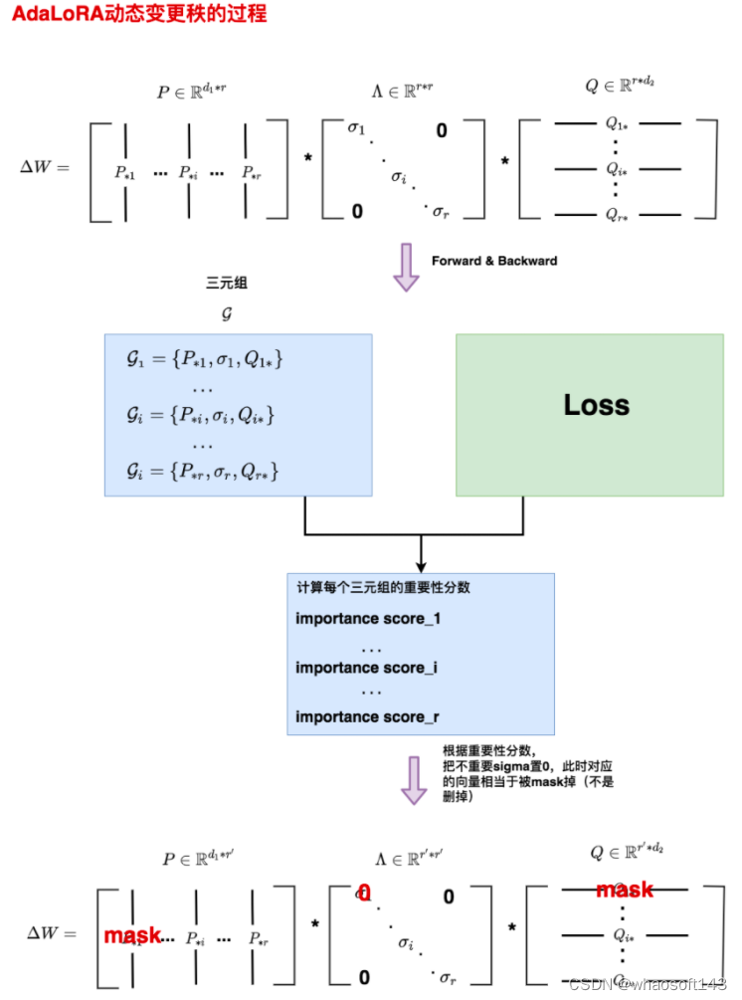

### 损失函数
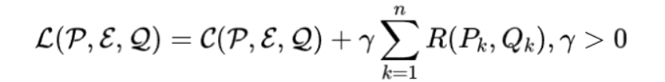
其中：
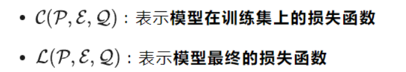
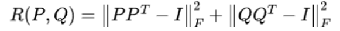

SVD分解中，P、Q必须是正交矩阵，即$P^TP=I$，$Q^TQ=I$。
第二项损失为正则项，对于偏离太远的情况进行惩罚。

### 参数重要性分数
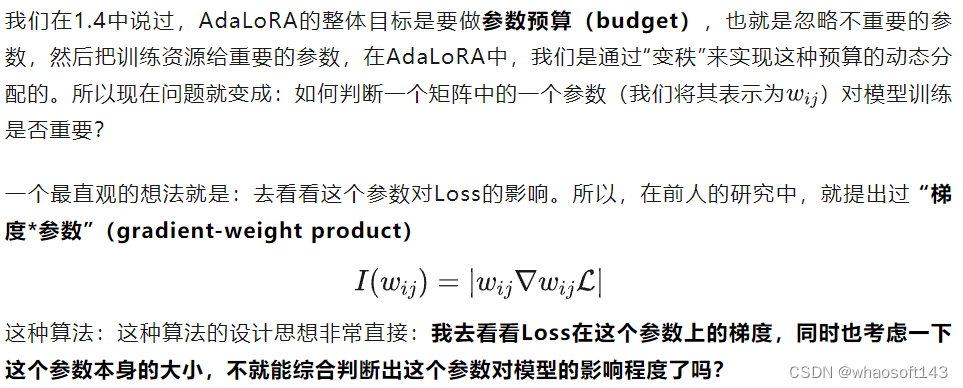

有一个显著的问题：在mini-batch上计算重要性分数的，不同step间重要性分数可能会受到mini-batch客观波动的影响，有啥办法能消除这种影响吗？
使用**momentum方法**。

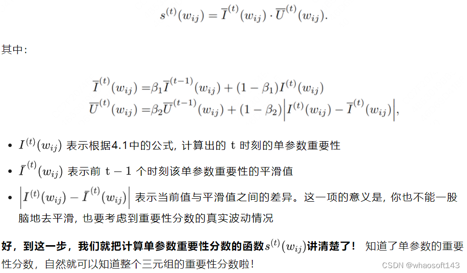

### 三元组重要性分数
在AdaLoRA中，三元组重要性分数计算方式如下：
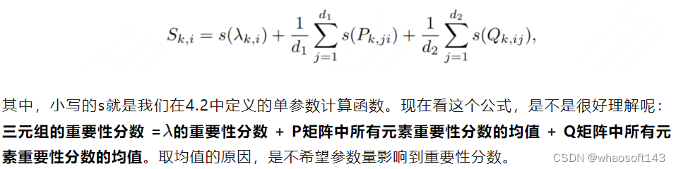

### 动态调整矩阵的秩
#### top-b策略
模型的学习是探索性的过程。

在训练刚开始，我们逐渐增加top_b，也就是逐渐加秩，让模型尽可能多探索。到后期再慢慢把top_b降下来，直到最后以稳定的top_b进行训练，达到AdaLoRA的总目的：把训练资源留给最重要的参数。这个过程就和warm-up非常相似。
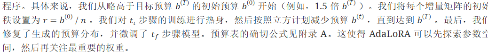

#### 调整方法
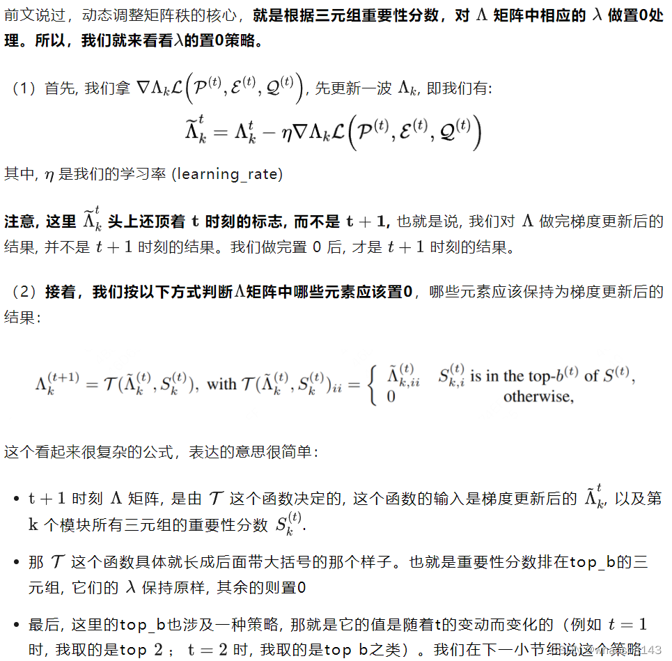

### 算法流程
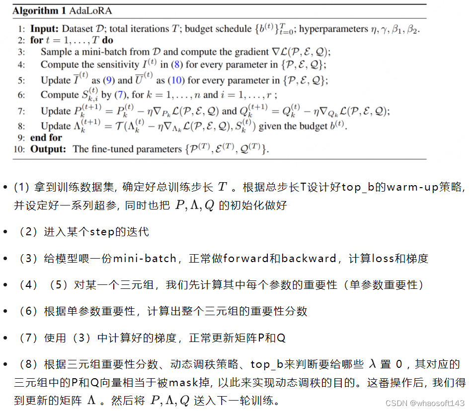

### 实验结果
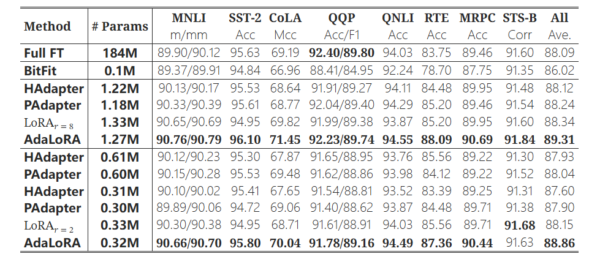

## 学习资源
**paper**: https://arxiv.org/abs/2303.10512
**blog**: https://blog.csdn.net/qq_29788741/article/details/132957760