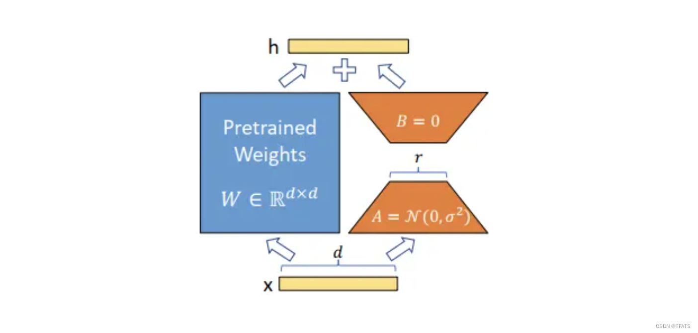
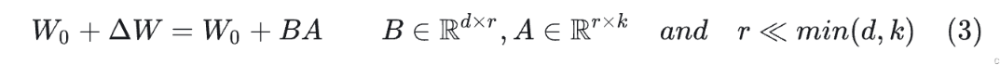
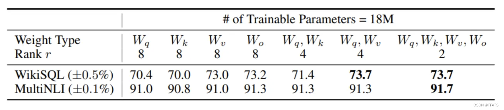
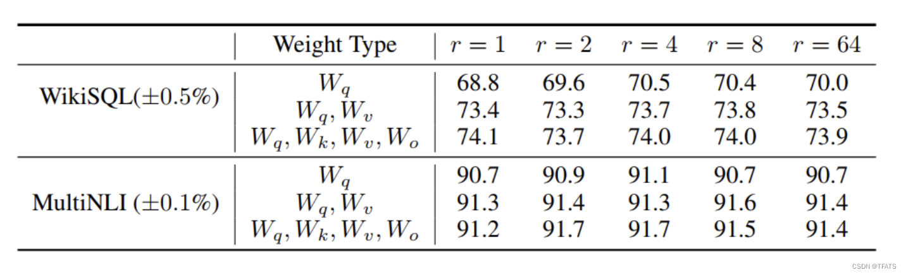
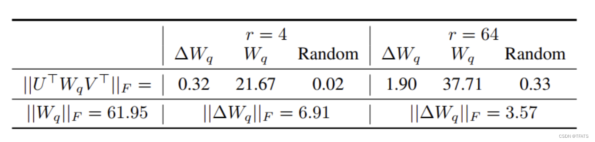

## LoRA 作用
LoRA(Low-Rank Adaptation)
LoRA 是一种低资源微调大模型方法，使用LORA，训练参数仅为整体参数的万分之一、GPU显存使用量减少2/3且不会引入额外的推理耗时。

## LoRA 原理

为何大模型表现出很好的**few-shot**能力？
Aghajanyan的研究表明：**预训练模型拥有极小的内在维度(instrisic dimension)，即存在一个极低维度的参数，微调它和在全参数空间中微调能起到相同的效果**。
同时Aghajanyan发现在预训练后，**越大的模型有越小的内在维度**，这也解释了为何大模型都拥有很好的few-shot能力。

## 模型结构

受instrisic dimension工作的启发，作者认为参数更新过程中也存在一个‘内在秩’。对于预训练权重矩阵 $W_0∈ \mathbf{R^{d*k}}$，我们**可以用一个低秩分解来表示参数更新$\Delta W$**，即：

在训练过程中冻结预训练参数$W_0$，仅训练A和B中的参数。

## LoRA 微调transformer
#### 1、LORA应该作用于Transformer的哪个参数矩阵？

将所有微调参数都放到attention的某一个参数矩阵的效果并不好，将可微调参数平均分配到$W_q$和$W_k$的效果最好。
即使是秩仅取4也能在$\Delta W$中获得足够的信息。
因此在实际操作中，**应当将可微调参数分配到多种类型权重矩阵中，而不应该用更大的秩单独微调某种类型的权重矩阵**。

#### 2、LORA最优的秩r是多少？

从上述实验结论我可以看到，**在秩小到1或者2的时候，LORA的仍有不错的效果**,秩变大，效果没有明显提升。
作者通过实验证明了**更新参数矩阵$\Delta W$存在极小的‘内在秩’**。

#### 3.参数增量矩阵$ΔW$和预训练参数矩阵$W$的关系

从上图的对比结果，作者发现三个现象：

1.相比于随机矩阵，$Δ W$和 $W$ 有强关联。 
2.**$Δ W$仅放大了$W$中任务相关的特征**， 并未放大头部特征。
3.r等于4时，$Δ W$的放大系数已经很大了，达到了21.67倍。

## 学习资源
**论文解读(较简略)**: https://blog.csdn.net/TFATS/article/details/135528141
**论文解读(较详细)**: https://blog.csdn.net/sinat_37574187/article/details/131995554
**论文**：https://ar5iv.labs.arxiv.org/html/2106.09685?_immersive_translate_auto_translate=1
**huggingface**:https://huggingface.co/docs/peft/v0.11.0/en/package_reference/lora#peft.LoraConfig