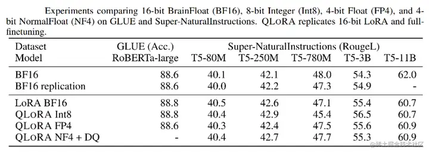

## QLoRA作用
QLoRA（Quantized Low-Rank Adapter）。

QLoRA使用一种新颖的高精度技术将预训练模型量化为 4 bit，然后添加一小组可学习的低秩适配器权重，这些权重通过量化权重的反向传播梯度进行微调。
QLORA 有一种低精度存储数据类型（4 bit），还有一种计算数据类型（BFloat16）。实际上，这意味着**无论何时使用 QLoRA 权重张量，我们都会将张量反量化为 BFloat16，然后执行 16 位矩阵乘法。**
QLoRA提出了两种技术实现高保真 4 bit微调——4 bit NormalFloat(NF4) 量化和双量化。此外，**还引入了分页优化器，以防止梯度检查点期间的内存峰值，从而导致内存不足的错误**，这些错误在过去使得大型模型难以在单台机器上进行微调。

## QLoRA原理
- 4bit NormalFloat（NF4）：对于正态分布权重而言，一种信息理论上最优的新数据类型，该数据类型对正态分布数据产生比 4 bit整数和 4bit 浮点数更好的实证结果。
- 双量化：对第一次量化后的那些常量再进行一次量化，减少存储空间。
- 分页优化器：使用NVIDIA统一内存特性，该特性可以在GPU偶尔OOM的情况下，**进行CPU和GPU之间自动分页到分页的传输，以实现无错误的 GPU 处理**。该功能的工作方式类似于 CPU 内存和磁盘之间的常规内存分页。使用此功能为优化器状态（Optimizer）分配分页内存，然后在 **GPU 内存不足时将其自动卸载到 CPU 内存，并在优化器更新步骤需要时将其加载回 GPU 内存**。

## 结果
实验证明，无论是使用16bit、8bit还是4bit的适配器方法，都能够复制16bit全参数微调的基准性能。这说明，**尽管量化过程中会存在性能损失，但通过适配器微调，完全可以恢复这些性能**。

