## LLM核心组件
### 归一化方法
- LayerNorm
  - 层归一化会计算每一层中所有激活值的均值 𝝁 和方差 𝝈，从而**重新调整激活值的中心和缩放比例**。
  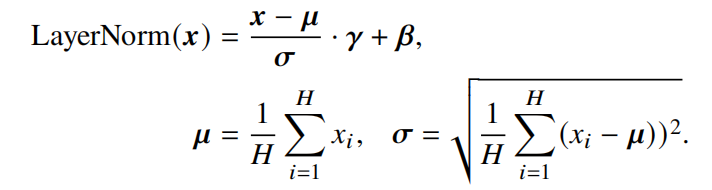

- **RMSNorm**
  - 仅利用激活值总和的均方根 RMS(𝒙) 对激活值进行重新缩放。
  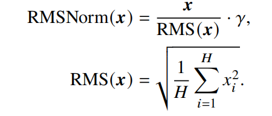
  - 对于layerNorm和RMSNorm，layerNorm包含缩放和平移两部分，RMSNorm去除了平移部分，只保留了缩放部分。**这样做的依据是，有研究认为layerNorm取得成功的关键是缩放部分的缩放不变性，而不是平移部分的平移不变性。**
  - RMSNorm相比一般的layerNorm，减少了计算均值和平移系数的部分，训练速度更快，效果基本相当，甚至有所提升。

- **DeepNorm**
  - 这种方法**基于Post-Norm**进行了优化，通过调整残差连接的权重，使得模型在训练过程中更加稳定，同时保持或提升模型的性能。
  - 在进行LayerNorm之前添加一个可学习的权重参数（如α），用于**放大残差连接**；同时，在初始化过程中调整部分参数的初始化范围（如使用β参数）
  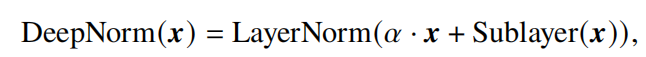

#### 归一化位置
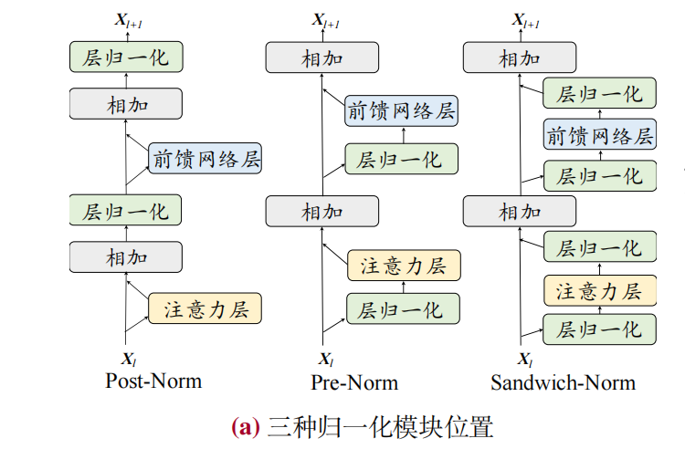
##### 1.**Post-Norm**
- 在原理上，后向归一化具有很多优势。首先，**有助于加快神经网络的训练收敛速度，使模型可以更有效地传播梯度**，从而减少训练时间。
- 其次，后向归一化可以**降低神经网络对于超参数（如学习率、初始化参数等）的敏感性**，使得网络更容易调优，并减少了超参数调整的难度。
- 然而，由于**在输出层附近存在梯度较大**的问题，采用 Post-Norm 的 Transformer 模型在训练过程中通常会出现不稳定的现象，因此，现有的大语言模型中，Post-Norm很少被单独使用，通常是与其他策略相结合应用。例如，**GLM-130B 将 Post-Norm与 DeepNorm 结合使用**。
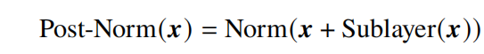

##### 2.**Pre-Norm**
- 相较于 Post-Norm，Pre-Norm 直接把每个子层加在了归一化模块之后，仅仅对输入的表示进行了归一化，从而**可以防止模型的梯度爆炸或者梯度消失现象**。
  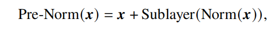
- 虽然使用了 Pre-Norm 的 Transformer 模型在训练过程中更加稳定，但是**性能却逊色于采用了 Post-Norm 的模型**。尽管对于性能有一定的影响，但由于其能够有效维持训练的稳定性，**很多主流的大语言模型仍然采用 Pre-Norm**。
- **当模型扩展到 100B 或遇到多模态数据时，Pre-LN 仍然无法解决训练崩溃**。这在 GLM-130B 的初步实验中也得到了证实，Pre-LN 在其早期训练中一直处于崩溃状态。
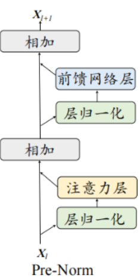
- 在层数相同情况下，Pre-Norm性能逊色于Post-Norm的原因
  - 在PreNorm结构中，**归一化层（如LayerNorm）被放置在残差分支之后，但在恒等路径和残差分支相加之前**。这意味着**恒等路径上的数据没有经过归一化处理**，而**残差分支上的数据则经过了归一化**。由于归一化操作通常会将数据缩放到一个较小的范围内（例如，通过减去均值并除以标准差），这可能会**减小残差分支上数据的幅度**。
  - 在PreNorm结构中，当恒等路径和残差分支相加时，**恒等路径上未经归一化的数据可能会占据主导地位**，因为其幅度可能相对较大。这导致恒等路径的权重相对较大，残差分支的作用可能相对减弱。
  - PreNorm结构在多层叠加时，**由于恒等路径的突出，可能导致多层在效果上更接近于增加模型的宽度而非深度**。这意味着虽然模型在结构上看起来有很多层，但实际上这些层并没有充分利用其深度来提取特征，而是更多地表现为一个更宽的模型。

##### 3.Sandwich-Norm
- 在 Pre-Norm 的基础上，Sandwich-Norm在残差连接之前增加了额外的 LayerNorm，旨在避免 Transformer 层的输出出现数值爆炸的情况。
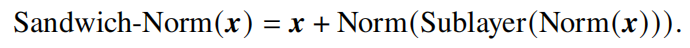
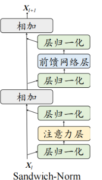
- 作为补救措施，CogView在 Pre-LN 的基础上开发了 Sandwich-LN，在每个残差分支的末端添加额外的归一化。配合 PB-Relax技术，它们稳定了40亿文本到图像生成模型的训练。尽管 Sandwich-LN 优于Pre-LN，但令人遗憾的是，**它在 GLM-130B 训练中也被证明是崩溃的**；更不用说其 Pre-LN 性质可能导致的较弱的微调性能了。
- [GLM测试报告](https://arxiv.org/abs/2210.02414)

### 激活函数
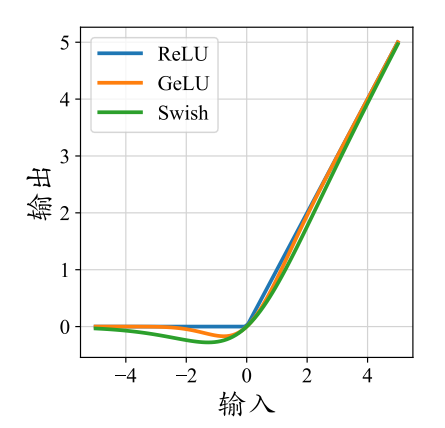
- ReLU
  - ReLU 可能会产生神经元失效的问题，**被置为0的神经元将学习不到有用的信息**
- Swish
  - Swish 激活函数将神经元和该神经元的 sigmoid 激活的乘积作为新的激活函数。
  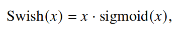
- GELU（Gaussian Error Linear Unit）
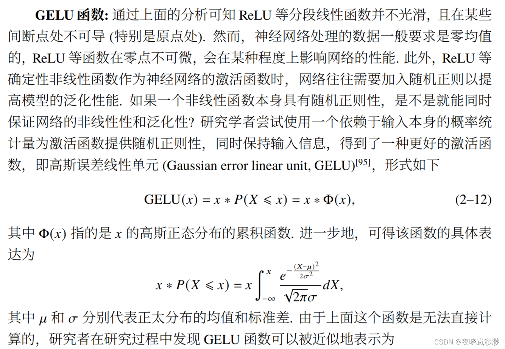
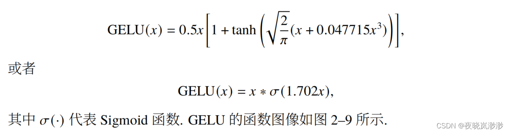
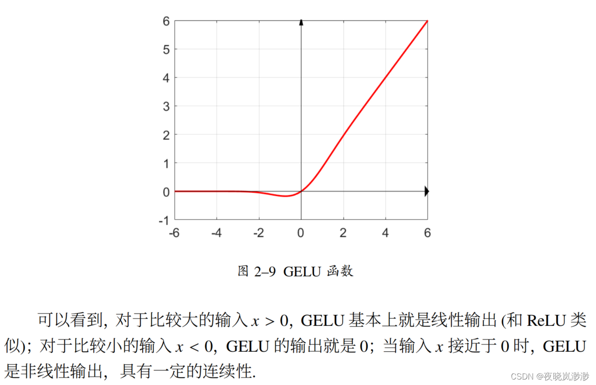

- **GLU（Gated Linear Unit）**
  - **GLU 激活函数引入了两个不同的线性层。其中一个线性层的输出将被输入到一个激活函数（例如，GeGLU 采用 GELU 激活函数）中，其结果将和另一个线性层的输出进行逐元素相乘作为最终的输出**。相比于其他的激活函数，使用 GLU激活函数变体通常能够带来更佳的性能表现。SwiGLU 和 GeGLU 激活函数的计算公式如下所示：
  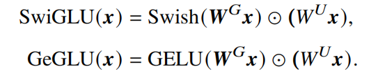
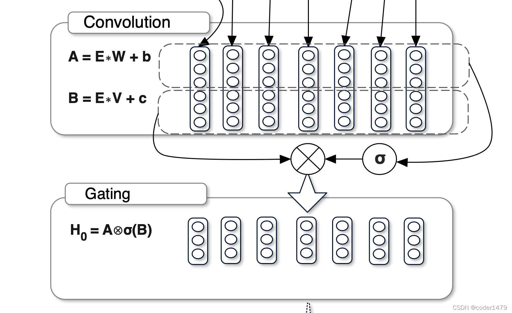

### 位置编码
由于 Transformer 模型中自注意力模块具有**置换不变性**，因此**仅使用注意力机制无法捕捉序列中的顺序关系，从而退化为“词袋模型”。**
为了解决这个问题，Transformer 模型在输入序列中引入了**位置编码（Positional Encoding）**，使得模型能够捕捉到序列中的顺序信息。

#### 绝对位置编码
在编码器和解码器的输入端，根据输入的词元**在序列中的绝对位置生成唯一的位置嵌入，并与词元的嵌入表示进行相加来注入位置信息。**绝对位置编码的公式如下所示：
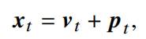
其中，$𝒑_𝑡$ 表示位置 $𝑡$ 的位置嵌入，$𝒗_𝑡$ 是该位置词元对应的词向量。
直观理解：**初始所有词向量在同一空间，通过位置编码，将词向量移动到不同空间，从而捕捉词序信息**。
绝对位置编码设置方法：
- 1.**正余弦位置编码**
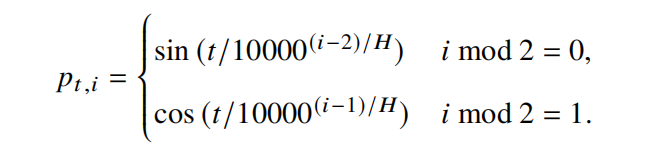
- 2.**可学习的位置编码**(bert)

#### 相对位置编码
与绝对位置编码不同，**相对位置编码是根据键和查询之间的偏移量计算得来的**。计算得到的相对位置编码通常应用于注意力矩阵的计算中，而不是直接与词元本身的位置编码进行相加。
**直观理解：** 与绝对位置编码一样，相对位置编码也是将词向量移动到不同空间，但不同的是，相对位置编码**考虑了词元之间的相对位置关系**。

##### Transformer-XL的相对位置编码
原始的Transformer中，注意力机制的计算可以进行分解：
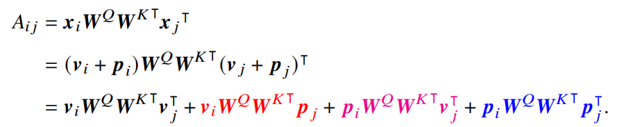
Transformer-XL 对上述注意力值进行了改写，使用相对位置信息代替绝对位置信息。
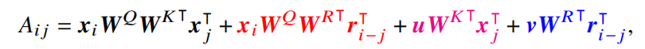
其中，$𝒙_𝑖$ 是每个词元对应的词向量（对应没有显式加入位置编码的词向量 $𝒗_𝑖$），而$𝒓_{𝑖− 𝑗}$ 表示相对位置编码，𝒖和𝒗是两个可学习的表示全局信息的参数。
相比于绝对位置编码，注意力值的第二项中和第四项**key对应的绝对位置编码 $𝑾^{𝐾⊺}𝒑_𝑗$ 被替换为相对位置编码 $W^{R⊺}𝒓_𝑗$**，以引入相对位置信息；而第三和第四项中则**使用全局参数 𝒖 和𝒗 替换query对应的绝对位置编码 $𝒑_𝑖𝑾^𝑄$**，用于衡量键的语义信息和相对位置信息本身的重要程度。

##### T5的相对位置编码
T5提出了一种较为简化的相对位置编码。具体来说，它**在注意力分数中引入了可学习的标量**，这些标量是基于查询和键的位置之间的距离计算的。
**它的作者认为输入和位置间不应过多的交互，因此将Transformer-XL式子中的第二、三项删除**，将第四项都替换为一个可学习的偏执$b_{m,n}$.

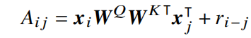
其中 $𝑟_{𝑖− 𝑗}$ 表示**基于查询和键之间偏移的可学习标量**.
直观理解：对于相对距离较近的给出一个较大的标量，对于相对距离较远的给出一个较小的标量，从而使得模型能够更好地捕捉相对位置信息。
**计算方法：** 在计算当前token和目标token的attention值时，记录两个token的距离的绝对值，我们**不直接使用这个距离值，而是根据距离值的大小进行一定程度的缩小，距离值越大缩小倍数越大**，距离值越小缩小倍数越小。具体实现时，**采用一种bucket"分桶"的方法，即对于临近距离应分到不同的桶中，分别进行精细编码；对于稍远距离应分到同一个桶中，共用一个编码**；对于更远距离则共用范围更大一些；对于超出限定距离则clip截断。

##### DeBerta式位置编码
 和T5的构造相反，**它舍弃了Transformer-XL式子中第四项(位置与位置的交互)**，保留了第二、三项并将位置信息替换为了相对位置向量$\tilde{\mathbb{R}}_{n-m} $
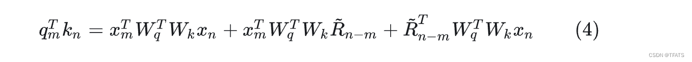

##### 旋转位置编码（Rotary Position Embedding, RoPE）
Attention的核心运算是内积，所以我们希望经过内积的结果能够带有相对信息。**那么我们希望$q_m$和$k_n$的内积仅与输入$x_m$，$x_n$和他们的相对位置$m-n$有关**，那么我们可以假设存在函数g,使得：
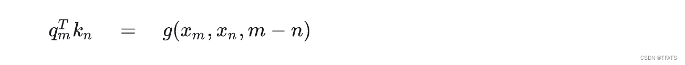

二维形式下，有：
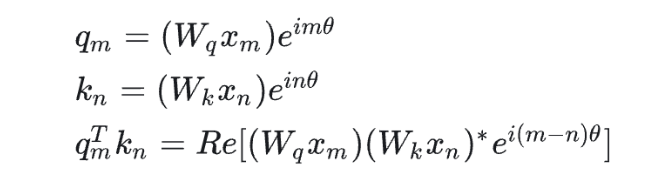
以$q_m$为例，假设$e^{im\theta}$表示为模长为1的复数，根据复数乘法的几何意义， $(W_qx_m)e^{im\theta}$变换实际上对应着向量 $W_qx_m$的旋转，所以我们称之为“旋转式位置编码”，它还可以写成矩阵形式：
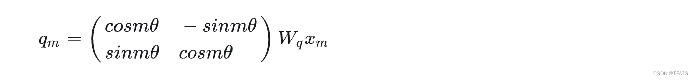
多维情况:
以$q_m$为例,旋转式位置编码的一般形式为：$q_m=R^d_{\Theta,m}W_qx_m$.
其中：
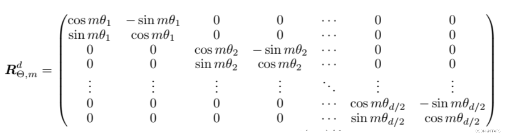
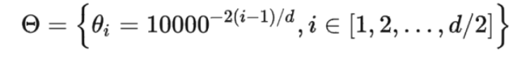
由于稀疏性，所以直接用矩阵乘法来实现会很浪费算力，推荐通过下述方式来实现 RoPE：

**code:**
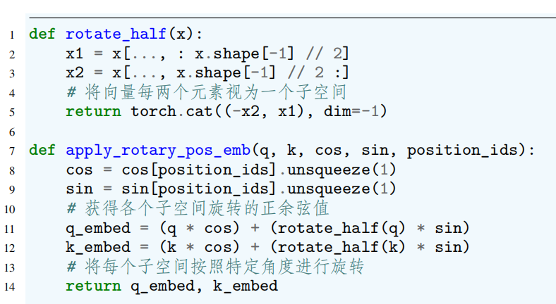
优点：
- 矩阵$R^d_{\Theta,m}$为正交矩阵，它**不会改变向量的模长**，因此通常来说它**不会改变原模型的稳定性**。
- RoPE具有远程衰减的优点，相对距离更大的token之间的联系更少。
- 可用于线性Attention

##### ALiBi位置编码
ALiBi是一种特殊的相对位置编码，主要用于增强Transformer模型的**外推能力**。具体来说，ALiBi**通过在键和查询之间的距离上施加相对距离相关的惩罚来调整注意力分数**。
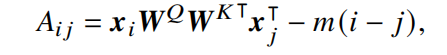
其中，$𝑖 − 𝑗$ 是查询和键之间的位置偏移量，$𝑚 $是**每个注意力头独有的惩罚系数**。与T5 等模型中的相对位置编码不同，ALiBi 中的惩罚分数是预先设定的，**不需要引入任何可训练的参数**。此外，ALiBi 展现出了**优秀的外推性能**，能够对于超过上下文窗口更远距离的词元进行有效建模。

**每个头的惩罚系数设定**：
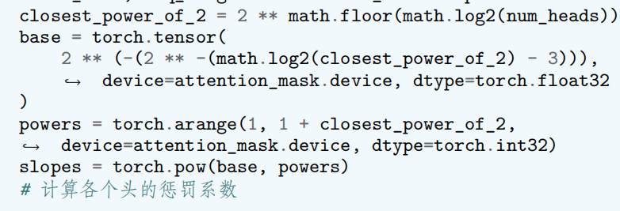

### 注意力机制
#### 滑动窗口注意力机制（Sliding Window Attention, SWA）
滑动窗口注意力机制是大语言模型中使用最多的一种**稀疏注意力机制**。不同于完整的注意力机制，滑动窗口注意力根据词元位置，**仅仅将位置索引上距离该词元一定范围内的词元考虑到注意力的计算中**。
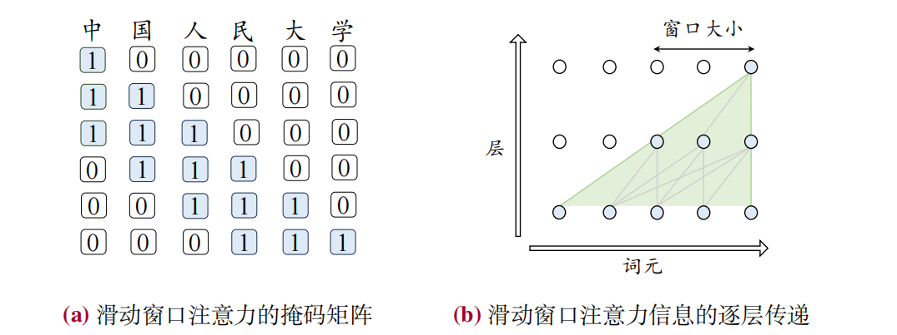

#### 多查询注意力（Multi-Query Attention, MQA）
MQA提出针对**不同的头共享相同的键和值变换矩阵**。这种方法减少了访存量，提高了计算强度，从而实现了更快的解码速度,并且对于模型性能产生的影响也比较小。

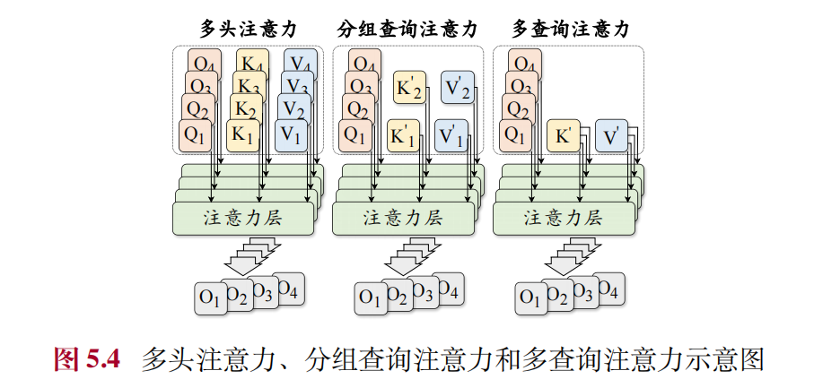

#### 分组查询注意力机制（Grouped-Query Attention, GQA）
GQA 将全部的头划分为若干组，并且针对**同一组内的头共享相同的KV变换矩阵**。这种注意力机制有效地平衡了效率和性能，被 LLaMA-2 模型所使用。

#### 硬件优化的注意力机制
除了在算法层面上提升注意力机制的计算效率，还可以**进一步利用硬件设施来优化注意力模块的速度和内存消耗**。其中，两个具有代表性的工作是 **FlashAttention** 与 **PagedAttention** .
- FlashAttention 通过**矩阵分块计算**以及**减少内存读写次数**的方式，提高注意力分数的计算效率；
- PagedAttention 则针对**增量解码阶段**，对于 **KV 缓存进行分块存储**，并优化了计算方式，增大了并行计算度，从而提高了计算效率。

### 混合专家模型（Mixture-of-Experts, MoE）
大语言模型能够通过扩展参数规模实现性能的提升。然而，随着模型参数规模的扩大，计算成本也随之增加。为了解决这一问题，研究人员
在大语言模型中引入了**基于稀疏激活的混合专家架构**，旨在**不显著提升计算成本的同时实现对于模型参数的拓展**。
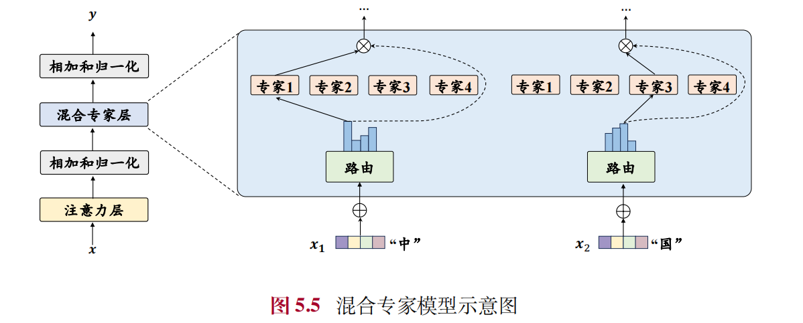

在混合专家架构中，每个混合专家层包含 $𝐾$ 个专家组件，记为 $[𝐸_1, 𝐸_2, . . . , 𝐸_𝐾 ]$，其中每个专家组件 $𝐸_𝑖$ 都是一个前馈神经网络。对于输入的每个词元表示 $𝒙_𝑡$，模型通过一个路由网络（或称为门控函数）𝐺 来计算该词元对应于各个专家的权重。
在路由函数中，首先**通过线性层 $𝑾_𝐺 ∈ R^{𝐻×𝐾}$ 映射为 𝐾 个专家的得分，并基于此选择出概率最高的 $𝑘$ 个专家进行激活。**
随后，这 𝑘 个专家的得分将被送入 softmax函数计算出它们的权重 $𝐺(𝒙_𝑡) = [𝐺(𝒙_𝑡)_1, . . . , 𝐺(𝒙_𝑡)_𝑘]$,**没有被选择的专家权重将被置为 0**。
上述路由网络的计算过程如下式所示：
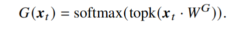
之后，每个被选择的词元的输出的加权和将作为该混合专家网络层的最终输出 $o_t$.
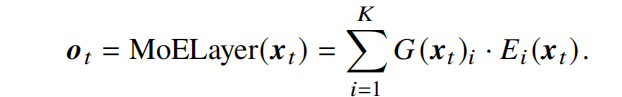

