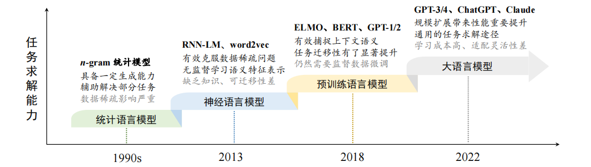

## LLM 基本概念

#### 一、语言模型的发展历程

- 统计语言模型（Statistical Language Model, SLM）
  - 统计语言模型使用马尔可夫假设（Markov Assumption）来建立语言序列的预测模型，通常是**根据词序列中若干个连续的上下文单词来预测下一个词的出现概率**，即根据一个固定长度的前缀来预测目标单词。
  
- **神经语言模型**（Neural Language Model, **NLM**）
  - 神经语言模型使用神经网络来建模文本序列的生成，如循环神经网络（Recurrent Neural Networks, RNN）
- **预训练语言模型**（Pre-trained Language Model, **PLM**）
  - **ELMo**是一个早期的代表性预训练语言模型，提出使用大量的无标注数据训练双向 LSTM（Bidirectional LSTM, biLSTM）网络，**预训练完成后所得到的 biLSTM 可以用来学习上下文感知的单词表示**，这与 word2vec 学习固定的词表示有着显著不同。 
  - 基于 Transformer 架构，谷歌进一步提出了预训练语言模型**BERT**，采用了仅有编码器的 Transformer 架构，并通过在大规模无标注数据上使用专门设计的预训练任务来学习双向语言模型。
  - 在同期，OpenAI也迅速采纳了 Transformer 架构，将其用于 **GPT-1** 的训练。与 BERT 模型不同的是，GPT-1 采用了仅有解码器的 Transformer 架构，以及**基于下一个词元预测的预训练任**务进行模型的训练。
- **大语言模型**（Large Language Model, LLM）.
  - GPT-3 可以通过“上下文学习”（In-Context Learning, ICL）的方式来**利用少样本数据解决下游任务**，而 GPT-2 则不具备这一能力。这种大模型具有但小模型不具有的能力通常被称为“**涌现能力**”（Emergent Abilities）。为了区别这一能力上的差异，学术界将这些大型预训练语言模型命名为“大语言模型”。

#### 二、大语言模型的能力特点
- 具有较为丰富的**世界知识**
- 具有较强的**通用**任务解决能力
- 具有较好的复杂任务推理能力
- 具有较强的人类指令遵循能力. 大语言模型建立了自然语言形式的统一任务解决模式：**任务输入与执行结果均通过自然语言进行表达。**通过预训练与微调两个阶段的学习，大语言模型具备了较好的人类指令遵循能力，**能够直接通过自然语言描述下达任务指令**（又称为“**提示学习**”）

#### 三、大语言模型关键技术概览
##### 1.数据工程
目前来说，数据工程主要包括三个方面。
- 首先，需要对于数据进行全面的采集，拓宽高质量的数据来源；
- 其次，需要对于收集到的数据进行**精细的清洗**，尽量提升用于大模型训练的数据质量；第
- 三，需要进行有效的**数据配比与数据课程**，加强模型对于数据语义信息的利用效率。
这三个方面的数据工程技术**直接决定了最后大语言模型的性能水平**。

##### 2.高效预训练

##### 3.能力激发
大语言模型经过超大规模数据的预训练后，能够编码大量的文本语义知识信息。然而，这个阶段的模型能力仍然是通过通用的下一个词预测任务建立的，主要目的是为了进行预训练文本数据的恢复。**为了提升模型的任务求解能力，需要设计合适的指令微调以及提示策略进行激发或诱导。**
- 在**指令微调**方面，**可以使用自然语言表达的任务描述以及期望的任务输出对于大语言模型进行指令微调**，从而增强大语言模型的通用任务求解能力，提升模型在未见任务上的泛化能力。通常来说，现有的研究认为**指令微调无法向大模型注入新的知识，而是训练大模型学会利用自身所掌握的知识与信息进行任务的求解**。
- 在**提示学习**方面，需要**设计合适的提示策略去诱导大语言模型生成正确的问题答案**。为此，研究人员提出了多种高级提示策略，包括**上下文学习、思维链提示**等，通过构建特殊的提示模板或者表述形式来提升大语言模型对于复杂任务的求解能力。提示工程已经成为利用大语言模型能力的一个重要技术途径。

##### 4.人类对齐
在实践应用中，需要保证大语言模型能够较好地符合人类的价值观。目前，比较具有代表性的对齐标准是“3 H 对齐标准”，即 Helpfulness（有用性）、Honesty（诚实性）和Harmlessness（无害性）。与传统的任务优化目标不同，**这三个对齐标准一定程度上都与人类主观感知相关，很难直接建立形式化的特定优化目标**。
目前主流算法：**RLHF，DPO**

##### 5.工具使用
**由于大语言模型的能力主要是通过大规模文本数据的语义学习所建立的，因此在非自然语言形式的任务（如数值计算）中能力较为受限。**
此外，语言模型的能力也受限于预训练数据所提供的信息，无法有效推断出超过数据时间范围以及覆盖内容的语义信息。为了解决上述问题，工具学习成为一种扩展大语言模型能力的关键技术，**通过让大语言模型学会使用各种工具的调用方式，进而利用合适的工具去实现特定的功能需求。**

#### 四、大语言模型的构建过程
##### 1.大规模预训练

##### 2.指令微调与人类对齐
经过大规模数据预训练后的语言模型已经具备较强的模型能力，能够编码丰富的世界知识，但是由于预训练任务形式所限，**这些模型更擅长于文本补全，并不适合直接解决具体的任务**。尽管可以通过上下文学习（In-Context Learning, ICL）等提示学习技术进行适配，但是模型自身对于任务的感知与解决能力仍然较为局限。**当预训练结束后，通常需要对于大语言模型进行微调与对齐，使之更好地被用于任务求解**。

目前来说，比较广泛使用的微调技术是“指令微调”（也叫做**有监督微调，Supervised Fine-tuning, SFT**），通过使用任务输入与输出的配对数据进行模型训练，可以**使得语言模型较好地掌握通过问答形式进行任务求解的能力**。
一般来说，指令微调很难教会大语言模型预训练阶段没有学习到的知识与能力，它主要起到了对于模型能力的**激发作用**，而不是知识注入作用。与预训练相比，指令微调通常来说需要的指令实例数据规模要小的多。