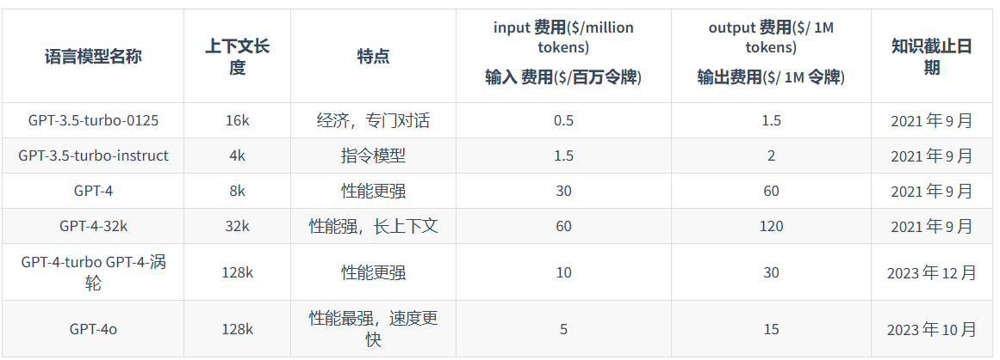

## 常见大语言模型

### 闭源
#### GPT系列

link:https://chatgpt.com/

#### claude系列

link:https://claude.ai/chats

#### PaLM/Gemini 系列
PaLM link:https://ai.google/discover/palm2/
Gemini link:https://gemini.google.com/

#### 文心一言
link:https://yiyan.baidu.com/

#### 星火
link:https://xinghuo.xfyun.cn/

### 开源
#### Llama
link:https://llama.meta.com/
github:https://github.com/meta-llama/llama

- **训练数据**： **仅使用公开可用的数据集来训练的模型**，而不需要依赖专有或不可访问的数据集。这些数据集包括 Common Crawl、Wikipedia、OpenWebText2、RealNews、Books 等。LLaMA 模型使用了**大规模的数据过滤和清洗技术**，以提高数据质量和多样性，减少噪声和偏见。

##### LLaMA 主要改进
- Pre-normalization 正则化：为了提高训练稳定性，LLaMA 对每个 Transformer 子层的输入进行了 **RMSNorm 归一化**，这种归一化方法可以避免梯度爆炸和消失的问题，提高模型的收敛速度和性能；
- **SwiGLU** 激活函数
- **旋转位置编码（RoPE，Rotary Position Embedding）**：模型的输入不再使用位置编码，而是在网络的每一层添加了位置编码，RoPE 位置编码可以有效地捕捉输入序列中的相对位置信息，并且具有更好的泛化能力。

##### LLaMA3主要改进
- 更多的**训练数据量**：LLaMA3 在 **15 万亿个 token**的数据上进行预训练，相比 LLaMA2 的训练数据量增加了 7 倍，且代码数据增加了 4 倍。LLaMA3 能够接触到更多的文本信息，从而提高了其理解和生成文本的能力。

- 更长的**上下文长度**：LLaMA3 的上下文长度增加了一倍**，从 LLaMA2 的 4096 个 token 增加到了 8192**。这使得 LLaMA3 能够处理更长的文本序列，改善了对长文本的理解和生成能力。

- **分组查询注意力（GQA，Grouped-Query Attention）**：通过将查询（query）分组并在组内共享键（key）和值（value），减少了计算量，同时保持了模型性能，提高了大型模型的推理效率（LLaMA2 只有 70B 采用）。

- 更大的**词表**：LLaMA3 升级为了 **128K 的 tokenizer**，是前两代 32K 的 4 倍，这使得其语义编码能力得到了极大的增强，从而显著提升了模型的性能。

####  通义千问
link:https://tongyi.aliyun.com/
github:https://github.com/QwenLM/Qwen2

##### Qwen
- 3T tokens
- BPE tokenizer（基于tiktoken）；使用常用chinese token增强;数字细粒度切分
- 基础模型：主要基于llama，改进的地方：embedding和output project不在共享权重；使用FP32的Rope；移去所有的bias，但是**QKV添加了bias**；
- 使用Pre-Norm & RMSNorm；SwiGLU激活函数
- 上下文扩展：  
  - **动态NTK感知插值**，即对序列长度的增加动态缩放位置信息
  - LogN-Scaling，根据上下文长度与训练长度的比率，对Q和V的点积进行重新缩放，确保注意力值的熵随着上下文长度的增长而保持稳定。
  - Window attention，将注意力限制在一个上下文窗口内，防止模型关注到太远的内容。并在不同层采用不同的窗口大小，较低的层使用较短的窗口，而较高的层使用较长的窗口

##### Qwen2主要改进
- **GQA**：Grouped-query attention，它是一种插值方法，介于多查询和多头注意力之间，可以在保持接近多头注意力的质量的同时，达到与多查询注意力相当的速度。

- **Mixture of SWA and Full Attention**: SWA指的是Sliding Window Attention，是一种注意力模式，用于处理长序列输入的问题。而full attention则是传统的注意力机制，考虑序列中所有元素的交互。这里的mixture可能指的是这两种注意力机制的结合使用。

- **Improved Tokenizer Adaptive to Multiple Natural Languages and Code**: 这说明模型使用了一种改进的分词器，它不仅适用于多种自然语言，还能处理代码。在自然语言处理和编程语言处理中，分词器用于将文本分解成更小的单位（如词、字符或其他符号），这是理解和处理文本的基础步骤。

#### GLM系列
link:https://chatglm.cn/
github:https://github.com/THUDM/GLM-4

##### GLM特点
主要有三个特点
- 自编码，随机 MASK 输入中连续spans的 token
- 自回归，基于自回归空白填充的方法重新构建spans中的内容
- 2维的位置编码技术，来表示span间和span内位置信息

**GLM 从输入文本中随机挖掉一些连续的词语（自编码思路），然后训练模型按照一定的顺序逐个恢复这些词语**（自回归思路）。这种方法结合了自编码和自回归两种预训练方式的优点。
此外，GLM打乱了空白区域的预测顺序，并使用二维位置编码（第一个维度对span在原文本中的位置进行编码，第二个维度对token在span中的位置进行编码）。实验表明，GLM 在参数量和计算成本相同的情况下，能够在 SuperGLUE 基准测试中显著超越BERT，并且在使用相似规模的语料（158GB）预训练时，能够超越 RoBERTa 和 BART。GLM 还能够在自然语言理解和生成任务上显著超越 T5，而且使用的参数和数据更少。

##### GLM2

##### GLM3
与GLM2完全一致

#### Baichuan 系列
link:https://ying.baichuan-ai.com/chat
github:https://github.com/baichuan-inc

##### Baichuan1

##### Baichuan2
- 分词器：为了构建一个大小合适且压缩率高的分词器，文章**将词表大小从百川1的64000扩充到125695。分词方法为BPE**。特别地，为了更好地处理数字，百川2将数字分隔为单个的digit；为了更高地处理代码，百川2在分词器中增加了空格tokens（单个空格、多个空格分别为一个token？）
- 位置编码：百川2选择采用**AliBi编码**，该方法相比于RoPE编码方法表现更好。
- 激活函数：百川2使用SwiGLU作为激活函数。SwiGLU是当下一些LLMs（PALM，LLaMA等）倾向选择的一种激活函数。由于SwiGLU相当于两个线性变换（其中一个加了Swi函数）的乘积，前馈层SwiFFN包含了三个参数矩阵.为了保持相同的计算量，我们将隐藏层的尺寸从4倍隐藏层大小缩减到8/3倍隐藏层大小（缩减到原来的2/3，这样三个参数的计算量为2/3*3=2，基本和原来2个矩阵的计算量持平），再近似到128的倍数。
- Optimization：文章采用AdamW为优化器
- **NormHead**：文章做了数值实验发现通过使用**NormHead**，即正则output层（heads），训练动态过程可以更加稳定.
- **Max-z loss**：文章发现训练过程中，LLMs的logits可能变得非常大，而softmax很容易被这些非常大的logits所影响。为此，一些研究选择采用惩罚项来对太大的logits进行惩罚，比如repetition penalty，但这样可能会扭曲最后生成的概率。文章类似PALM，增加一项max-z loss来对logits进行正则.

#### Mistral 系列
##### Mistral 7B

- 滑动窗口注意力
- 滚动缓冲区
- GQA
##### Mixtral 8x7B

它与Mistral 7B具有相同的架构，但引入了**稀疏混合专家**的概念，其中每层由8个前馈块组成.

#### Grok
link:https://x.ai/blog/grok-os
github: https://github.com/xai-org/grok-1

#### Gemma
- 模型参数：

训练数据：2T和6T个token
- **分词器**：SentencePiece
- **Multi-Query Attention**

- RoPE
- GeGLU激活函数
- RMSNorm

#### Phi
##### phi-1
本文使用了**FlashAttention**实现的多头注意力（MHA）的解码器Transformer模型，还采用了**MHA和MLP层并行配置的结构**。**1.3B**参数的phi-1模型的架构包括24层，隐藏维度为2048，MLP内部维度为8192，以及32个维度为64的注意力头。而较小的350M参数的phi1-small模型包括20层，隐藏维度为1024，MLP内部维度为4096，以及16个维度为64的注意力头。使用旋转位置嵌入，旋转维度为32。使用与 codegen-350M-mono相同的分词器。

对于预训练和微调，将各自的数据集连接成一个单一的一维数组，使用“⟨∣endoftext∣⟩”标记用于分隔文件。从数据集数组中切片出长度为2048的序列，并使用下一个标记预测损失进行训练。

**训练数据**：
D1. **过滤后的代码语言数据集**，这是The Stack和StackOverflow的子集，通过使用基于语言模型的分类器获得（包含约6B词元）。
D2. 一个合成的教科书数据集，由GPT-3.5生成的Python教科书的不到1B词元组成。
D3. 一个小型的合成练习数据集，由大约180M个Python练习和解决方案的词元组成。

主要改进点：提出**利用LLM生成“教科书质量”的数据作为增强学习过程的一种方式**。
##### phi-1.5
- 模型架构：模型架构与phi-1完全一致。
- 数据集：用于phi-1.5的训练数据是phi-1的训练数据（7B词元）和新创建的合成的“教科书式”数据（大约20B词元）的组合，旨在教授常识推理和世界的一般知识（科学、日常活动、心理等）。作者精心选择了20,000个主题来启动这些新合成数据的生成。在这些生成提示中，使用网络数据集的样本以增加多样性。作者指出，**phi-1.5的训练数据中唯一的非合成部分是phi-1训练中使用的过滤代码数据的6B词元**（参见phi-1）。

- 结果：

##### phi-2

- 训练数据：
  - 来源1：使用GPT-3.5创建的NLP合成数据。
  - 来源2：经过GPT-4评估的Falcon RefinedWeb和SlimPajama的筛选网络数据。
- 结果

##### phi-3
phi-3-mini，一个3.8亿个参数的语言模型，训练了3.3万亿个token，其总体性能，通过学术基准和内部测试进行衡量，可以与Mixtral 8x7B和GPT-3.5等模型相媲美(在MMLU上达到69%，在MT-bench上达到8.38)，它是足够小，可以部署在手机上。
phi-3-mini模型是一个transformer-decoder架构，默认上下文长度为4K。作者还通过**LongRope**引入了一个长上下文版本，它将上下文长度扩展到128K，称为phi-3-mini-128K。

phi-3-mini建立在与Llama-2相似的块结构上，并使用相同的标记器，词汇量为320641。这意味着**为Llama-2系列型号开发的所有软件包都可以直接适用于phi-3-mini**。该模型使用了3072个隐藏维度，32个头部和32个图层。我们使用bfloat16对总共3.3T token进行了训练。

**phi-3-small模型(7B参数)**利用词汇表大小为100352的tik token标记器(用于更好的多语言标记)，默认上下文长度为8K。它遵循7B模型类的标准解码器架构，有32层，隐藏尺寸为4096。为了最小化KV缓存占用，该模型还利用**分组查询关注**，4个查询共享一个键。此外，phi-3-small使用替代的密集关注层和一种新的块稀疏关注来进一步优化KV缓存节省，同时保持长上下文检索性能。该模型还使用了另外10%的多语种数据 。
由于体积小，phi3-mini可以量化为4bits，只占用约1.8GB的内存。作者通过在带有A16仿生芯片的iPhone 14上部署phi-3-mini来测试量化模型，该芯片在设备上本机运行，完全离线，每秒超过12个token。

- 结果

