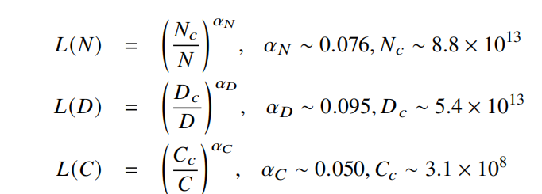
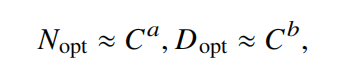

## KM 扩展法则
Kaplan 等人首次建立了**神经语言模型性能**与三个主要因素——**模型规模（𝑁）、数据规模（𝐷）和计算算力（𝐶**之间的幂律关系.

𝐿(·) 表示交叉熵损失(以e为底取对数)。

##  Chinchilla 扩展法则
Chinchilla 扩展法则这项研究的意义并不在于给出了资源在数据规模与模型规模上的具体分配方案，而是首次形式化指出了之前的预训练工作可能忽视了**训练数据的规模扩展**。越来越多的工作表明，现有的预训练语言模型对于**数据的需求量**远高于这些扩展法则中所给出的估计规模。这种现象的一个重要原因是由于**Transformer 架构具有较好的数据扩展性**，到目前为止，还没有实验能够有效验证特定参数规模语言模型的饱和数据规模。

## 对比
研究人员 发现 KM 扩展法则和 Chinchilla 扩展法则都可以近似表示成上述算力为核心的公式：

**即当算力 𝐶 给定的情况下，最优的模型参数规模和数据规模由指数系数 𝑎 和 𝑏 分别确定**。可以看到，𝑎 和 𝑏 决定了参数规模和数据规模的资源分配优先级：当 𝑎 > 𝑏时，应该用更多的算力去提高参数规模；当 𝑏 > 𝑎 时，应该用更多的算力去提高数据规模。
尽管 KM 扩展法则和 Chinchilla 扩展法则具有相似的公式形式，但是在模型规模和数据规模的扩展上存在一定的差异。随着算力预算的增加，**KM 扩展法则（𝑎 ≈ 0.73, 𝑏 ≈ 0.27  ）倾向于将更大的预算分配给模型规模的增加，而不是分配给数据规模的增加；而 Chinchilla 扩展法则主张两种规模参数应该以等比例关系增加（𝑎 ≈ 0.46, 𝑏 ≈ 0.54 ）。**

## 涌现能力
涌现能力具体是指**当模型扩展到一定规模时，模型的特定任务性能突然出现显著跃升的趋势**，远超过随机水平。
#### 代表性的涌现能力
1.**上下文学习**（In-context Learning, ICL）. 
上下文学习能力在 GPT-3 的论文中被正式提出。具体方式为，**在提示中为语言模型提供自然语言指令和多个任务示例**（Demonstration），无需显式的训练或梯度更新，仅输入文本的单词序列就能为测试样本生成预期的输出。

2.指令遵循（Instruction Following）

3.逐步推理（Step-by-step Reasoning）
大语言模型则可以利用思维链（Chain-of-Thought, CoT）提示策略  来加强推理性能。具体来说，大语言模型**可以在提示中引入任务相关的中间推理步骤来加强复杂任务的求解**，从而获得更为可靠的答案。

