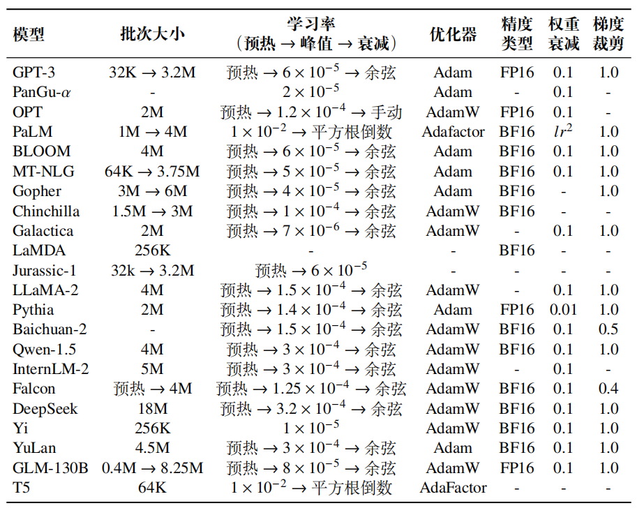
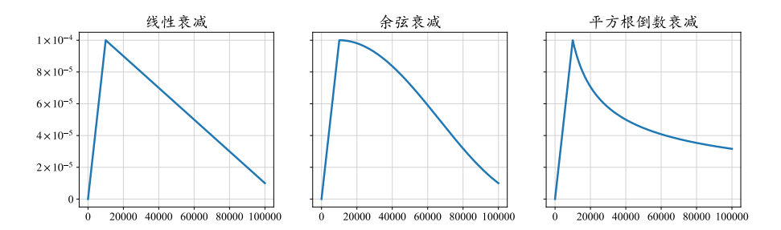

## 预训练任务介绍
在进行模型的大规模预训练时，往往需要设计合适的自监督预训练任务，使得模型能够从海量无标注数据中学习到广泛的语义知识与世界知识。目前，常用的预训练任务主要分为三类，**包括语言建模（Language Modeling, LM）、去噪自编码（Denoising Autoencoding, DAE）以及混合去噪器（Mixture-of-Denoisers, MoD）**。

### 1. 语言建模（Language Modeling, LM）
语言建模任务是目前绝大部分大语言模型广泛采用的预训练任务。该任务的核心在于“**预测下一个词元**”，并且经常被应用于训练基于解码器的大语言模型。
从本质上看，**基于语言建模的预训练还可以看作是一种多任务学习过
程**例如：
- 在预测句子前缀“这部电影剧情饱满，演员表演得也很棒，非常好看”中的“好看”时，模型实际上在进行情感分析任务的语义学习；
- 而在预测句子前缀“小明有三块糖，给了小红两块糖，还剩下一块糖”中的“一块糖”时，则是在进行数学算术任务的语义学习。

可以列举出来更多类似的例子，覆盖更广的任务范围。因此，**基于大规模文本语料的预训练任务能够潜在地学习到解决众多任务的相关知识与能力**。

#### 前缀语言建模（Prefix Language Modeling）
语言建模的一个重要变种是前缀语言建模（Prefix Language Modeling）任务，这种任务专门为采用**前缀解码器架构**的模型而设计。
在训练阶段，每个文本序列 𝒖 会根据随机选择的位置 𝑘 (1 ≤ 𝑘 ≤ 𝑇) 切分为前缀$𝒖_{prefix} = {𝑢_1, · · · , 𝑢_𝑘 } 和后缀 𝒖_{suffix} = {𝑢_{𝑘+1}, · · · , 𝑢_𝑇 }$ 两个部分。
与标准语言建模任务不同，**在前缀解码器中，仅后缀中的词元损失会被计入总损失**。

#### [中间填充任务](https://arxiv.org/abs/2207.14255)
语言建模的另一个重要变种是中间填充任务。**此任务通过重新调整输入序列的顺序，旨在训练模型对于中间缺失信息的填充能力**。具体来说，一个输入序列 𝒖 被划分为三个部分：前缀 𝒖_prefix、中间部分 𝒖_middle 和后缀 𝒖_suffix。随后，中间部分被移至序列末尾。因此，模型需要自回归地对新序列 𝒖_prefix ⊕ 𝒖_suffix ⊕ 𝒖_middle进行预测。
中间填充任务被用作标准语言建模方法的辅助任务。在保留预测下一
个词能力的同时，这种方法使得模型具备对于文本中间部分内容的恢复能力。**这种预训练任务经常被用于训练代码预训练模型，从而提升模型在代码补全等实际应用场景中的表现**。

### 2.去噪自编码
在去噪自编码任务中，输入文本经过一系列随机替换或删除操作，形成损坏的文本$𝒖'$。模型的目标是根据这些损坏的文本恢复出被替换或删除的词元片段 ˜𝒖。
与语言建模相比，去噪自编码任务的实现更为复杂，**需要设定额外的优化策略，如词元替换策略、替换片段长度、替换词元比例等**。这些策略的选择会直接影响模型的训练效果。尽管去噪自编码任务在许多预训练语言模型中得到了广泛应用。然而，相比于语言建模任务，目前完全使用去噪自编码进行预训练的大语言模型还较为有限。代表性的模型包括 FLAN-T5.

### 3.混合去噪器
混合去噪器，又称UL2损失，**通过将语言建模和去噪自编码的目标均视为不同类型的去噪任务，对于预训练任务进行了统一建模**。具体来说，混合去噪器定义了三种去噪器：**S-去噪器、R-去噪器和 X-去噪器。**

- **S-去噪器与前缀语言建模的目标相同**
- R-去噪器和 X-去噪器与去噪自编码任务的优化目标更为相似。**二者仅仅在被掩盖片段的跨度和损坏比例上有所区别**。
  - R-去噪器屏蔽序列中约**15%**的词元，且每个被屏蔽的片段仅包含**3到5**个词元。
  - 而 X-去噪器则采用**更长的片段（12 个词元以上）**或**更高的损坏比例（约 50%）**，进而要求模型能够精准还原原始信息。这种设置增加了任务难度，迫使模型学习到更全面的文本表示。

## 预训练优化参数设置

### 常见模型的训练优化设置

### 批量大小
- 在大模型预训练中，**通常将批次大小（Batch Size）设置为较大的数值**，例如1M 到 4M 个词元，从而提高训练的稳定性和吞吐量。
- 现在很多工作都采用了动态批次调整策略，即**在训练过程中逐渐增加批次大小，最终达到百万级别**。
  - 动态调整批次大小的策略可以有效地**稳定大语言模型的训练过程**。
  - 较小的批次对应反向传播的频率更高，**训练早期可以使用少量的数据让模型的损失尽快下降**；而较大的批次可以在**后期让模型的损失下降地更加稳定，使模型更好地收敛**。
  
### 学习率
- 学习率预热
  - 预热阶段一般占整个训练步骤的 **0.1% 至 0.5%**，然后学习率便开始进行衰减。
  - **在模型训练的初始阶段，由于参数是随机初始化的，梯度通常也比较大**，因此需要使用较小的学习率使得**训练较为稳定**。
- 最大学习率
  - 通常设定在 $5 × 10^{-5} 到 1 × 10^{−4}$ 之间
- 学习率衰减
  - 达到最大阈值之后学习率会开始逐渐衰减，以**避免在较优点附近来回震荡**。
  - 学习率一般会衰减到其最大阈值的 **10%**
  - 常见的衰减策略有**线性衰减，余弦衰减，平方根倒数衰减**

### 优化器
大语言模型的训练通常采用**Adam**及其变种**AdamW**和**Adafactor**作为优化器。
- Adam
  - Adam 优化器使用**梯度的“动量”作为参数的更新方向**，它使用**历史更新步骤中的梯度加权平均值来代替当前时刻的梯度**，从而缓解样本随机性带来的损失震荡。
- AdamW
  - 进一步，Adam 使用自适应的学习率方法，通过梯**度的加权“二阶矩”对梯度进行修正**（可以看做使用“标准差”进行“归一化”），从而**防止梯度过小**导致模型难以优化。
- Adafactor
  - 是 Adam 优化器的一个变种，通过引入了特殊设计可以在训练过程中**节省显存**，被用于 PaLM 和 T5 等大语言模型的训练。Adafactor 常见的超参数设置如下：$𝛽1 = 0.9，𝛽2 = 1.0 − 𝑘^{−0.8}$，其中 𝑘 表示训练步数.

 
