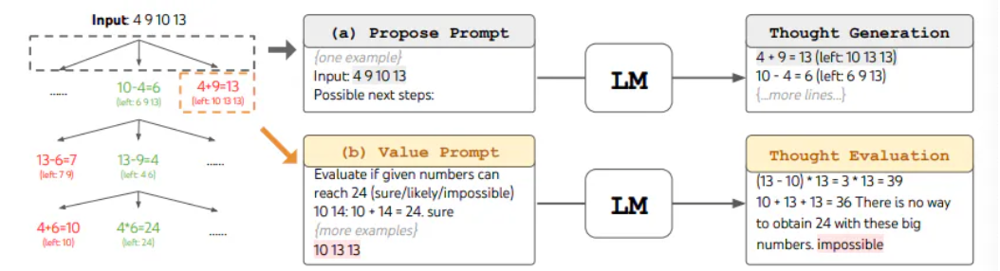

# CoT(Chain-of-Thought)
与上下文学习方法仅使用 ⟨ 输入，输出 ⟩ 二元组来构造提示不同，思维链提示进一步融合了中间的推理步骤来指导从输入到输出的推理过程,思维链将原始的 ⟨ 输入，输出 ⟩ 映射关系转换为⟨**输入，思维链，输出**⟩这一三元组形式。
在这个结构中，思维链扮演着重要的角色，**它提供了一系列语义连贯且具有逻辑性的中间推理步骤，有效地建立起输入与输出之间的桥接关系**。

## CoT与few-shot结合

通过在样例中加入思维链，引导模型生成中间步骤。

## Zero-Shot-CoT

只将“让我们逐步思考”添加到原始提示中即可有效提高推理结果。

## Auto-CoT
### 作用
为了减轻手工设计思维链的负担，作者提倡另一种自动CoT范式，以**自动构建带有问题和推理链的演示**。
具体来说，自动CoT利用LLMs使用“让我们一步一步地思考”的提示，逐个生成推理链。作者发现这个挑战不能通过简单的解决方案有效解决。例如，给定数据集的测试问题，检索语义相似的问题并调用零样本CoT生成推理链将会失败。尽管LLMs是不错的零样本推理者，但它们并不完美：**零样本CoT在推理链中仍然可能出错**。

为了减轻零样本CoT推理链错误的影响，作者的分析表明，演示问题的**多样性是关键**。基于这一洞见，我们提出了一种自动CoT方法来自动构建演示。
Auto-CoT由两个主要步骤组成:
1. 首先，将给定数据集的问题**划分为几个簇**。
2. 其次，从每个簇中**选择一个代表性问题，并使用简单的启发式方法使用零样本CoT生成其推理链**。

### 实现
#### 问题聚类
我们首先通过**Sentence-BERT**为Q中的每个问题计算一个向量表示。上下文化的向量被平均化以形成一个固定大小的问题表示。
然后，通过k-means聚类算法处理问题表示，以产生k个问题簇。对于每个簇i中的问题，将它们按距离簇i中心的升序排列成一个列表$q(i) = [q(i)_1, q(i)_2, …]$。

#### 示例抽样
为这些抽样问题生成推理链，然后抽样满足我们选择标准的示例。
对于列表$q(i)$,会按顺序输入到LLM中。输入格式：$[Q: q_j(i). A: [P]]$，其中$[P]$是一个单一提示“**让我们一步一步地思考**”。这个形成的输入被输入到LLM中，**使用零样本CoT输出由理由$r_j(i)$和提取的答案$a_j(i)$组成的推理链**。然后，通过串联问题、理由和答案构建第i个簇的候选示例$d_j(i)：[Q: q_j(i), A: r_j(i)◦a_j(i)]$。
对于得到的候选示例，作者遵循简单的启发式方法进行筛选，以鼓励抽样更简单的问题和理由：如果它有一个问题$q_j(i)$**，不超过60个token和一个理由$r_j(i)$，不超过5个推理步骤**，则将选定的示例$d(i)$设置为$d_j(i)$。

在对所有k个簇进行示例抽样后，将构建k个示例$[d(1), …, d(k)]$。构建的示例用于增强测试问题$q_{test}$的上下文学习。具体来说,**输入是所有示例$[d(1), …, d(k)]$的串联，然后是$[Q: q_{test}. A: [P]]$**.这个输入被输入到LLM中，以获得$q_{test}$的最终答案的推理链.

#####  多样性可能减轻相似性误导

作者使用k-means将所有600个测试问题分成k=8个簇，每个簇包含相似的问题。有了这些簇和零样本-CoT生成的推理链，现在我们好奇某些簇是否包含零样本-CoT经常失败的问题。因此，我们计算每个簇的错误率。研究发现，存在一个簇（簇2）零样本-CoT错误频繁（52.3%）。这种现象可能是普遍的，因为**零样本-CoT可能缺乏解决目标任务中某些常见问题的技能**。

由于不同的簇反映了问题的多样性语义，这种基于聚类的抽样方法可以被视为基于多样性的，与基于相似性的检索-Q-CoT形成鲜明对比。一方面，**以多样性抽样问题可能减轻相似性误导的影响**。另一方面，**如果我们将每个示例视为一种技能，多样化的示例似乎涵盖了更多解决目标问题的替代技能**：即使示例中仍然存在一小部分（例如，1/8）的错误，性能也不会受到负面影响。

#### 实验结果
在来自**三个推理任务类别**的**十个基准数据集上**进行了评估：

- （i）算术推理（MultiArith, GSM8K, AddSub , AQUA-RAT, SingleEq, SVAMP ）；
- （ii）常识推理（CSQA , StrategyQA）；
- （iii）符号推理（Letter，Coin）。


##### 错误示例的影响

可能会有错误的示例（其答案是错误的）。为了看看多样性是否减轻了这种影响，我们设计了一个In-Cluster Sampling基线，它通过从包含测试问题的同一簇中随机抽样问题来构建示例。图6比较了在MultiArith上不同错误示例数量下的准确性。与In-Cluster Sampling相比，**auto-CoT（使用基于多样性的聚类）受错误示例的影响较小：即使在呈现50%错误示例时，其性能仍然没有显著下降**。


## ToT(Tree of Thoughts)
**链接：** 
code:https://github.com/princeton-nlp/tree-of-thought-llm/blob/master/src/tot/methods/bfs.py

对于**需要探索或预判战略的复杂任务**来说，传统或简单的提示技巧是不够的。最近，Yao et el. (2023) 提出了思维树（Tree of Thoughts，ToT）框架，该框架基于思维链提示进行了总结，引导语言模型探索把思维作为中间步骤来解决通用问题。

ToT以**多轮对话搜索树**的形式来增强 LLM 解决复杂问题的能力,ToT 需要针对不同的任务定义思维/步骤的数量以及每步的候选项数量。例如，论文中的“算 24 游戏”是一种数学推理任务，需要分成 3 个思维步骤，每一步都需要一个中间方程。而每个步骤保留最优的（best） 5 个候选项。

ToT 完成算 24 的游戏任务要执行广度优先搜索（BFS），**每步思维的候选项都要求 LM 给出能否得到 24 的评估：“sure/maybe/impossible”（一定能/可能/不可能）** 。作者讲到：“目的是得到经过少量向前尝试就可以验证正确（sure）的局部解，基于‘太大/太小’的常识消除那些不可能（impossible）的局部解，其余的局部解作为‘maybe’保留。”每步思维都要抽样得到 3 个评估结果。整个过程如下图所示：


结果：


Hulbert (2023) 提出了另一种思维树（ToT）提示法，将 ToT 框架的主要概念概括成了一段简短的提示词，指导 LLM **在一次提示中对中间思维做出评估**。ToT 提示词的例子如下：
```
假设三位不同的专家来回答这个问题。
所有专家都写下他们思考这个问题的第一个步骤，然后与大家分享。
然后，所有专家都写下他们思考的下一个步骤并分享。
以此类推，直到所有专家写完他们思考的所有步骤。
只要大家发现有专家的步骤出错了，就让这位专家离开。
请问...
```

而 Long (2023) 则提出由强化学习（Reinforcement Learning）训练出的 “**ToT 控制器**”（ToT Controller）来驱动树的搜索策略(包括什么时候回退和搜索到哪一级回退等等)。，由强化学习训练出的 ToT 控制器有可能从新的数据集学习，或是在自对弈（AlphaGo vs. 蛮力搜索）的过程中学习。因此，**即使采用的是冻结的 LLM，基于强化学习构建的 ToT 系统仍然可以不断进化**，学习新的知识。

