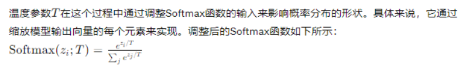
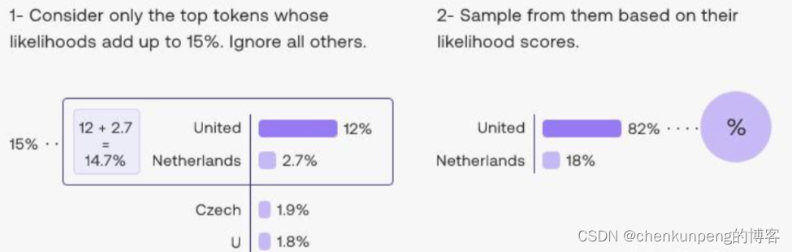

## LLM setting
- 1.Temperature

  - 简而言之， **temperature 越低，结果就越确定**，因为总是选择最有可能的下一个标记。**增加温度可能导致更多的随机性，从而鼓励更多多样化或创意性的输出**。实质上，您正在增加其他可能标记的权重。
   - 在应用方面，您可能希望对于**基于事实**的问答任务使用较低的温度值，以鼓励更多事实性和简洁的回答;
   - 对于诗歌生成或其他**创意任务**，增加温度值可能是有益的。
  

- 2.Top P 
  - 大模型选择输出token的时候，会有一个采样策略，用于选择输出哪些token，其中两种主要的采样方法就是**top-k和top-p**

  - top-p原理：
    **从概率加起来之和为p的top token中采样，称作top-p**；该策略动态设置tokens候选列表的大小。这种称为Nucleus Sampling 的方法将可能性之和不超过特定值的top tokens列入候选名单。下图是top-p=0.15的例子：
    
  - top_k原理:
   在每次生成一个新词时，模型会预测下一个词的概率分布，**然后只保留概率最高的K个词汇，并重新归一化这些词的概率分布**，最后从这K个词中随机选择一个作为下一个生成的词。这种方法有助于避免生成过于罕见的词汇，但可能会导致文本多样性受限。
  - top_k_top_p：
    结合了两种方法，即**先从概率加起来之和为p的top token中采样，再从这K个词中随机选择一个作为下一个生成的词**。
    这种方法可以同时控制生成的多样性和生成的长度。

  - 因此较低的 top_p 值选择最自信的响应。**这意味着较高的 top_p 值将使模型能够查看更多可能的单词，包括可能性较小的单词，从而产生更多样化的输出**
  - **一般建议是改变温度或top-p 值，但不要同时改变两者**。

- 3.Stop Sequences 
  - stop sequence 是一个字符串，用于阻止模型生成标记。指定停止序列是控制模型响应长度和结构的另一种方式。例如，您可以通过添加"11"作为停止序列，告诉模型生成不超过 10 个项目的列表。
- 4.Repetition Penalty
    - 也称为“**重复惩罚**”或“重复项惩罚”。**它主要针对连续生成序列中相同词汇或短语的重复现象**。
    - 当模型在生成下一个词时，如果这个词与前几个生成的词完全相同，**重复惩罚就会增加生成该词的负log概率**，也就是说，模型在决定生成下一个词时会因为这个惩罚而更少选择最近刚刚生成过的词。
    - 取值范围通常是一个大于等于1的浮点数，通常默认设置为1（无惩罚），当需要抑制重复时会设置为大于1的值。
    - 值越大，模型在生成下一个词时，如果该词之前不久已经出现过，那么它的生成概率会被进一步降低，从而更倾向于生成不同的词汇，减少连续重复的现象。
- 5.Presence Penalty
    这个参数同样用于惩罚模型在生成文本时对已出现过的任意位置词汇的偏好。不仅限于连续重复，而是对整个生成序列中已出现过的任何词汇或信息都会产生影响。
    如果设置了 presence_penalty > 0，**对于那些在整个生成文本中已经出现过的词，不论它们是否连续出现，模型都会在计算其生成概率时施加一个额外的惩罚因子。**
    取值范围也是通常为一个大于等于0的浮点数，且默认情况下可能设置为0（不惩罚）
    当 presence_penalty 被设置为一个大于0的值时，模型会在计算整个序列中每个词的生成概率时考虑它已经出现过的次数，并对其施加一个额外的惩罚。
    值越大，模型对已经在输出序列中出现过的任何一个词的再次生成都会更加谨慎，**这有助于整体上减少重复内容和过度依赖某些特定词汇的现象**。

- 6.Frequency_Penalty:
    - 作用：类似于repetition_penalty，**但关注的是整个词汇表中某个词汇的全局出现频率**。当frequency_penalty > 0时，高频词汇在生成文本时会被系统性地降权，有助于增加生成文本的多样性，避免过度依赖常用的高频词汇。
    实现：在生成过程中，可能会统计词汇在整个训练数据集或者前缀文本中的出现次数，并对概率分布进行调整，使得高频词汇生成的可能性降低。
    当 frequency_penalty = 0 时，不对词汇的出现频率进行任何惩罚。
    当 frequency_penalty > 0 时，模型会减少高频词汇被选中的概率，促进文本多样性和新颖性。值越大，对高频词的抑制越强。

