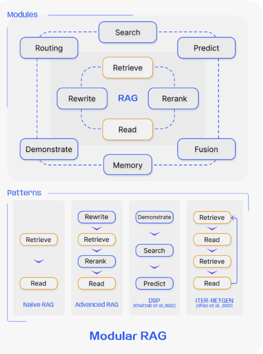
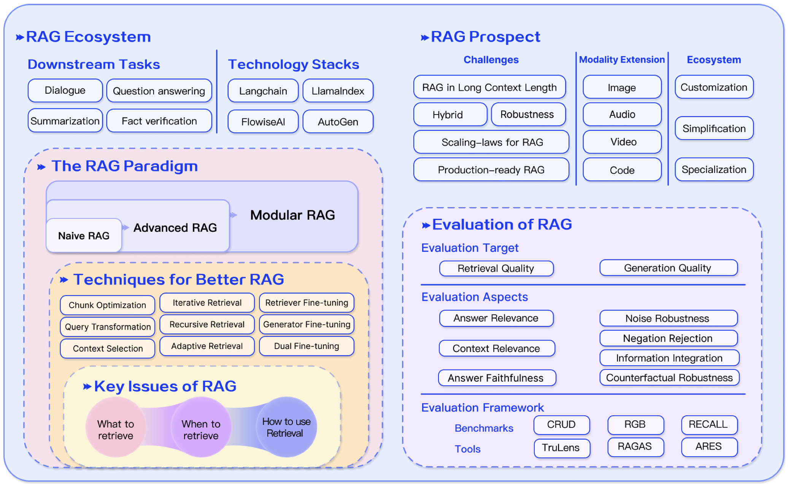

## RAG作用
RAG(Retrieval-Augmented Generation) 技术是一种检索增强生成的方法，结合了大型语言模型和检索系统的优势，以提高生成内容的准确性、相关性和时效性。
相比于仅依赖大型语言模型的生成，RAG技术可以从外部知识库中检索信息，避免了模型的幻觉问题，并提升了对实时性要求较高问题的处理能力。与传统的知识库问答系统相比，RAG技术更加灵活，可以处理非结构化的自然语言文本。

## RAG概述
RAG研究范式不断发展，我们将其分为三个阶段：**Naive RAG**、**Advanced RAG**和**Modular RAG**。

### Naive RAG

Naive RAG遵循传统流程，包括索引、检索和生成，也被称为“**Retrieve-Read**”框架。

索引从清理和提取PDF、HTML、Word和Markdown等不同格式的原始数据开始，然后将其转换为统一的纯文本格式。为了适应语言模型的上下文限制，文本被分割成更小的、可消化的块。然后**使用嵌入模型将块编码为矢量表示**，并**存储在矢量数据库**中。这一步骤对于在随后的检索阶段实现高效的相似性搜索至关重要。

Retrieval。在接收到用户查询时，**RAG系统采用在索引阶段使用的相同编码模型来将查询转换为矢量表示**。然后，它计算查询向量和索引语料库内块的向量之间的相似性得分。系统对与查询具有最大相似性的前K个块进行优先排序并检索。这些块随后被用作prompt中的扩展上下文。

Generation。**提出的查询和选择的文档被合成为一个连贯的提示，大型语言模型负责制定响应**。模型的回答方法可能因特定任务的标准而异，这使其能够利用其固有的参数知识或限制其对所提供文档中包含的信息的响应。在进行对话的情况下，任何现有的对话历史都可以集成到提示中，使模型能够有效地参与多回合对话交互。

#### 缺点
- 检索挑战。检索阶段经常在准确性和召回率方面遇到困难，导致选择错位或不相关的块，并**丢失关键信息**。
- 生成困难。在生成响应时，模型可能会面临幻觉的问题，因为它会产生检索到的上下文不支持的内容。这一阶段也可能受到输出的不相关性、毒性或偏差的影响，从而降低响应的质量和可靠性。
- 增强跨栏。将检索到的信息与不同的任务集成起来可能很有挑战性，有时会**导致输出不连贯或不连贯**。当从多个来源检索类似信息时，该过程也可能遇到冗余，导致重复响应。挖掘不同段落的意义和相关性，确保风格和音调的一致性，会增加复杂性。面对复杂的问题，基于原始查询的单一检索可能不足以获取足够的上下文信息。
- 此外，还有一种担忧是，生成模型可能**过度依赖增强信息，导致输出只反映检索到的内容，而不添加深入或合成的信息**。

### Advanced RAG

Advanced RAG引入了特定的改进，以克服Naive RAG的局限性。它专注于提高检索质量，采用了**检索前和检索后策略**。为了解决索引问题，Advanced RAG通过使用**滑动窗口方法**、**细粒度分割**和**元数据的结合**来改进其索引技术。此外，它还结合了几种优化方法来简化检索过程。

- 预检索过程。在这个阶段，主要关注的是**优化索引结构和原始查询**。
  - 优化索引的目标是**提高被索引内容的质量**。这涉及到以下策略：增强数据粒度、优化索引结构、添加元数据、对齐优化和混合检索。
  - 而查询优化的目标是**使用户的原始问题更清晰**，更适合检索任务。常见的方法包括查询重写、查询转换、查询扩展等技术。
- 后期检索过程。**检索到相关上下文后，将其与查询有效集成至关重要**。后检索过程中的主要方法包括**重新存储块**和**上下文压缩**。对检索到的信息重新排序以将最相关的内容重新定位到提示的边缘是一个关键策略。这一概念已在框架中实现，如LlamaIndex、LangChain和HayStack。
将所有相关文档直接输入LLM可能会导致信息过载，用不相关的内容淡化对关键细节的关注。为了缓解这种情况，检索后的工作集中于选择基本信息，**强调关键部分，并缩短要处理的上下文**。

### Modular RAG
模块化RAG架构超越了前两个RAG范式，提供了增强的适应性和多功能性。它采用了多种策略来改进其组件，例如：
- 添加用于相似性搜索的搜索模块
- 微调来改进检索器
- 引入重组的RAG模块
- 重新排列的RAG管道

#### 新模块
模块化RAG框架引入了额外的专业组件，以增强检索和处理能力。

- **搜索模块**适用于特定场景，使用LLM生成的代码和查询语言，实现在搜索引擎、数据库和知识图等各种数据源之间的直接搜索。

- **RAG-Fusion** 通过采用**多查询策略**来解决传统搜索的局限性，该策略将用户查询扩展到不同的角度，利用并行矢量搜索和智能重新排序来揭示显式和变革性的知识。

- **内存模块**利用LLM的内存来指导检索，创建一个无限内存池，通过迭代自增强，将文本与数据分布更紧密地对齐。

- **路由模块**（Routing）在不同的数据源中导航，**选择查询的最佳路径**，无论是涉及摘要、特定的数据库搜索还是合并不同的信息流。

- **Predict 模块**旨在通过LLM直接生成上下文来减少冗余和噪声，确保相关性和准确性。

- **任务适配器（Task Adapter）模块**针对各种下游任务定制RAG，自动检索零样本输入，并通过生成较少的搜索查询创建特定于任务的检索器。

#### 新模式
Modular RAG 除了集成新模块，还通过**调整现有模块之间的交互流**来扩展灵活性，增强了其在不同任务中的适用性。
例如：
- **Rewrite-Retrieve-Read**模型之类的创新利用LLM的能力，通过**重写模块**和**LM反馈机制**来改进检索查询，以更新重写模型，提高任务性能。

- **Generate-Read**等方法**用LLM生成的内容取代传统检索**
- **Recite- Read**则强调从模型权重进行检索，增强了模型处理知识密集型任务的能力。

- **混合检索策略**集成了关键字、语义和矢量搜索，以满足不同的查询。此外，部署子查询和假设文档嵌入（HyDE）试图通过专注于嵌入生成的答案和真实文档之间的相似性来提高检索相关性。

- 模块排列和交互的调整，如 **Demonstrate-Search-Predict**（DSP）框架和ITER-RETGEN的**迭代检索-读取-检索-读取流**，展示了模块输出的动态使用，以支持另一个模块的功能，说明了对增强模块协同的复杂理解。

- 模块化RAG流的灵活编排展示了通过FLARE和Self-RAG等技术进行**自适应检索**的好处。这种方法通过基于不同场景评估检索的必要性，超越了固定的RAG检索过程。

## 检索
### 检索来源
#### 数据结构
- 非结构化数据
- 半结构化数据
- 结构化数据
- LLM生成的内容

#### 数据粒度

- 粗粒度检索单元可以为问题提供更多相关信息，但它们也**可能包含冗余内容**，这可能会分散检索器和语言模型在下游任务中的注意力。
- 细粒度的检索单元粒度增加了检索的负担，**不能保证信息的完整性和满足所需的知识**。
在推理过程中选择适当的检索粒度是提高密集检索器的检索和下游任务性能的一种简单有效的策略。

在文本中，检索粒度从细到粗不等，包括**标记、短语、句子、命题、块、文档**。
在知识图上，检索粒度包括实体、三元组和子图。
检索的粒度也可以适用于下游任务，例如检索推荐任务中的项目ID和句子对。

### 索引优化
在索引阶段，文档将被**处理、分段并转换为嵌入**，以存储在矢量数据库中。索引构建的质量决定了能否在检索阶段获得正确的上下文。

#### 分块策略
最常见的方法是**在固定数量的令牌（例如，100、256、512）上将文档分割成块**。较大的块可以捕获更多的上下文，但它们也会产生更多的噪声，需要更长的处理时间和更高的成本。虽然较小的块可能无法完全传达必要的上下文，但它们确实具有较少的噪声。
然而，组块会导致句子中的截断，促使**递归拆分**和**滑动窗口方法**的优化，通过**在多个检索过程中合并全局相关信息来实现分层检索**。
尽管如此，这些方法仍然无法在语义完整性和上下文长度之间取得平衡。因此，已经提出了类似**Small2Big**的方法，**其中使用句子（小）作为检索单元，并将前后句子作为（大）上下文提供给LLM**。

#### 元数据附件
可以**用元数据信息来丰富区块**，如页码、文件名、地址、类别时间戳。随后，可以基于该元数据过滤检索，从而限制检索的范围。在检索过程中为文档时间戳分配不同的权重可以实现时间感知RAG，确保知识的新鲜性，避免过时的信息。

除了从原始文档中提取元数据外，还可以人工构建元数据。例如，添加段落摘要，以及引入假设性问题。这种方法也被称为反向HyDE。具体来说，使用LLM生成文档可以回答的问题，然后在检索过程中计算原始问题和假设问题之间的相似性，以减少问题和答案之间的语义差距。

#### 结构索引
增强信息检索的一种有效方法是**为文档建立层次结构**。通过构造In结构，RAG系统可以加快相关数据的检索和处理。

- **分层索引结构**：文件按父子关系排列，块链接到它们。数据总和存储在每个节点，有助于数据的快速遍历，并有助于RAG系统确定要提取哪些块。这种方法还可以减轻由块提取问题引起的错觉。
- **知识图谱索引**：利用KG构建文档的层次结构有助于保持一致性。它描绘了不同概念和实体之间的联系，显著减少了产生幻觉的可能性。

### 查询优化
####  查询扩展
将单个查询扩展为多个查询，丰富了查询的内容，提供了进一步的上下文来解决任何缺乏特定细微差别的问题，从而确保生成的答案的最佳相关性。

- 多查询。通过使用即时工程通过LLM扩展查询，这些查询可以并行执行。查询的扩展不是随机的，而是经过精心设计的。
- 子查询。**子问题规划的过程代表了必要的子问题的生成**，以在组合时将原始问题情境化并完全回答。原则上，添加相关上下文的过程类似于查询扩展。具体来说，使用最少到最多提示的方法，可以将复杂的问题分解为一系列更简单的子问题。
- **验证链（CoVe**）。**扩展后的查询经过LLM验证，以达到减少幻觉的效果**。经过验证的扩展查询通常表现出更高的可靠性。

#### 查询转换
核心概念是基于转换后的查询而不是用户的原始查询来检索块。

- 查询重写。对于LLM检索，原始查询并不总是最优的，尤其是在真实世界的场景中。因此，我们可以**提示LLM重写查询**。

#### 查询路由
基于不同的查询，路由到不同的RAG管道，适用于设计用于适应不同场景的通用RAG系统。
元数据路由器/筛选器。第一步包括从查询中提取关键词（实体），然后**根据块中的关键词和元数据进行过滤，以缩小搜索范围**。
语义路由器是另一种路由方法，涉及利用查询的语义信息。具体的请参阅语义路由器。
当然，混合路由还可以采用这种方法，将基于语义和元数据的方法相结合，以增强查询路由。

### 嵌入
-  混合/混合检索：稀疏和密集嵌入方法捕获不同的相关性特征，并可以通过利用互补的相关性信息来相互区分。
-  微调嵌入模型：在上下文明显偏离预训练语料库的情况下，特别是在医疗保健、法律实践和其他充满专有术语的领域等高度专业化的学科中，在您自己的领域数据集上微调嵌入模型对于缓解这种差异至关重要。

#### Adapter
微调模型可能会带来挑战，例如通过API集成功能，或解决有限的本地计算资源带来的限制。因此，一些方法**选择结合外部适配器来帮助对齐**。

## 生成
检索后，将所有检索到的信息直接输入LLM以回答问题不是一种好的做法。以下将从两个角度介绍调整：**调整检索到的内容**和**调整LLM**。
### 内容调整
**冗余信息**可能会干扰LLM的最终生成，而过长的上下文也可能导致LLM出现“中间丢失”问题。和人类一样，LLM倾向于只关注长文本的开头和结尾，而忘记中间部分。因此，在RAG系统中，我们通常需要进一步处理检索到的内容。

- **重新排序**：重新排序从根本上重新排序文档块，**以首先突出最相关的结果，有效地减少了整个文档库**，切断了信息检索的双重目的，同时**充当增强器和过滤器，为更精确的语言模型处理提供精细的输入**。可以使用基于规则的方法执行重新排序，这些方法依赖于预定义的度量，如多样性、相关性和MRR，或者基于模型的方法，如BERT系列的编码器-解码器模型（例如，SpanBERT），专门的重新排序模型，如相干重新排序或bge-raranker-large，以及通用大型语言模型，如GPT。

- **上下文选择/压缩**：RAG过程中的一个常见误解是认为检索尽可能多的相关文档并将它们连接起来以形成冗长的检索提示是有益的。然而，过多的上下文会引入更多的噪声，削弱LLM对关键信息的感知。

### LLM微调
基于LLM的场景和数据特性进行有针对性的微调可以产生更好的结果。这也是使用内部部署LLM的最大优势之一。当LLM缺乏特定领域中的数据时，可以通过微调向LLM提供额外的知识。

## RAG 增强过程
在RAG领域，标准实践通常涉及单一的（一次）检索步骤，然后生成，这可能导致效率低下，有时对于需要多步骤推理的复杂问题通常是不够的，因为它提供的信息范围有限。许多研究针对这个问题**优化检索过程**。

### 迭代检索
迭代检索是一个**基于初始查询和迄今为止生成的文本重复搜索知识库的过程**，为LLM提供了更全面的知识库。这种方法已经被证明可以通过多次检索迭代提供额外的上下文参考来增强后续答案生成的稳健性。然而，它可能会受到语义不连续性和无关信息积累的影响。
**ITER-RETGEN**采用了一种协同方法，将“检索增强型生成”与“生成增强型检索”结合起来，用于需要复制特定信息的任务。**该模型利用处理输入任务所需的内容作为检索相关知识的上下文基础**，这反过来又有助于在后续迭代中生成改进的响应。

### 递归检索
递归检索经常用于信息检索和NLP，以提高搜索结果的深度和相关性。该过程包括基于从先前搜索中获得的结果**迭代地细化搜索查询**。递归检索旨在通过反馈循环逐步聚合到最相关的信息，从而增强搜索体验。
IRCoT使用思想链来指导检索过程，并根据所获得的检索结果对CoT进行细化。ToC创建了一个澄清树，**系统地优化查询中不明确的部分**。它在复杂的搜索场景中尤其有用，在这些场景中，用户的需求从一开始就不完全清楚，或者所寻求的信息非常专业或微妙。该过程的递归性质允许不断学习和适应用户的需求，通常会提高对搜索结果的满意度。

### 自适应检索
以Flare和Self-RAG为例的自适应检索方法通过**使LLM能够主动确定检索的最佳时刻和内容来完善RAG框架**，从而提高信息来源的效率和相关性。

这些方法是LLM在其操作中使用主动判断的更广泛趋势的一部分，如AutoGPT、Toolformer和Graph-Toolformer等模型代理所示。例如，Graph Toolformer将其检索过程分为不同的步骤，在这些步骤中，LLM主动使用检索器，**应用自询问技术，并使用少量提示来启动搜索查询**。这种主动的立场允许LLM决定何时搜索必要的信息，类似于代理如何使用工具。

## RAG Ecosystem

