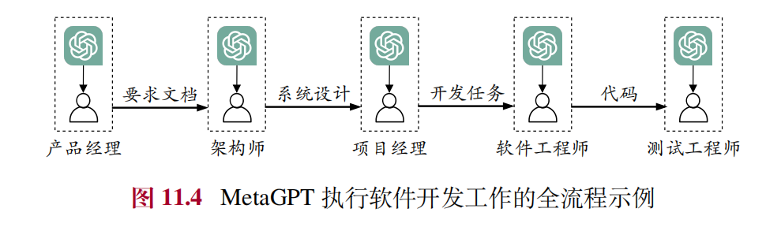

## Agent 作用
智能体（Agent）是一个**具备环境感知、决策制定及动作执行能力**的**自主算法系统**。研发智能体的初衷在于模拟人类或其他生物的智能行为，旨在**自动化地解决问题或执行任务**。

## Agent 分类
### 1. 基于规则的Agent
基于规则的Agent（Rule-Based Agent）是一种**基于预定义规则**的智能体，其行为完全由**硬编码的规则**决定。这些规则通常以**if-then形式**表示，当特定条件满足时，执行相应的动作。
但受限于预定义的规则和知识库，早期的智能体往往表现出**较低的适应性和灵活性**，无法有效应对未经历过的应用场景。

### 2. 基于模型的Agent
基于模型的Agent（Model-Based Agent）不再依赖于预先定义的规则，而是**基于环境中的特征来构建可学习的决策模型**。
- **强化学习智能体**通过与环境的交互来学习最佳行为策略。它们通过探索和利用，不断进行试错并根据所获得的环境反馈信息来调整自己的行为，从而最大化累积奖励。这种方法在游戏、自动驾驶等领域取得了显著成果。
- **基于大语言模型的智能体**能够利用大语言模型的强大能力，从而自主、通用地与环境进行交互。

## 大语言模型智能体的构建
我们介绍大语言模型智能体的构建过程，将围绕三个基本组件进行介绍，包括**记忆组件（Memory）**、**规划组件（Planning）** 和**执行组件（Execution）**。通过这些组件共同协作，智能体能够有效地感知环境、制定决策并执行规划的动作，进而完成相应任务。

### 记忆组件
在人工智能系统中，记忆组件构成了智能体的核心存储单元，主要用于**存储智能体与环境的历史交互记录，并能够随时检索使用**，这些信息可以是文本形式，也可以是图像、声音等多模态形式。
- 短期记忆
  短期记忆是负责暂时存储和处理智能体相关信息的记忆载体。在大语言模型智能体中，**短期记忆通常对应于模型内部的上下文窗口**。
- 长期记忆
  长期记忆是智能体**存储长期累积信息**的记忆载体。长期记忆单元中的存储内容具有持久性，即使在不常访问的情况下也能稳定保留，**涵盖事实知识、基础概念、过往经验以及重要技能等多个层面的信息**。长期记忆的存储方式比较灵活，可以是文本文件、结构化数据库等形式，通常使用**外部存储**来实现。大语言模型通过**检索机制**读取长期记忆中的信息，并借助反思机制进行信息的写入与更新。

### 规划组件
规划组件为智能体引入了类似于人类解决任务的思考方式，将复杂任务分解为一系列简单的子任务，进而逐一进行解决。这种方法降低了一次性解决任务的难度，有助于提高问题解决的效率和效果，提高了智能体对复杂环境的适应性和操作的可靠性。

### 执行组件
执行组件在智能体系统中承担了关键作用，它的主要职责是执行由规划组件制定的任务解决方案。通过设置执行组件，智能体可以产生具体的动作行为，进而与环境进行交互，并获得实际的执行效果反馈。

### 工作流程
这一流程通常遵循以下步骤：
- 首先，智能体对当前状态进行理解和分析。在这一过程中，它可能会从记忆组件中检索相关的历史信息或知识，以便更**全面地理解和分析当前状态**。
- 接下来，规划组件通过综合考虑长短期记忆组件中已存储的信息，**生成下一个行动策略或计划**。这一步骤涉及对多个执行方案进行预测与评估，以选择最优的行动路径。
- 随后，执行组件负责根据规划组件生成的任务解决方案**执行实际行动，并与当前环境产生交互**。在执行过程中，智能体可能会借助外部工具或资源来增强自身的执行能力。
- 最后，智能体通过感知单元或系统接口从环境中**接收反馈信息**，并将这些信息**暂时存储于短期记忆**中。智能体会对短期记忆中的新获取到的信息进行处理，例如舍弃掉和未来规划无关的观察。上述流程将作为新的记忆被记录在记忆组件中。

## 多智能体系统的构建
与单智能体系统的独立工作模式不同，**多智能体系统着重强调智能体间的协同合作**，以发挥集体智慧的优势。在多智能体系统中，可以从相同或不同类型的大语言模型中实例化出多个智能体，每个智能体均扮演特定角色并承担着对应功能。**通过智能体间的交互与协作，智能体系统的灵活性和适应性得到显著增强**，能够完成相较于单智能体而言更为复杂、具有挑战性的任务。

### 构建方法
要构建多智能体系统，首先需要明确多智能体系统整体**需要解决的问题或实现的目标**，可以针对特定任务，也可以针对某一个环境进行仿真模拟。随后，在系统内创建多个智能体实例。在创建智能体实例的过程中，需要根据问题的复杂性和所需功能，设计智能体的类型、数量和特性。

作为最为关键的一个步骤，接下来需要**定义多智能体之间的交互方式**，包括协作、竞争、信息交流等方面，以及制定协议、策略或博弈论规则，以确保智能体之间能够有效进行协同运作。

在多智能体系统中，通讯机制与协同机制是实现智能体之间有效协作的重要基础技术。这两种机制的核心在于加强智能体之间的信息交流与能力共享。

#### 通讯机制
多智能体系统的通讯机制通常包括三个基本要素：**通讯协议、通
讯拓扑和通讯内容**。
- 通讯协议规定了智能体之间如何进行信息交换和共享，包括通讯的方式、频率、时序等；
- 通讯拓扑则定义了智能体之间的连接关系，即哪些智能体之间可以进行直接通讯，哪些需要通过其他智能体进行间接通讯；
- 通讯内容则是指智能体之间实际传输的信息，包括状态信息、控制指令、任务目标等，其形式可以是自然语言、结构化数据或者代码等。

#### 协同机制
多智能体系统的协同机制通常包括**协作、竞争和协商**。
- 协作指的是智能体通过共享资源、信息和任务分配来实现共同目标；
- 竞争则涉及到在资源有限的环境中，智能体之间的竞争关系，通过博弈论和竞价机制，使得整体系统可以在竞争中寻求最优解决方案；
- 协商是指智能体通过交换信息和让步来解决目标或资源的冲突。

## 大模型Agent应用
- RecAgent
  - **推荐系统智能体框架**
- WebGPT
  - WebGPT部署在一个基于文本的网页浏览环境，用以增强大语言模型对于外部知识的获取能力。作为一个单智能体系统，WebGPT 具备**自主搜索、自然语言交互以及信息整合分析**等特点，能够理解用户的自然语言查询，自动在互联网上搜索相关网页。根据搜索结果，WebGPT 能够点击、浏览、收藏相关网页信息，对搜索结果进行分析和整合，最终以自然语言的形式提供准确全面的回答，并提供参考文献。WebGPT在基于人类评估的问答任务中，获得了与真实用户答案准确率相当的效果。
- MetaGPT
  - MetaGPT是一个基于多智能体系统的协作框架，旨在模仿人类组织的运作方式，**模拟软件开发过程中的不同角色和协作**。相关角色包括产品经理、架构师、项目经理、软件工程师及测试工程师等，并遵循标准化的软件工程运作流程对不同角色进行协调，覆盖了需求分析、需求文档撰写、系统设计、工作分配、代码实现、系统测试等软件开发全生命周期，最终满足特定软件开发项目的需求。
  
- 《西部世界》沙盒模拟
  - 为了探索大语言模型智能体在社会模拟中的应用，研究人员于 2023 年提出了“**生成式智能体**”（Generative Agent）这一创新概念 ，并构建了类似《西部世界》的沙盒模拟环境。其中，**多个智能体根据各自独特的人物背景（以自然语言形式描述人物身份的配置文件）在小镇中生活**。这些模拟人物不仅能与其他人物进行自主交流，还能与环境进行丰富多样的交互，例如在图书馆看书、在酒吧喝酒，这些行为都通过自然语言的形式被详细记录下来。

### 大模型智能体开源库
- AgentScope
- RecAgent

## 待解决的关键技术问题
- 智能体系统的**计算资源消耗**
- 复杂工具使用
  - **现有工具的开发过程通常没有充分考虑与大语言模型的适配**，难以在复杂环境中为大语言模型提供最适合的功能支持
- 高效的多智能体交互机制.
  - 目前，开发适用于大规模智能体系统的通信协议和组织架构仍然是一个技术挑战，需要考虑智能体的异构性、系统的可扩展性和交互的实时性等多个因素。
- 面向智能体系统的模型适配方法
  - 支撑智能体系统的基础能力方面仍然存在着一定的局限和不足。例如，在**理解复杂指令、处理长期记忆信息**等方面，现有的大语言模型的表现还需要进一步优化与改进。
- 面向真实世界的智能体模拟
  - 现有的大语言模型智能体研究通常设置在虚拟环境中进行，然而真实世界更加复杂，与虚拟环境存在着较大差异。