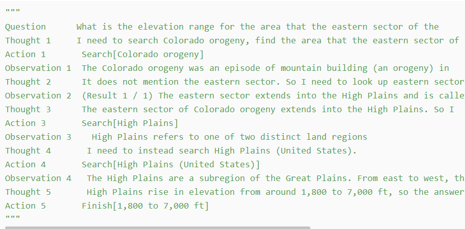
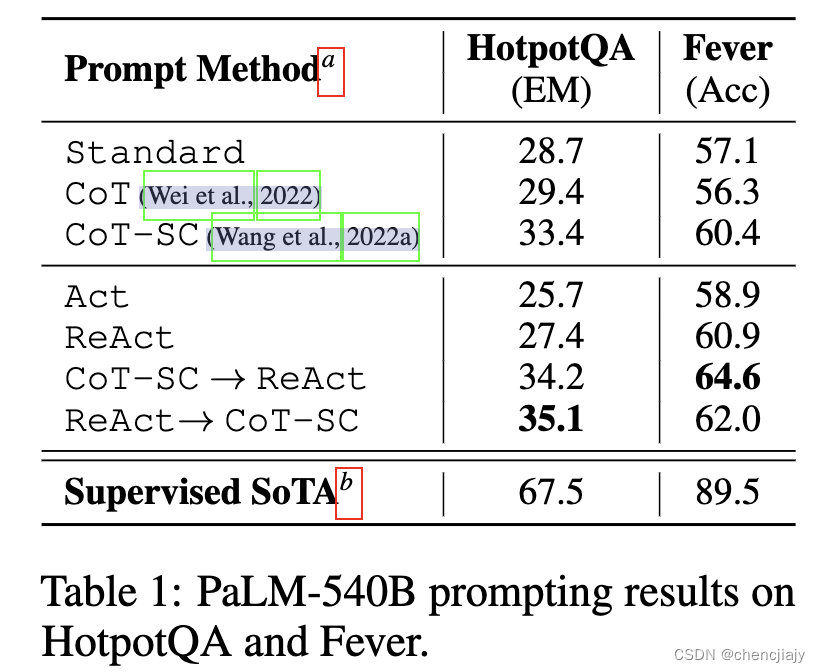
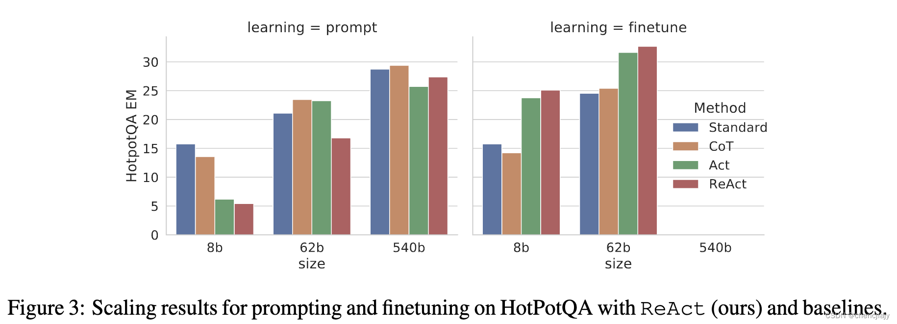

## ReAct作用
本文提出ReAct框架用语言模型结合推理和行动，它prompt LLM用一种交互性的方式生成与任务相关的言语推理轨迹和动作，这使得模型能够执行动态推理来创建、维护和调整高级行动计划（行动的理由），同时与外部环境（例如维基百科）交互将附加信息纳入推理（行为到推理）。

## ReAct框架
对于一个与环境交互来解决任务的agent，在时刻t，一个agent从环境中收到了观察$o_t \in \mathcal{O}$，并且遵循策略$\pi(a_t|c_t)$采取动作$a_t \in \mathcal{A}$，其中$c_t = (o_1, a_1, \cdots, o_{t-1}, a_{t-1}, o_t)$是agent的上下文(context)。

**由于$c_t \rightarrow a_t$的映射是隐形的并且需要大量计算时，学习一个策略是有挑战的。故在ReAct中，增加一个thought** $\hat{a_ 
t}$,它不影响外部环境，因此也不会有观察反馈。这个thought$\hat{a_t}$意在对现有上下文$c_t$推理来组合出有用的信息，并**更新上下文**$c_{t+1} = (c_t, \hat{a_t})$以支持将来的推理或动作。

**示例：**

在解决任务时**使用few-shot上下文例子**prompt模型来生成领域相关的动作或者thought。

有用的thought的类型不定：

- 拆分任务目标和创建行动计划（2b,Act 1; 1d, Thought 1）
- 注入解决任务相关的常识知识（2b, Act 1）
- 从观察中抽取重要的信息（1d, Thought2,4）
- 跟踪进度和行动计划（2b, Act8）
- 处理异常和调整行动计划（1d, Thought 3）


### ReAct Promping：
从训练集中随机选取样本并人工标注作为few-shot例子，HotpotQA是6个例子，Fever是3个例子，作者们试验发现更多例子不会提升性能。作者在写例子的时候，尝试了：

- 问题分解(“I need to search x, find y, then find z”)
- 从Wikipedia页面中提取信息 (“x was started in 1844”, “The paragraph does not tell x”)
- 进行常识推理(“x is not y, so z must instead be…”)
- 算数推理 (“1844 < 1989”)
- 引重新定义搜索内容(“maybe I can search/look up x instead”)
- 合成答案 (“…so the answer is x”).

### hotpotQA提示词
```
webthink_examples = prompt_dict['webthink_simple6']
instruction = """Solve a question answering task with interleaving Thought, Action, Observation steps. Thought can reason about the current situation, and Action can be three types: 
(1) Search[entity], which searches the exact entity on Wikipedia and returns the first paragraph if it exists. If not, it will return some similar entities to search.
(2) Lookup[keyword], which returns the next sentence containing keyword in the current passage.
(3) Finish[answer], which returns the answer and finishes the task.
Here are some examples.
"""
webthink_prompt = instruction + webthink_examples
```

### 实验
组合内外部知识：**因为ReAct更基于事实，而CoT在推理结构上更准确，但是容易产生幻觉**，所以**合并了ReAct和CoT-SC**，基于如下启发式规则让模型决定什么切换到另一种方法：

- $ReAct → \rightarrow→ CoT-SC$：当ReAct在指定步数内无法返回答案，则切换到CoT-SC，对HotpotQA设定为7步，Fever设定为5步。
- $CoT-SC→ \rightarrow→ ReAct$： 当n个CoT-SC样本的多数答案少于n/2时，则切换到ReAct。

Finetuning: **使用boostraping方法生成3000条正确的React轨迹微调小一点的语言模型PaLM-8/62B**。

#### 结果


ReAct方法在fine-tuning时表现最好，如下图的Figure 3显示了四种方法在HotpotQA上prompting和finetuning的对比所示。 作者们相信如果用更大的标注数据集去finetuning，有可能会比最先进的有监督的方法效果更好。


## 学习资源
**paper**:https://react-lm.github.io/
**code**:https://github.com/ysymyth/ReAct/blob/master/hotpotqa.ipynb
blog: https://blog.csdn.net/beingstrong/article/details/132123996