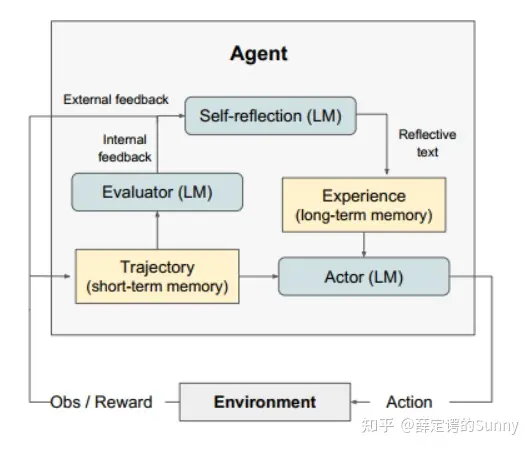

## Reflexion 作用
本文提出了Reflexion框架，使用语言反馈信号(verbalreinforcement)来**帮助agent从先前的失败经验中学习**。具体地，Reflexion将传统梯度更新中的参数信号转变为**添加在大模型上下文中的语言总结**，使得agent在下一个episode中能参考上次执行失败的失败经验，从而提高agent的执行效果。这个过程和人类反思(reflexion)过程十分相似。

## Reflexion 框架

Reflexion框架包含四个组成部分：

- Actor: Actor由LLM担任，主要工作是基于当前环境生成下一步的动作。
- Evaluator: Evlauator主要工作是衡量Actor生成结果的质量。就像强化学习中的Reward函数对Actor的执行结果进行打分。
- Self-reflexion：Self-reflexion一般由LLM担任，是Reflexion框架中最重要的部分。它能结合离散的reward信号(如success/fail)、trajectory等**生成具体且详细语言反馈信号**，这种反馈信号会储存在Memory中，启发下一次实验的Actor执行动作。相比reward分数，这种语言反馈信号储存更丰富的信息，例如在代码生成任务中，Reward只会告诉你任务是失败还是成功，但是**Self-reflexion会告诉你哪一步错了，错误的原因是什么等**。
- Memory：分为短期记忆(short-term)和长期记忆(long-term)。**在一次实验中的上下文称为短期记忆，多次试验中Self-reflexion的结果称为长期记忆**。类比人类思考过程，在推理阶段Actor会不仅会利用短期记忆，还会结合长期记忆中存储的重要细节，这是Reflexion框架能取得效果的关键。

### 执行过程

如上图伪代码所示，Reflexion是一个迭代过程，Actor产生行动，Evaluator对Actor的行动做出评价，**Self-Reflexion基于行动和评价形成反思，并将反思结果存储到长期记忆中，直到Actor执行的结果达到目标效果**。

### 实验结果与分析
#### 决策能力
在AlfWorld任务中，Reflexion框架能够有效解决幻觉(hallucination)和规划不足(inefficinet planning)问题，使得agent的任务完成率明显提升，在10次实验后最多完成130/134个任务。

#### 推理能力
HotpotQA是一个基于百科知识库的问答任务，主要是测试agent在大量文本中推理的推理能力。在这个任务中，Reflexion的效果比所有的baseline都高出不少。同时作者还对比了cot+EPM(episodic memory 类似一种长期记忆)和Reflexion框架(下图最右)，发现Reflexion的效果仍要高很多，**这说明Reflexion框架中长期记忆和Self-Reflexion模块都起到了重要的作用。**

#### 代码生成能力
在HumanEval(PY)代码生成任务中，Reflexion取得了SOTA效果，准确率相比GPT-4提高10.9%。

从作者的实验分析看来，Reflexion最重要的两个模块是：
**长期记忆模块**：赋予了agent长期记忆的能力
**Self-Reflexion模块**：**将一些数字化的reward信号转化为细致分析的语言总结**，形成重要的长期记忆，能明显提高下一次执行的成功率。

## 学习资源
**paper**: https://arxiv.org/abs/2303.11366
**code**: https://github.com/noahshinn/reflexion
**blog**: https://zhuanlan.zhihu.com/p/639254455