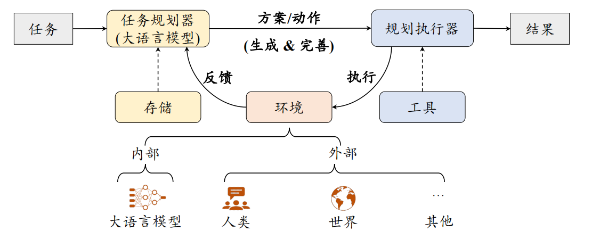
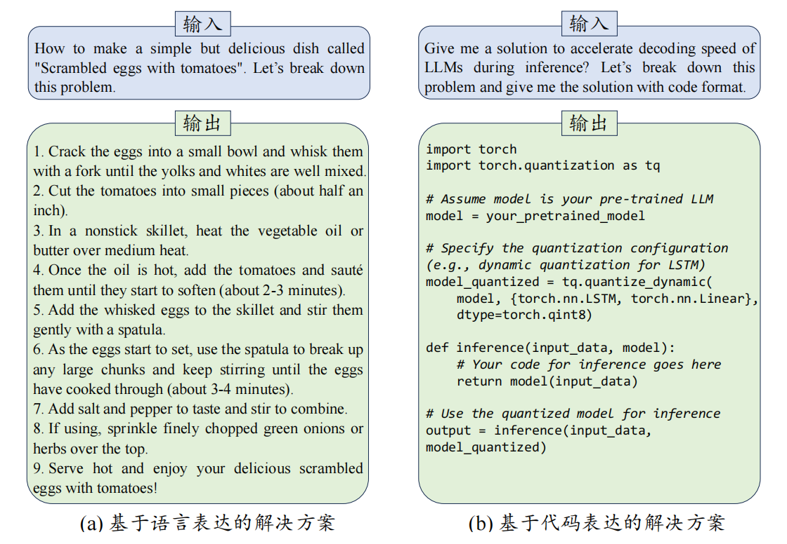

## 规划作用
规划旨在**为目标任务制定包含一系列动作的解决方案**，是大语言模型解决复杂问题能力的重要体现，也是自主智能体最重要的核心能力。

虽然上下文学习和思维链提示方法形式上较为简洁且较为通用，但是在面对诸如**几何数学求解、游戏、代码编程以及日常生活任务**等复杂任务时仍然表现不佳。为了解决这类复杂任务，可以使用**基于大语言模型的规划（Planning**）。
该方法的核心思想在于**将复杂任务分解为若干相关联的子任务，并围绕这些子任务制定包含一系列执行动作（Action）的解决方案**，从而将复杂任务的求解转换为一系列更为简单的子任务依次求解，进而简化了任务难度。

## 整体框架
基于大语言模型的规划方法主要由三个组件构成，包括**任务规划器（Task Planner）**、**规划执行器（Plan Executor**）以及**环境（Environment）**

- 大语言模型作为任务规划器，其主要职责是**生成目标任务的解决方案**。该方案包含一系列执行动作，每个动作通过合适的形式进行表达，例如自然语言描述或代码片段。**对于长期任务，任务规划器还可以引入存储机制**，用于解决方案与中间执行结果的存储与检索。
- 规划执行器则负责执行解决方案中所涉及到的动作。根据任务性质的不同，**规划执行器可以由大语言模型实现，也可以由执行具体物理任务的实体（如机器人）来实现**。
- 环境是规划执行器**实施动作的具体场景**，不同任务对应着不同的执行环境，例如 Web 互联网或像 Minecraft 这样的外部虚拟世界。

### 方案生成
#### 解决方案形式
一般来说，解决方案（或者其中包含的中间步骤）可以采用**自然语言表达**或者**代码表达**的形式。
- 自然语言的形式较为**直观**，但由于自然语言的多样性与局限性，**不能保证动作被完全正确执行**。
- 而代码形式则较为**严谨规范**，可以使用外部工具如代码解释器等保证动作被正确执行。

#### 规划方法
任务规划器主要采用两种规划方法：**一次性的方案生成**和**迭代式的方案生成**。
##### 一次性方案生成
这种方法通过特殊设计的提示方法让大语言模型**一次性生成完整的解决方案**，生成的方案通常包含一系列供规划执行器执行的动作描述。

在实际应用时，需要**根据任务特性来选择具体的规划方案形式**。
- 一般来说，如果待解决任务需要较强的推理逻辑或数值计算能力，则推荐使用基于代码表达的方案生成。
- 如果待解决任务的形式不固定、难以进行形式化表达，如多跳问答、信息检索或推荐任务，则推荐使用基于自然语言的表达。这一建议对于下面介绍的迭代式动作生成方法同样适用。

##### 迭代式方案生成
在这一类方法中，大语言模型**基于历史动作和当前环境的反馈逐步规划**下一步的执行动作。
相关模型：
- ReAct
- Reflexiton

#### 反馈获取
在执行动作后，**规划执行器会将环境的反馈信号传递任务规划器。这些反馈信号可以用于完善整体解决方案或规划下一步动作**。根据任务规划器与环境之间的交互方式，环境反馈可以分为两类，包括**外部反馈**和**内部反馈**。

##### 外部反馈
外部对象可以为任务规划器提供重要的反馈信号。
例如：
- 物理工具
  - 代码解释器
- 人类
  - 当机器人在物理世界中与人类进行交互时，人类能够根据机器人的询问或动作，提供关于物理世界的实时信息
- 游戏领域
  - 虚拟环境

##### 内部反馈
除了外部反馈，大语言模型本身也能够对任务规划器提供反馈信息。

具体来说，可以**将历史动作序列以及对应的反馈输入给大语言模型**，通过使用类似“Is the current action step beingtaken correct or not?”的指令，让大语言模型检查当前动作的正确性，并给出反馈结果。

为了更好地理解执行结果的背后原因，**大语言模型可以将简单的环境反馈（例如成功或失败）转换为信息量更为丰富的、自然语言表达的总结反思**，帮助任务规划器重新生成改进的解决方案。一个代表性的工作是 **Reflexion**。

