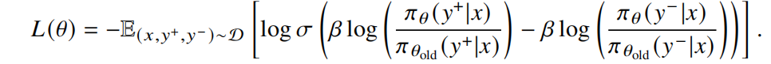

## DPO作用
直接偏好优化（Direct Preference Optimization, DPO）是一种**不需要强化学习的对齐算法**。由于去除了复杂的强化学习算法，DPO 可以通过与有监督微调相似的复杂度实现模型对齐，不再需要在训练过程中针对大语言模型进行采样，同时超参数的选择更加容易。

## DPO算法
损失函数：

推导过程：
https://blog.csdn.net/Ever_____/article/details/139304624

在实现中，DPO 采用梯度下降的方式来优化策略模型的参数 𝜃。通过对上述目标函数的导数进行分析，可以发现优化过程中会增大 $log 𝜋^𝜃 (𝑦^+|𝑥)$ 与 $log 𝜋^𝜃 (𝑦^−|𝑥)$之间的差异。这表明优化过程中训练模型向符合人类偏好的内容靠近（$𝑦^+$），同时尽量避免生成不符合人类偏好的内容（$𝑦^−$）。