## RLHF作用
由于对齐标准难以通过形式化的优化目标进行建模，因此研究人员提出了基于人类反馈的强化学习（Reinforcement Learning from Human Feedback, RLHF），**引入人类反馈对大语言模型的行为进行指导**。

## RLHF流程
1. **人类标注员**：收集人类对模型生成的文本的偏好，即奖励信号。
2. **奖励模型(RM)**：训练一个奖励模型，用于预测人类对模型生成的文本的偏好。
3. **强化学习**：使用强化学习算法，根据奖励模型对模型的生成行为进行优化，使模型生成的文本更符合人类的偏好。

## RL in NLP
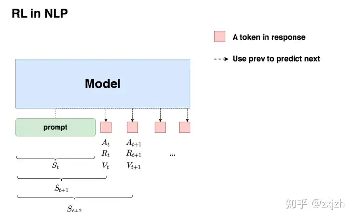
Action：在$t$时刻，模型根据上文，产出一个token，动作空间即为词表
State: 当前生成的token串，状态空间即为所有的token组合
Agent（policy）：大模型本身
轨迹$\tau$：一个完整的response生成
值函数$V(s_t)$：
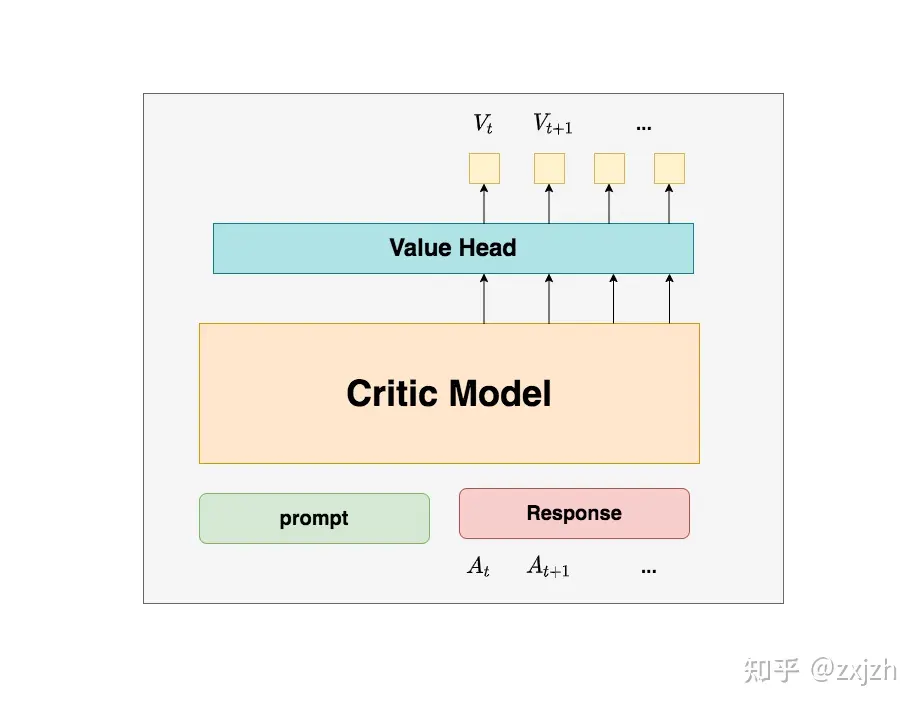

## RLHF方法

### 奖励模型(RM)训练
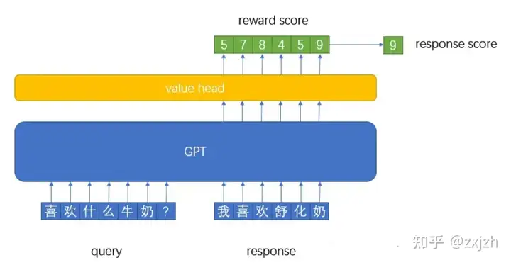
奖励模型的**输入是prompt+answer的形式**，让模型学会对prompt+answer进行打分。
奖励模型最后一层隐藏层的输出维度为(B,L,D)，通过一个D✖️1的全连接层将维度变为(B, L)，**在L这个维度上，第i个位置的数据表示：从第i个位置到最后一个位置输出所能获得的奖励分值的累加和**（和DQN里边的Q值一个意义），这种形式的输出满足了critic model的输出要求。对应代码如下：
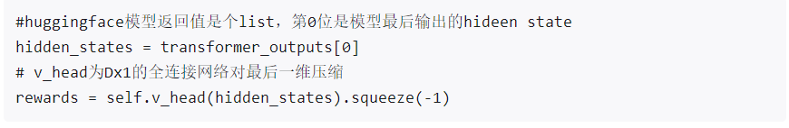

对于一个奖励模型来说，目标是给一个句子进行打分，按理说每个句子对应一个分值就行了，但是目前对于长度为L的句子，奖励模型输出了L个值。我们**用L维度上的最后一个位置的值当作为本句话的奖励得分**。
奖励模型训练优化采用**pair wiss loss**，即同时输入模型关于同一个问题的两个回答，**让模型学会这两个句子哪个分高哪个分低**。之所以如此训练是因为，在给奖励模型进行数据标注的过程中，**给同一个问题的不同回答量化的打具体分值比较难，但是对他们进行排序相对简单**，代码如下：
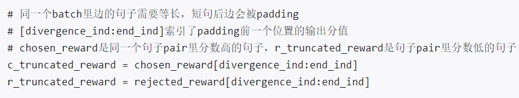
pair wise loss代码如下，如果给pair里边好的句子打分高（c_truncated_reward），坏的句子（r_truncated_reward）打分低，loss就会小：
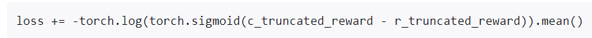

#### 输入数据格式
原始数据格式如下，openai在训练chatGPT时，针对相同的query(在大模型背景下即是prompt)会生成4-9个不同的答案，任意抽取两个答案交由标注人员评估相对优劣，这样根据排列组合原理，相同query根据生成答案的数量，可以形成(6, 36)个不同的训练集。这里之所以会使用排序标注方式，是因为标注数量的要求，很难只使用一个标注人员，如果使用多个标注人员，**直接对生成结果打分可能很不稳定**。

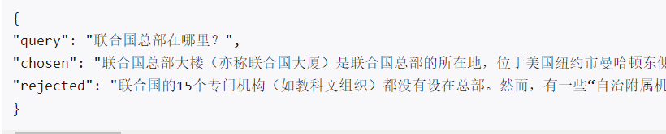
训练时对应的loss为如下公式：
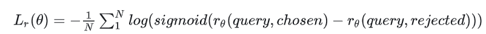

### 强化学习微调
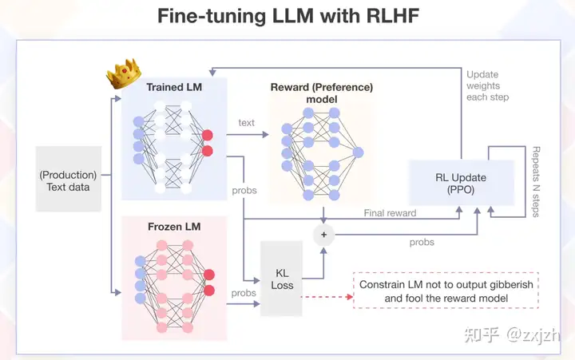
Ref model：SFT模型，用来辅助Actor的优化，**保证其不偏离SFT模型**。
Actor model：目标策略模型，使用SFT初始化。
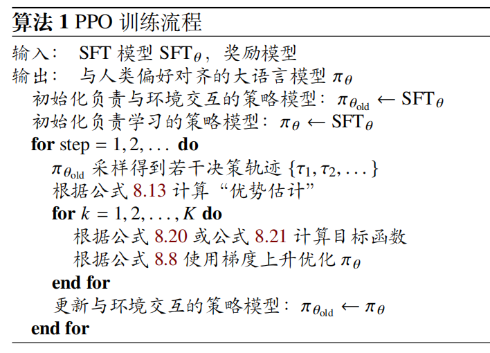

**RLHF详细训练流程：**
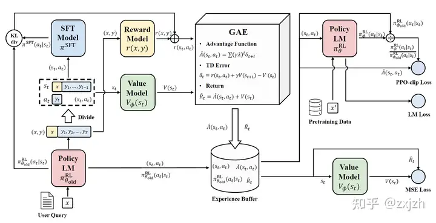

微调过程与PPO算法基本一致，详细介绍见：https://zhuanlan.zhihu.com/p/695258585

## RLHF优缺点
### 优点
在最近的研究中，相关研究发现 RLHF 在减少有害内容输出的同时，也能够有
效增强模型的综合能力。
- 在 RLHF 算法中，标注员主要为训练过程提供偏好标注数据，而不是直接生成示例数据，因此它可以**减少标注员之间的不一致**。
- 其次，与编写示例数据相比，偏好标注更为简单易行。**标注员甚至可以评估超出自己创作水平的模型输出质量，使得模型能够探索标注员能力之外的状态空间**，而不用受限于给定的教师示例。
- RLHF 通过对比模型的输出数据（区分“好”输出与“坏”输出）来指导大语言模型学习正确的生成策略，它**不再强迫大语言模型模仿教师的示例数据，因此可以缓解上述提到的 SFT 所导致的幻象问题**。
### 缺点
- RLHF也继承了经典强化学习算法的缺点，如**样本学习效率低和训练过程不稳定等问题**。
- RLHF 的过程通常会持续多轮，这是一个复杂的迭代优化过程，其中涉及了很多重要细节的设定（例如**提示选择、奖励模型训练、PPO的超参数设置以及训练过程中对超参数的调整**），都会影响整个模型的性能，对于精确的高效复现提出了较大挑战。
- 

## LLaMA-RLHF
尽管 InstructGPT 使用了一个较小的奖励模型（6B 参数的GPT-3 模型），使用更大的奖励模型（例如与原始模型尺寸相等或更大的模型）通常能够更好地判断模型输出质量，提供更准确的反馈信号。此外，**LLaMA-2 在训练过程中使用相同的检查点来初始化待对齐语言模型和奖励模型**，由于奖励模型与待对齐模型拥有相同的预训练知识，这一方法可以有效地**减少两者之间的信息不匹配问题**，加强模型对齐效果。
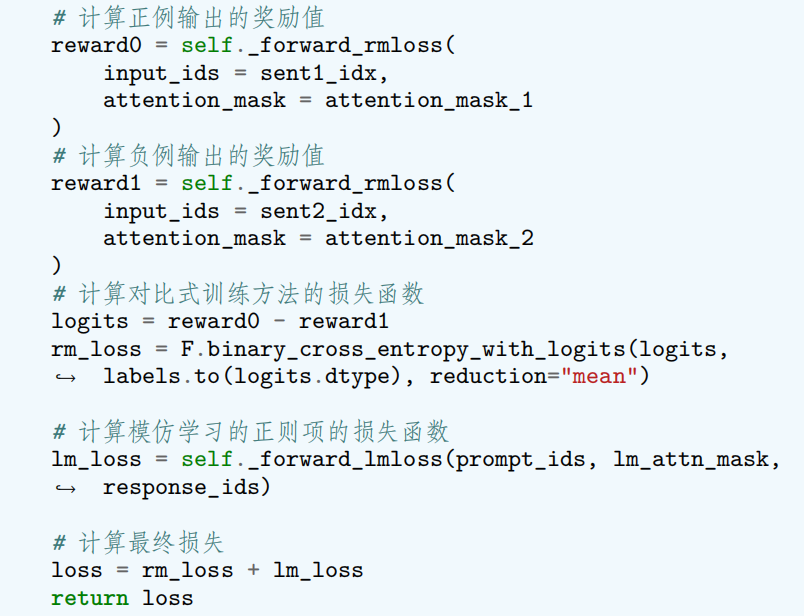
