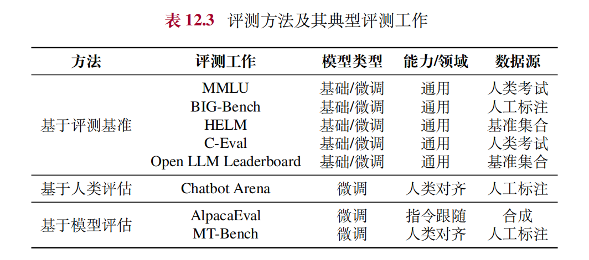
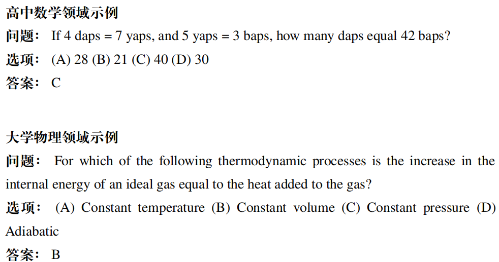
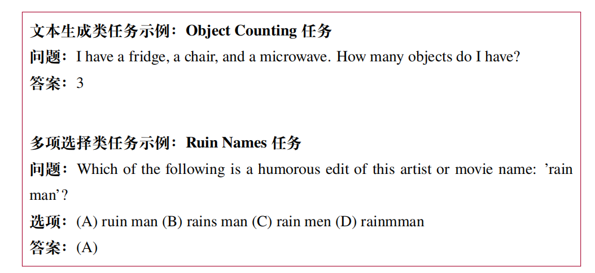
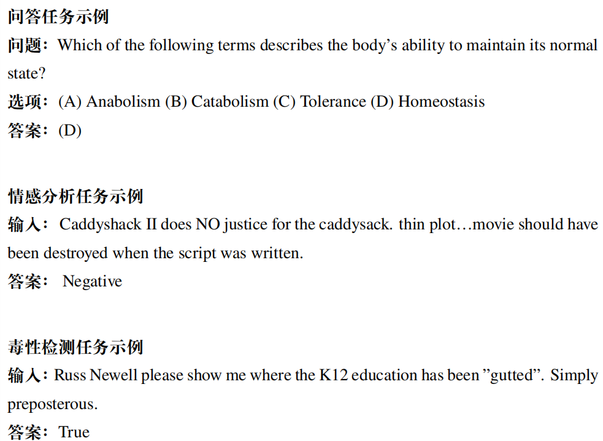
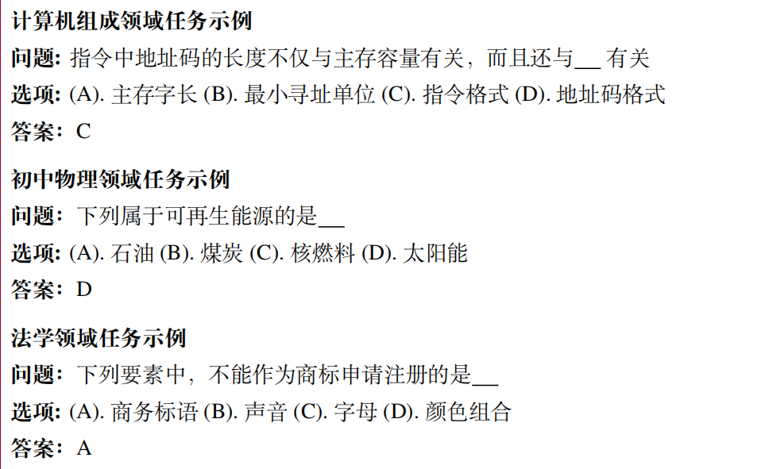
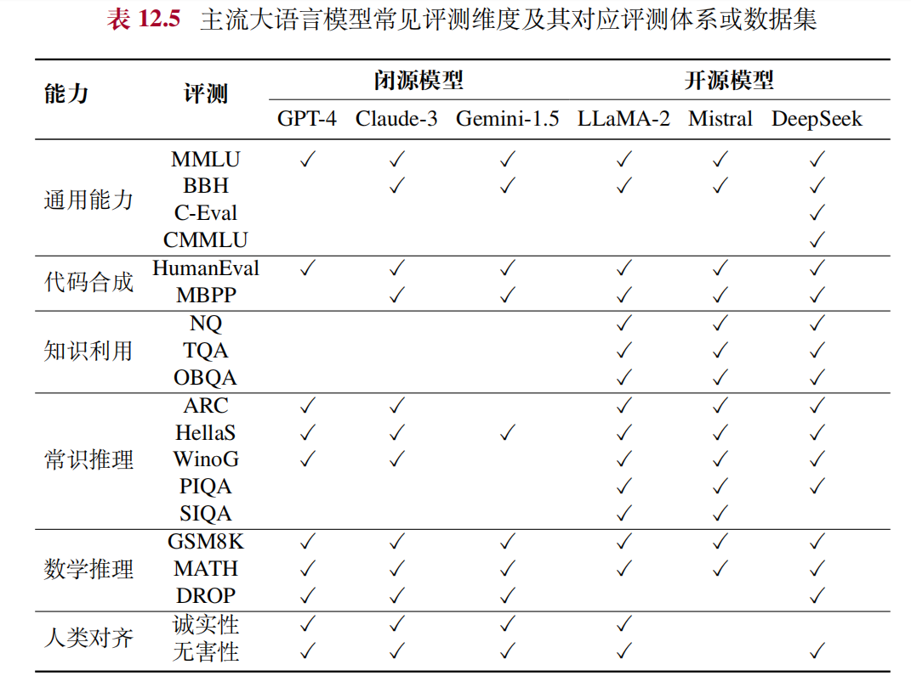

## LLM benchmark
根据评测方式的不同，针对上述能力维度的评估方法可以分为三种方式：**基于评测基准的方法、基于人类评估的方法和基于模型评估的方法。**

### 基于评测基准的方法
在评测基础大语言模型时，研究人员通常会采用一系列经典的评测数据集。这些数据集多以选择题等封闭式问题形式呈现，旨在全面评估模型的知识利用和推理能力。

**基于评测基准的模型评测流程:**
在进行基准评估时，我们首先将每个评测任务的具体样本转化为模型可以理解的提示语，引导模型生成相应的结果文本。然后，利用人工编写的规则或自动化脚本对生成的结果文本进行解析和处理，以提取出模型针对每个问题的预测答案。最后，将预测答案与真实答案进行对比，并借助准确率等定量指标来评估模型的性能。

### 基于人类评估的方法
与针对基础大语言模型的自动化评测不同，微调大语言模型的评测**更加注重模型在实际应用场景中的表现**，如与人类交互的自然度、对齐
度等。这类评测任务通常采用开放式指令或对话形式，并邀请人类评估员对模型生成的回复进行质量评估。评估员的评分方法主要有两种：**成对比较法(ELO)和单一评分法**。

### 基于模型的评测
一些研究工作**使用强大的闭源大语言模型（如 ChatGPT 和 GPT-4）来替代人类评估员，对微调大模型的输出进行自动评分或比较**。

作为人工评估的替代方案，基于模型的评测方法旨在**降低对于人工参与的依赖程度**，从而提升评估的效率与可扩展性。该方法旨在使用其他大语言模型对待评测文本进行自动化评测，从而能够高效地在开放性任务上对众多大语言模型进行批量评估与比较。此外，**部分性能先进的模型还能够给出相应的打分理由，进而增强评估结果的可解释性**。

## 公开综合评测体系
### MMLU
MMLU是一个综合性的大规模评测数据集，旨在**全面评估大语言模型在多个领域中的知识理解和应用能力**，包括人文科学、社会科学、自然科学和工程技术等。MMLU 设置了涵盖各种领域知识的 57 种子任务。这些子任务的难度不等，既有基础知识问题，也有高级问题挑战，从而能够**全面衡量模型在不同层次上的知识掌握情况**。由于涵盖的知识面极为广泛，MMLU 能够有效地检测出模型在哪些领域或知识点上存在不足。
在任务形式上，MMLU **采用选择题的形式**对模型能力进行检验，每个实例都包括一个问题和若干个候选项。模型需要根据任务描述和问题来预测各选项的概率，并选择概率最高的选项作为答案。
在评估设置方面，**该数据集通常采用少样本学习方式，在输入提示中加入 5 个示例数据**。在评测指标方面，主要采用平均准确率作为衡量标准。

示例：

### BIG-Bench
BIG-Bench是一个综合评测体系，旨在**从多个维度全面评估大语言模型的能力**。BIG-Bench 包含了 **204 个任务**，广泛涵盖了语言学、儿童发展、数学、常识推理、生物学、物理学、社会偏见、软件开发等多个领域，旨在全面反映模型在不同方面的综合能力。
为了降低评估成本和提高评估效率，研究人员进一步推出了一个轻量级的综合评测体系——**BIG-Bench Lite**。这个精简后的评测数据集包含了来自 BIG-Bench 的 **24 个多样且具有挑战性的评测任务**。
此外，为了探索大语言模型在处理挑战性任务时的局限性，研究人员进一步从 BIG-Bench 中挑选出**大语言模型表现逊色于人类水平的任务**，构建了 **BBH（BIG-Bench Hard）**，旨在推动模型能力的提升和突破。

在任务形式方面，BIG-Bench 主要采用了**文本生成与多项选择**两种类型。对于文本生成任务，该数据集支持常用的文本匹配指标，如BLEU、ROUGE 和精确匹配率等。而对于多项选择题任务，则通过计算平均准确率来反映模型的性能。BIG-Bench 还引入了**布莱尔分数**（Brier Score）来衡量模型预测选项概率与正确选项之间的一致性。这种评估方法能够**综合考虑模型对预测结果的置信度，从而提供更为细粒度的评估结果**。

示例：

### HELM
通过整合和扩展多个已有的评测数据集，HELM设计了一个全面而系统的评估体系。该综合评测体系采用了自顶向下的结构设计，首先确定核心场景和评估指标，然后根据这些场景和指标来选择合适的数据集和评估方式，从而**涵盖多种自然语言处理任务**，包括问答系统、信息检索、文本摘要、情感分析、有害信息检测等。
具体来说，HELM 包括了 **16 个核心场景和 7 类评估指标**。每个核心场景都由任务、领域和语言三个维度组成。
- **任务维度**指定了该场景下模型需要完成的**目标**，如信息检索、文本摘要等；
- **领域维度**指定了**数据所属的类别**，如新闻类、图书类；
- **语言维度**指定了**评测使用的语言**，在核心场景中仅包含英文及若干种英文方言。

HELM 所采用的 7 类评估指标包括**准确性、校准性、鲁棒性、公平
性、偏差、有害性和效率**。

示例：

### C-Eval
C-Eval是一个**专门为中文大语言模型设计的综合评测体系**，旨在为中文语言模型提供一个标准化、多层次的评估体系。C-Eval 的题目设计**涵盖了从初中到大学的不同难度级别**，包括初中、高中、大学和专业四个层次。同时，**题目内容也涉及了众多领域**，包括 STEM（科学、技术、工程和数学）、人类学、社会科学等多个领域，从而加强了评估的全面性和深入性。
为了进一步评估模型的推理能力，C-Eval 团队还推出了 **C-Eval Hard**，这是一组更具挑战性的数学、物理和化学题目集合，源自于高等数学、离散数学、概率统计、大学化学、大学物理以及高中阶段的数学、化学和物理课程等，**用于测试模型在解决复杂问题时的推理能力上限**。
在任务形式上，C-Eval 与 MMLU 类似，采用了**选择题**的形式。

示例：

## 主流大语言模型常见评测维度及其对应评测体系或数据集

## 公开评测资源选择参考
### 通用能力
为了评价模型的通用能力，主流模型通常会选用综合性的评测体系，例
如 **MMLU、BIG-Bench Hard** 等，这些评测体系主要面向英语任务进行。对于中文大语言模型，通常还会采用 **C-Eval、CMMLU**作为中文通用知识能力的评测体系。
此外，推理能力是评测的另一个关键维度。研发人员通常会采用数学推理数据集（如 **GSM8K、MATH 和 DROP 数据集**）来测试大语言模型的数学推理能力。

### 代码合成
很多工作针对模型的代码能力进行了专门的评测。研发人员通常选取 **HumanEval、MBPP** 数据集。这些数据集覆盖了从入门级到竞赛级不同难度的编程题目，并**配套了单元测试来自动化地检验代码的正确性**。

### 知识运用
目前常用的评测集合主要包括基于维基百科构建的**Natural Questions** 和 **TriviaQA** 数据集，可以有效测试模型对世界知识的掌握程度。进一步地，还可以在更为多样的场景下测试模型的常识理解能力，包括社会情境（**SIQA**数据集）、物理世界理解（**PIQA** 数据集）和科学常识（**ARC** 数据集）等。

### 人类对齐能力
研究者通常还会评价大语言模型的诚实性和无害性。一方面，闭源大语言模型的发布机构通常会基于内部构造的指令收集模型的回复，并进行细粒度人工评测。另一方面，开源大语言模型一般会采用公开评测数据集进行多维度评测，例如事实性幻象（**TruthfulQA**）、社会偏见（**WinoGender 和 CrowS-Pairs**）及有害性（**RealToxityPrompts**）等。

### 

