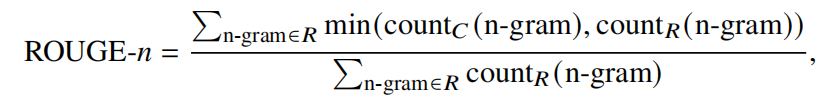

### 常见评测指标

#### 精确率，召回率，F1分数

- 精确率. 精确率表示模型**预测为正例的样本中真正为正例的比例**，其定义为：
$Precision =\frac{TP}{TP+FP}$ 
其中，TP表示真正例（True Positive），FP表示假正例（False Positive）。
- 召回率. 召回率表示**所有真正为正例的样本中被模型正确预测出来的比例**，其定义为：
$Recall =\frac{TP}{TP+FN}$
其中，FN表示假负例（False Negative）。
- F1 分数. F1 分数是精确率和召回率的调和平均数，用于衡量模型在分类任上的综合性能，其定义为：
$F1 = 2 ×\frac{Precision × Recall}{Precision + Recall}$

#### 困惑度
它通过计算给定文本序列概率的倒数的几何平均，来衡量模型对于语言
的建模能力。
困惑度越低，表示模型对于给定文本序列的概率估计越准确。
公式：

#### BLEU
BLEU（Bilingual Evaluation Understudy） **主要计算候选文本与参考文本的 𝑛 元组（𝑛-gram）共现频率**，评分结果在 [0, 1] 的区间内.
具体的计算方式如下所示：

1. $𝑤_𝑛$ 是 𝑛 元组的权重，用于调整不同长度的 𝑛 元组对最终评分的影响。**具体实践中，研究者通常设 𝑛 = 4，并平均分配 $𝑤_𝑛$**。
2. BP 表示长度惩罚因子，用于修正由于候选文本长度过短导致的评分偏差，其计算方式为：

3. $p_n$
   

#### $ROUGE-n$
ROUGE（Recall-Oriented Understudy for Gisting Evaluation）是另一种在机器翻译和文本摘要评估中广泛使用的指标。与 BLEU 不同，**ROUGE主要侧重于召回率**，即强调文本信息的**覆盖度**和完整性。

#### $ROUGE-L$
ROUGE-L 中的“L”代表**最长公共子序列**（Longest Common Subsequence, LCS），这是一种衡量两个序列相似性的方法。它可以不要求词组在文本中连续出现，因此能够更灵活地捕捉文本间的相似性。与基于 𝑛 元组的 ROUGE-𝑛 指标不同，ROUGE-L不是简单地计算固定长度的词组匹配，而是**寻找候选文本和参考文本之间的最长公共子序列**。
ROUGE-L 以 F1 分数计算，结合了精确率和召回率的信息。**精确率
衡量了候选文本中有多少内容是与参考文本相关的，而召回率则衡量了参考文本中有多少内容被候选文本所覆盖**。
具体计算公式如下：

#### Pass@𝑘
Pass@𝑘是由 OpenAI 在 **HumanEval** 数据集中提出的评测大语
言模型**代码合成（Code Synthesis）能力的指标**。具体来说,Pass@𝑘 的核心思想是**计算模型针对单个问题输入生成的 𝑘 个代码输出中，至少有一个代码能够通过验证的概率**。

然而，直接计算该指标需要对单个问题重复测试，并在每次测试中生
成 𝑘 个代码，**在k较大时会导致高昂的计算代价**。为了降低评估的计算复杂度，实现中通常**采用无偏估计的方式来近似计算** Pass@𝑘 的值，方法如下：
设定一个较小数$n(n<k)$,对每个问题进行n次解答，并记录成功次数c.
然后即可计算pass@𝑘的估计值：

#### ELO 
Elo 评分体系的核心思想是通过模型之间的成对比较来动态更新两个模型各自的评分。它的具体操作流程如下：
首先为每个模型分配一个初始的 Elo 分数，在进行模型比较时，根据两个模型当前的 Elo 分数，可以计算出它们各自的期望胜率，计算公式如下：

其中，$r_a$ 和 $r_b$ 分别表示模型 𝑎 和模型 𝑏 的 Elo 分数，然后，根据实际的比较结果更新模型的 Elo 分数。具体的更新公式如下所示：

其中，𝐾 是一个调整系数，决定了比较结果对于 Elo 分数更新的影响程度；$𝑆_𝐴$ 表示模型 A 在与模型 B 的比较中的实际得分（通常为 1 表示胜利，0.5 表示平局，0表示失败）；$E_𝐴$ 则是模型 A 的期望胜率。
