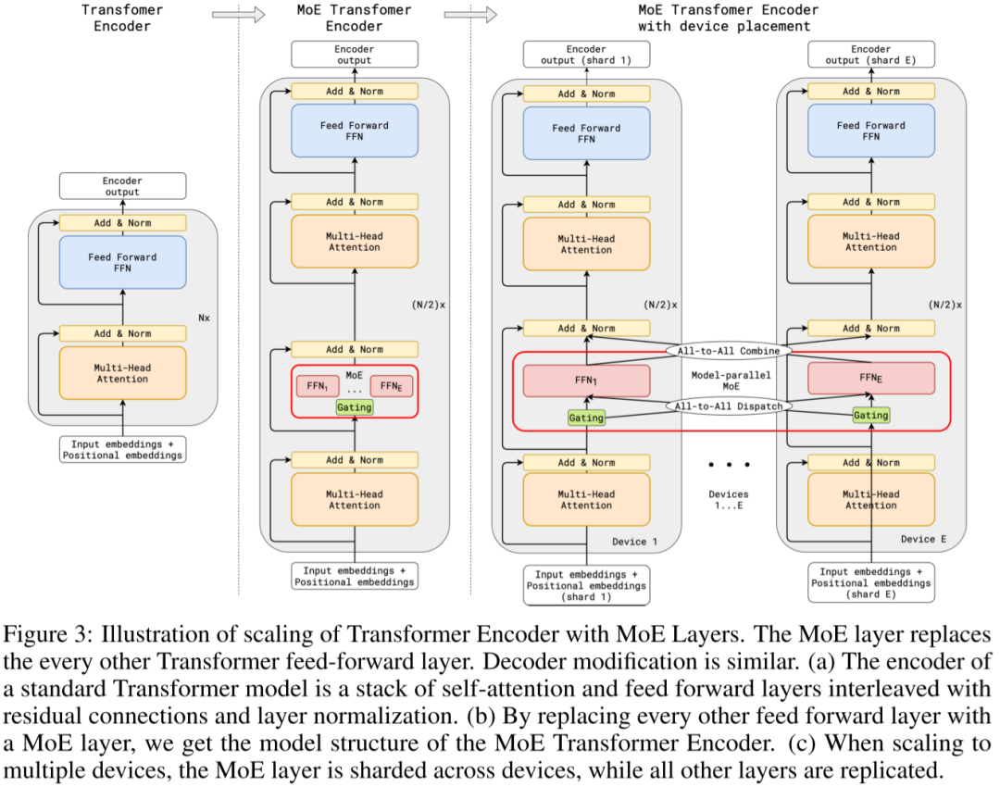

## Gshard
**paper:** GShard: Scaling Giant Models with Conditional Computation and Automatic Sharding
首次将MoE引入Transformer中.

## Gshard模型结构
GShard 将在编码器和解码器中的**每个前馈网络 (FFN) 层中的替换为使用 Top-2 门控的混合专家模型 (MoE) 层**。下图展示了编码器部分的结构。
这种架构**对于大规模计算非常有效**: **当扩展到多个设备时，MoE 层在不同设备间共享，而其他所有层则在每个设备上复制。**

为了保持负载平衡和训练效率，GShard 的作者除了引入了上一节中讨论的类似辅助损失外，还引入了一些关键变化:

- **随机路由:**在 Top-2 设置中，我们始终选择排名最高的专家，但**第二个专家是根据其权重比例随机选择的**。
- **专家容量:** 我们可以设定一个阈值，**定义一个专家能处理多少令牌。如果两个专家的容量都达到上限，令牌就会溢出**，并通过残差连接传递到下一层，或在某些情况下被完全丢弃。专家容量是 MoE 中最重要的概念之一。**为什么需要专家容量呢？因为所有张量的形状在编译时是静态确定的**，我们无法提前知道多少令牌会分配给每个专家，因此需要一个固定的容量因子。

GShard 的工作对**适用于 MoE 的并行计算模式**也做出了重要贡献。

