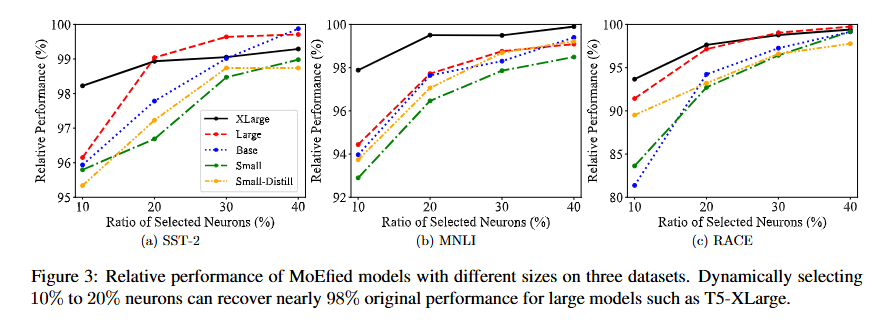

## MoEfication作用
作者研究了 Transformer 模型中 FFN 的激活模式，发现了一种**稀疏激活**现象，即**对于单个输入，只有极少部分神经元被激活(ReLU输出为正数)**。例如，当我们对一个拥有 7 亿个参数的微调 T5-Large 模型（Raffel 等，2020 年）进行推理时，**90% 的输入只能激活不到 5%的神经元**。这一现象类似于人脑中的稀疏性（Olshausen 和 Field，1996 年；Gross，2002 年），它推动了对人脑功能分区的研究（Garey，1999 年）。受这一观察结果的启发，作者进一步提出了一个问题：**人工神经模型（即预训练 Transformer 中的 FFNs）中是否也会出现功能分区**？
为了研究这个问题，作者探讨了能否**将 Transformer 转换为等效的专家混合物（MoE）模型**，该模型将 FFN 中的不同功能分区视为有条件激活的不同专家。特别地，作者提出 MoEfication 来发现 FFN 中的功能分区（专家），并建立选择专家的路由器。

## MoEfication方法
MoEfication 的总体思路分为两个阶段：专家构建和专家选择。

- **专家分割**：将 FFNs 分割成多个功能区作为专家，这里主要提供了两种方法。
  - 参数聚类分割：使用平衡 K-Means (Balanced K-Means) 算法对神经元向量做聚类。
  - 共激活图分割：构建共激活图 (Co-activation Graph)
- **专家选择**：这部分主要决定如何选择专家，这里没有使用典型的 MoE 门控网络，只是浅谈一下。
  - Groundtruth Selection：用贪婪算法计算每个专家的得分，然后选得分最高的专家。
  - Similarity Selection：用余弦距离做近似计算，选出最近似的
  - MLP Selection (推荐)：**训练多层感知器 (MLP)，预测每个专家中激活神经元的总和并将其作为得分**。

## 结果

MoEfication 对所有模型的效果都很好。MoEfied 模型使用了10%-30%的 FFN 参数，同时保持了 95% 以上的原始性能。大型模型可以使用更少的神经元来恢复原始性能。例如， **T5-XLarge 使用10%的神经元在 SST2 和 MNLI 上取得了近 98% 的相对性能**，而 T5-Small 使用 30% 至 40% 的神经元取得了相同的结果。这一结果与激活统计数据一致，即**更大的模型更稀疏**。

## 链接
**paper:** https://arxiv.org/abs/2110.01786 

