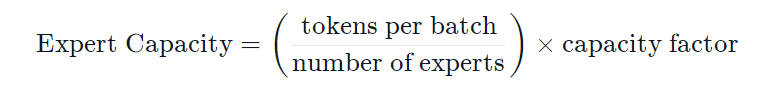
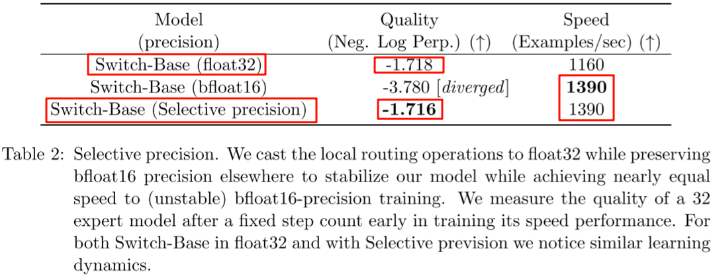
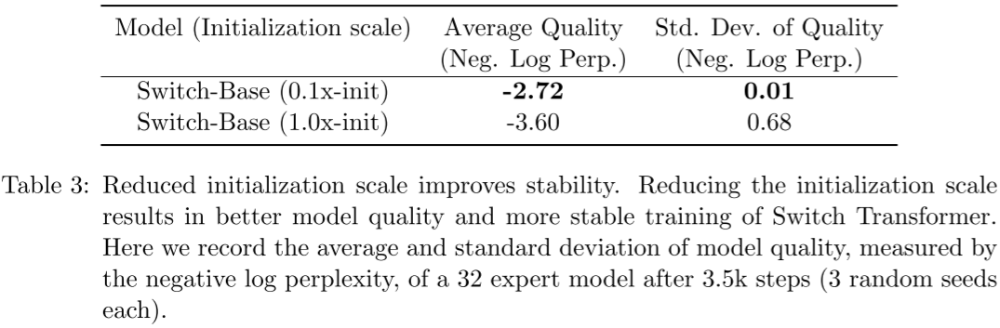
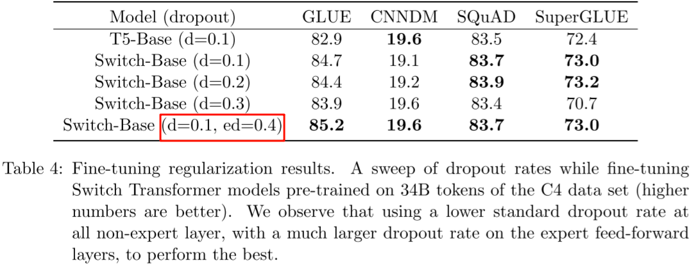

## Switch Transformers作用
尽管混合专家模型 (MoE) 显示出了很大的潜力，但它们**在训练和微调过程中存在稳定性问题**。Switch Transformers 是一项非常激动人心的工作，它深入研究了这些话题。
作者甚至在 Hugging Face 上发布了一个 1.6 万亿参数的 MoE，拥有 2048 个专家。Switch Transformers 实现了与 T5-XXL 相比 **4 倍的预训练速度提升**。

## Switch Transformers模型

就像在 GShard 中一样，作者用混合专家模型 (MoE) 层替换了前馈网络 (FFN) 层。Switch Transformers 提出了一个 Switch Transformer 层，**它接收两个输入 (两个不同的令牌) 并拥有四个专家**。

与最初使用至少两个专家的想法相反，Switch Transformers 采用了简化的**单专家策略**。这种方法的效果包括:
- 减少门控网络 (路由) 计算负担
- 每个专家的批量大小至少可以减半
- 降低通信成本
- 保持模型质量

### 专家容量

上述建议的容量是将批次中的令牌数量均匀分配到各个专家。如果我们使用大于 1 的容量因子，我们**为令牌分配不完全平衡时提供了一个缓冲**。增加容量因子会导致更高的设备间通信成本，因此这是一个需要考虑的权衡。特别值得注意的是，Switch Transformers 在低容量因子 (例如 **1 至 1.25**) 下表现出色。
为了更好地实现负载均衡，作者同样添加了**Load Balancing Loss**。

### 增强的训练和微调技巧
**Selective precision**：稀疏专家模型相比传统 Transformer 模型训练更加困难，由于每一层 Router 的存在，可能导致训练的不稳定性，此外 BF16 等低精度格式可能加剧 Router 中 Softmax 计算的问题。本文作者提出了在模型的局部部分选择性地转为 FP32 精度，可以实现很好的稳定性，而不会产生昂贵的 FP32 Tensor 通信成本。**具体来说，只在 Router 的内部使用 FP32 精度**。

**小的初始化参数有助于稳定性：**如下图所示，作者验证通过使用比较小的初始化参数可以获得更好的模型质量，并减小模型在训练早期的方差：

Dropout 正则化：当前的这些 Transformer 模型通常是在大规模语料库上进行预训练，然后在较小的下游任务上微调，而当微调数据集比较小时经常出现过拟合，而 Switch Transformer 这类 MoE 模型可能加剧过拟合的程度。为了缓解这一问题，作者增加了专家内部（FFN）的 Dropout 比例，称为专家 Dropout（Expert Dropout，ED）。然而，作者发现所有层增加 Dropout 率会导致性能更差；**作者发现，在非专家层使用较小的 Dropout 率可以缓解这一问题**：

## 学习资源
**blog:** https://blog.csdn.net/2401_84033492/article/details/139197263
**hf blog:** https://huggingface.co/blog/zh/moe