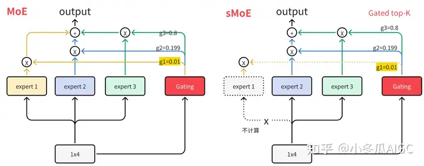
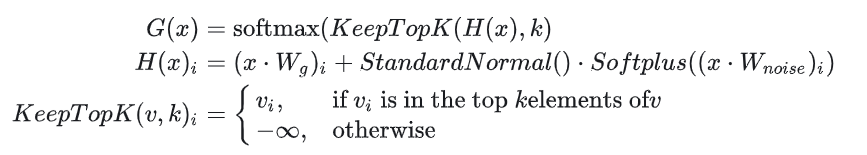
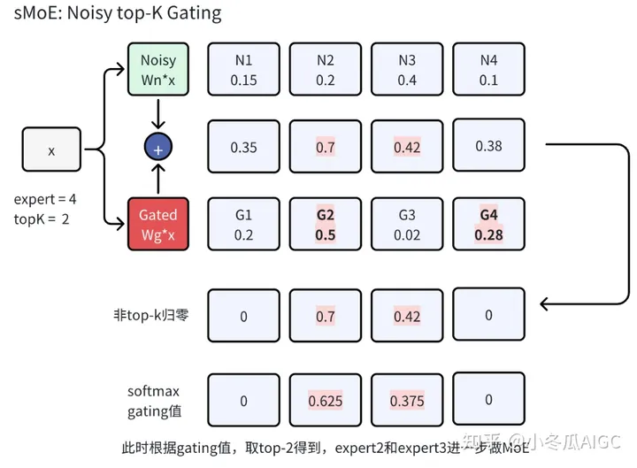
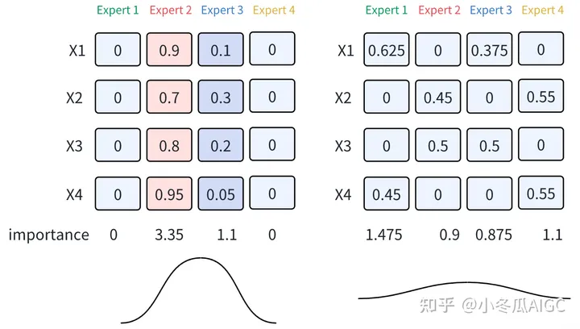
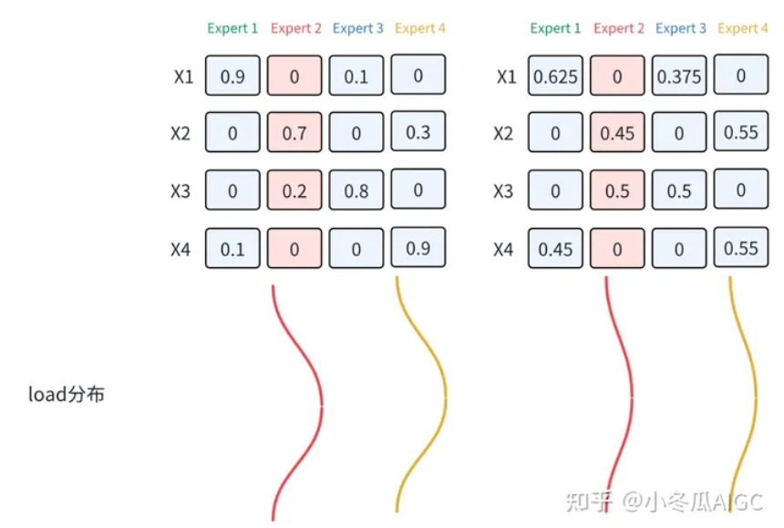
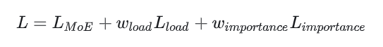

## sMoE 作用
paper: Outrageously Large Neural Networks: The **Sparsely-Gated Mixture-of-Experts** Layer Google Brain 2017

问题：MoE在网络变宽的情况下，能够实现多个专家输出的线性组合。如果有1000个专家，**其gating值经过softmax后，将存在非常多近0值的gating，此时会产生相应的稀疏性**。

动机：**sMoE在gating稀疏的情况下，取top-K的gating值对应的专家来计算mixture结果**，其计算流程发生了改变，只需要计算少数的expert.

优化：sMoE除了可以稀疏计算expert，其一个最大的特性可以**对gating网络做负载均衡(load balance)**, 避免少数几个expert有较大的权重。

## sMoE 算法
###  Noisy Top-k Gating

Noisy Top-k Gating 算法步骤如下：
1. 分别计算正常gate和noisy-gate的输出并相加，得到每个expect的得分$H(x).$
2. 保留top-k的H(x)值，其余的H(x)置为-inf.
3. 对H(x)进行softmax，得到新的gating值。
4. 对新的gating值进行加权求和，得到最终的输出。

其中noise 加在gating上，会增加一部分的随机性，并且w_noise参数是可学习的，只要**增加“负载均衡”的loss，便可使得gating网络在训练过程中保持均衡**。

### sMoE的Load Balancing问题

两种不均衡状态：
1. 横向：每个expert被选中的概率是均衡的，
   
2. 纵向：对于**单个expert在不同数据上**，我们期望noise的增加，能使得gating值的分布是平缓的，
   

**Load-Balancing Loss**：见 https://zhuanlan.zhihu.com/p/672726704

最终损失函数：

