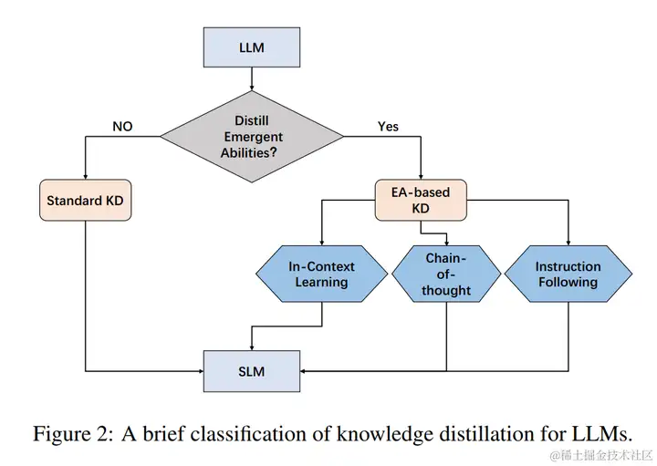
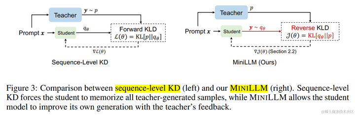

## 知识蒸馏简介
知识蒸馏是一种机器学习模型压缩方法，它用于将大型模型（教师模型）的知识迁移到较小的模型（学生模型）中。  
知识蒸馏（KD），也被称为教师-学生神经网络学习算法，是一种有价值的机器学习技术，旨在提高模型性能和泛化能力。  
它通过将知识从复杂的模型（称为教师模型）转移到更简单的模型（称为学生模型）来实现这一点。 
KD背后的核心思想是**将教师模型的综合知识转化为更精简、更有效的表示。**
## 将LLM作为教师模型的知识蒸馏方法
根据这些方法**是否将LLM的涌现能力（EA）提炼成小语言模型（SLM**）来对这些方法进行分类。 因此，我们将这些方法分为两个不同的类别：**标准 KD 和基于 EA 的 KD**。

### 标准知识蒸馏
Standard KD旨在使学生模型学习LLM所拥有的常见知识，如输出分布和特征信息。这种方法类似于传统的KD，但区别在于教师模型是LLM。 比如：MINILLM 和 GKD。
#### MINILLM
MINILLM （论文：Knowledge Distillation of Large Language Models）深入研究了白盒生成LLM的蒸馏。 **它观察到最小化前向 Kullback-Leibler 散度 (KLD) 的挑战（这可能会导致教师分布中不太可能的区域出现概率过高**，从而在自由运行生成过程中导致不可能的样本）。
为了解决这个问题，MINILLM 选择**最小化逆向 KLD**。 这种方法可以防止学生高估教师分布中的低概率区域，从而提高生成样本的质量。

#### GKD
GKD（论文：GKD: Generalized Knowledge Distillation for Auto-regressive Sequence Models） 探索了**自回归模型的蒸馏**，这里白盒生成 LLM 是一个子集。 
该方法确定了两个关键问题：**训练期间的输出序列与学生在部署期间生成的输出序列之间的分布不匹配，以及模型under-specification**，其中学生模型可能缺乏与教师分布相匹配的表达能力。
GKD 通过在训练期间**对学生的输出序列进行采样**来处理分布不匹配，它还通过优化替代散度（逆向 KL）来解决模型under-specification的问题。

### 基于涌现能力的知识蒸馏
基于 EA 的 KD 不仅仅迁移 LLM 的常识，还包括蒸馏他们的涌现能力。
涌现能力包含三个方面，包括**上下文学习 (ICL)、思维链 (CoT) 和指令遵循 (IF)**。
EA-based KD:

不仅仅是将LLM的常见知识转移到学生模型中，还涵盖了蒸馏它们独特的涌现能力。具体来说，EA-based KD又分为了上下文学习（ICL）、思维链（CoT）和指令跟随（IF）。

1.In-Context Learning：
- in-Context Learning distillation
2. Chain-of-Thought：
- MT-COT
- Fine-tune-CoT
- DISCO
- SCOTT
- SOCRATIC CoT
3.Instruction Following：
- Lion
https://www.zhihu.com/question/625415893/answer/3243565375
