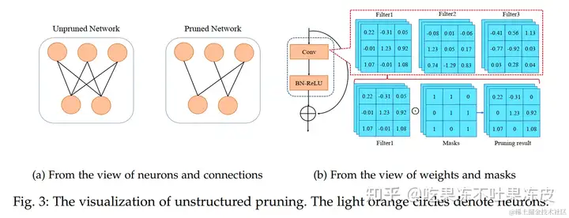
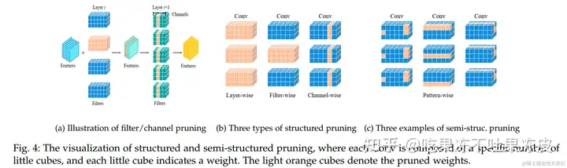
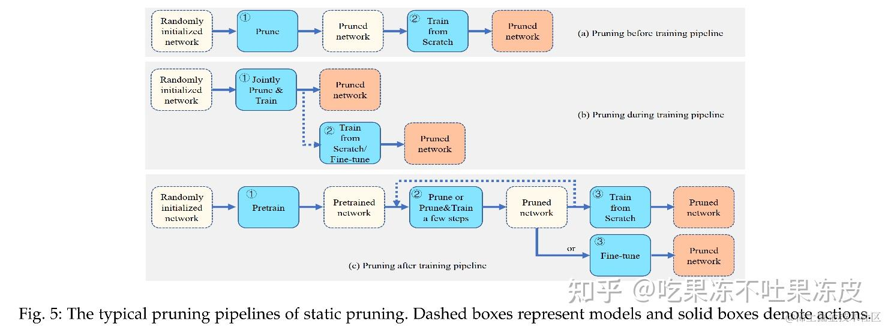
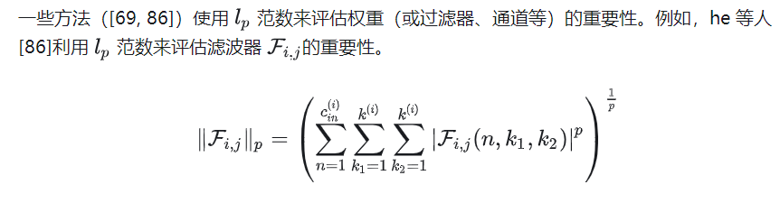

## 深度神经网络剪枝作用
深度神经网络的计算复杂性和内存占用使得它们在边缘设备上部署不切实际。近年来，随着大语言模型的流行，人们对具有灵活硬件要求的**计算机压缩神经网络**越来越感兴趣。
此外，包含冗余特征的深度神经网络可能会破坏其鲁棒性，从而**增加对抗性攻击的风险**。例如，这些网络创建的高维特征空间可以为对抗性攻击提供更大的入口点，从而削弱网络泛化到原始训练数据之外的能力。
为了缓解这个问题，研究人员提出了各种神经网络压缩技术来设计轻量级模型，包括神经网络剪枝（[17]）、权重矩阵的低秩分解（[18, 19]）、量化（[11, 20] ）、知识蒸馏（[21]）、神经架构搜索（[22, 23]）和其他压缩技术（[24, 25]）。其中，人们对神经网络剪枝的研究持续感兴趣，它已被证明是一种理想且有效的方法，**可以在推理时节省内存空间和计算时间，同时保持与神经网络相当甚至更好的性能**。

## 术语
- 剪枝率：剪枝率表示从密集网络中删除的权重（或通道、滤波器、神经元等）的百分比。一般来说，**可以通过两种方式确定：预先定义或学习决定**。

- 压缩比：[39, 40]中的压缩比被定义为原始权重数与保留的权重数的比率，但在[41]中它被定义为**保留的权重数与原始权重数的比率**。

- 稀疏率：稀疏率或稀疏度表示剪枝后网络中**零权重（或通道、滤波器、神经元等）的部分**[42, 43]。它等于[41]中的压缩比。

- 加速比：加速比定义为[12]中**剪枝后的FLOP数或[44]中的MAC数除以原始FLOP数或MAC数**。在[45]中，加速比是通过将一层中过滤器的剪枝数量除以该层中原始过滤器数量来计算的。

- 一次性剪枝：一次性剪枝，在[46]中也称为**单次剪枝，仅评分一次，然后将网络剪枝到目标剪枝率**[47, 48]。

- 迭代式剪枝：迭代式剪枝[10]，在[49]中也称为贪婪剪枝或预言剪枝，重复打分-剪枝-重新（score-prune-retrain）训练循环多轮，每一轮是一次迭代。

- 局部剪枝：局部剪枝通过将所有权重（或过滤器、通道等）细分为子集（例如层）然后删除每个子集的一定百分比来修剪网络[50]。

- 全局剪枝：与局部剪枝相反，全局剪枝从网络的所有可用结构中删除结构，直到达到特定的剪枝比率[50]。

- 动态剪枝：动态剪枝取决于特定的输入[51]，其中将为每个输入样本生成不同的子网络。

- 静态剪枝：与动态剪枝相反，静态剪枝的剪枝模型由不同样本共享[51]。换句话说，对于不同的输入，模型容量是固定的。

- 彩票假设：彩票假设（LTH）[47]指出**随机初始化的密集网络$f(x;w)$包含稀疏子网络$f(x;w⊙m)$，该子网络可以用原始权重进行训练以实现竞争性与原始网络相比的性能**。

- 中奖彩票：对于随机初始化的网络 f(x;w)，中奖彩票 f(x;w⊙m) 是其子网络，一旦经过 T epoch 的训练（即 f(x;w⊙m) 将匹配训练后网络 f(x; w) 在非平凡剪枝率下的性能[47]。

- 层坍塌：层坍塌是[39]中提到的一种现象，**当网络某一层的所有权重被移除时就会发生这种现象。它使网络无法训练**。哈尤等人[52]给出了这个问题的正式定义（即病态神经网络）。

- 权重倒带：权重倒带 [53] 将子网络的权重倒回到训练 w 中较早epoch的值，其中 t << T 。

- 学习率倒带：[40]中提出的学习率倒带，使用指定epoch数的学习率计划从最终值训练剩余的权重。

## 非结构化、半结构化和结构化剪枝
### 非结构化剪枝
也称为非结构化剪枝或权重剪枝，是最细粒度的剪枝，会删除神经网络中的某些权重。

在实践中，非结构化剪枝通常不会直接将权重设置为0，而是将其相应的掩码（或指标）m设置为0。在这种情况下，非结构化剪枝被视为对每个权重应用二进制掩码。
通常，网络使用固定掩码 m 进行重新训练（即微调或从头开始训练），并且掩码权重不参与重新训练。图3是通过删除神经元的连接（如上（a）所示）或用相应的掩码屏蔽权重（如上图（b）所示）进行权值剪枝。
由于它可以去除任何地方的权重，**非零权重的不规则替换导致实际加速需要特殊软件或硬件的支持**。因此，我们将非结构化剪枝归类为一种特定的加速技术。

### 结构化剪枝

结构化剪枝删除了整个过滤器、通道、神经元甚至层，如图 4（b）所示，并且可以重建具有规则结构的狭窄模型。它不需要特殊硬件和软件（例如稀疏卷积库）的支持，可以直接加速网络并减小神经网络的大小。此外，滤波器和通道剪枝可以认为是等效的，因为剪枝第i层中的滤波器相当于剪枝第i+1层中的相应通道，如上图（a）所示。

### 半结构化剪枝
**为了提高结构化剪枝的灵活性并在剪枝率较高时实现较低的精度下降**，一些最近的工作引入了半结构化剪枝，在中被称为基于模式的剪枝，以**同时实现高精度和结构规律性**。

可设计各种模式；一些例子如上图(c)所示。相反，全结构化剪枝（例如：通道或过滤器剪枝）被归类为粗粒度结构化剪枝，而半结构化剪枝被归类为细粒度结构化剪枝。例如，孟等人将一个过滤器视为多个stripes，并建议修剪每个过滤器中的stripes。然而，用于半结构化剪枝的模式需要仔细设计，以减轻性能下降并像非结构化剪枝一样进行特定的加速。

## 何时进行剪枝
### 训练前修剪（PBT）
PBT通常遵循两阶段：根据特定标准直接修剪未经训练的密集网络，然后训练稀疏网络至收敛以获得高性能，如图5（a）所示。第二步与静态稀疏训练相关，旨在在训练期间训练具有固定稀疏模式的稀疏网络。由于避免了耗时的预训练过程，PBT 方法在训练和推理时间上带来了相同的收益。

### 训练期间剪枝（PDT）
训练期间剪枝（PDT）一般以随机初始化的密集网络作为输入模型，通过在训练期间更新权重w和权重（或滤波器、通道）的掩码m来联合训练和剪枝神经网络。这些动态方案改变掩码并在 t 次迭代/历元后得到子网络。

我们将现有的主要解决方案总结为三个范式：
- （1）**基于稀疏正则化**
  稀疏正则化技术常用于 PDT 方法。这类方法从稠密网络开始，**对损失函数施加稀疏约束**，并且通常在训练期间将一些权重或其掩码归零。
- （2）基于动态稀疏训练 
  一类 PDT 方法采用随机初始化的稀疏网络而不是稠密网络作为输入模型。随后，**一种常见的方法是修剪一小部分不重要的权重，然后重新增长相同数量的新权重以调整稀疏架构**。这种方法通过在训练过程中重复剪枝-生长循环，不断寻找更好的稀疏架构，
- （3）基于分数
  一些 PDT 方法利用评分标准在训练期间剪枝网络。

### 训练后剪枝（PAT）
训练后剪枝（PAT）是最流行的剪枝流水线类型，因为人们普遍认为**预训练密集网络对于获得有效的子网络是必要的**。这类剪枝方法通常遵循**预训练-剪枝-再训练过程**。
#### LTH
彩票假设（LTH）是神经网络剪枝领域最有影响力的假设之一。给定一个预训练的网络，LTH 会根据权重的大小迭代地删除一定百分比的权重。修剪后，**剩余的权重从头开始重新训练原始初始化**，而不是随机重新初始化，以匹配原始网络的准确性。
#### 其他基于分数的方法
略
#### 基于稀疏正则化的方法
略
#### 无需再训练方法
与遵循预训练-剪枝-再训练过程的一般 PAT 方法相比，最近提出的训练后剪枝将三步过程简化为**预训练-剪枝**。它涉及**在不重新训练的情况下修剪预训练的模型 ，精度损失可以忽略不计**。这类剪枝方法对于十亿参数模型特别有吸引力，因为剪枝后重新训练此类剪枝模型仍然非常昂贵。

例如，Frantar 和 Alistarh 提出了一种称为 **SparseGPT** 的非结构化训练后剪枝方法。**通过将剪枝问题简化为近似稀疏性回归，作者将 GPT 系列模型剪枝为至少 50% 的稀疏度，且精度损失较小，无需重新训练**。据我们所知，这是第一个专门为 GPT 系列模型设计的剪枝方法。
Kwon等人提出了 **Transformers 的结构化训练后剪枝框架**，包括三个步骤：基于 Fisher 的掩模搜索、基于 Fisher 的掩模重排和掩模调整。**无需重新训练，该框架可以在 3 分钟内修剪一个 GPU 上的 Transformer**。

## 修剪标准
### 基于幅度的剪枝
它基于这样的假设：绝对值较小的权重往往对网络输出的影响最小。修剪掉绝对值小于设定阈值a的权重。
### $l_p$范数

### 敏感性和/或显著性
略
### 损失变化
略

## 大模型剪枝相关论文
结构化剪枝：
- LLM-Pruner(LLM-Pruner: On the Structural Pruning of Large Language Models)
- LLM-Shearing(Sheared LLaMA: Accelerating Language Model Pre-training via Structured Pruning)
非结构化剪枝：
- SparseGPT(SparseGPT: Massive Language Models Can be Accurately Pruned in One-Shot)
- LoRAPrune(LoRAPrune: Pruning Meets Low-Rank Parameter-Efficient Fine-Tuning)
- Wanda(A Simple and Effective Pruning Approach for Large Language Models)
- Flash-LLM(Flash-LLM: Enabling Cost-Effective and Highly-Efficient Large Generative Model Inference with Unstructured Sparsity)

**简介**：https://www.zhihu.com/question/652126515/answer/3457652467

  

