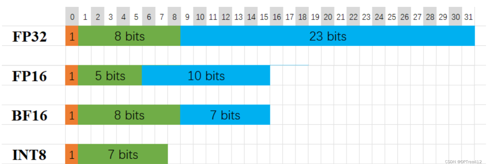
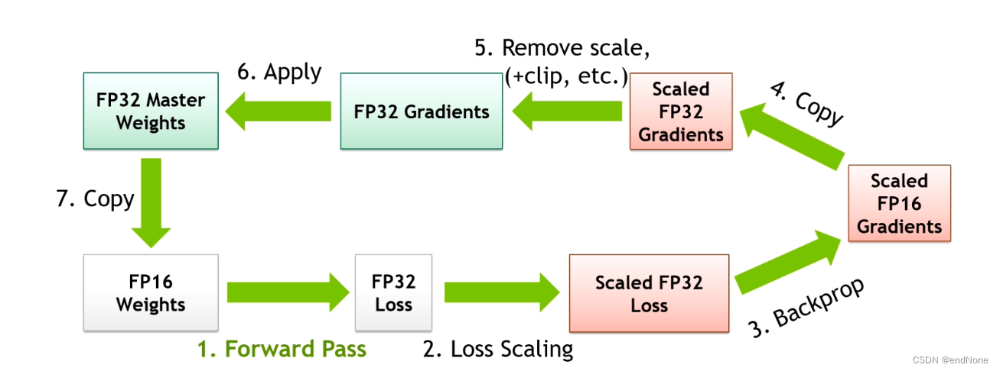

## Accuracy type

### 1. FP16
包含 1 位符号位、5 位指数位和 10 位尾数位，表示范围为 −65504 到 65504.

### 2. BF16
包含 1 位符号位、8 位指数位和 7 位尾数位，表示范围可以达到 $10^{38}$ 数量级.
**相比于 FP16，BF16 有着更大的数值范围，在大模型训练中被广泛使用**.
目主流的 GPU （例如英伟达 A100）都支持 16 位计算单元运算，因此混合精度训练能够被硬件很好地支持。
### 3. INT8
包含 1 位符号位和 7 位尾数位，表示范围可以达到 $10^{24}$ 数量级.

## 显存占用

## 混合精度训练

混合精度训练的流程如下：
- 前向传播：使用半精度（FP16）权重进行前向传播，计算模型的输出。
- 损失放大：计算单精度（FP32）的损失，并进行放大（scaling），以减少半精度计算中可能出现的数值下溢问题。
- 反向传播：基于放大的损失值进行反向传播，计算半精度（FP16）的梯度。
- 拷贝：将半精度梯度拷贝为单精度梯度。
- 去除放大效果：对单精度梯度去除之前的放大效果，并进行其他必要的调整（如梯度裁剪等）。
- 应用梯度：应用这些梯度来更新单精度的主权重。
- 拷贝权重：将更新后的单精度权重拷贝回半精度，用于下一轮的前向传播。

### 为什么大语言模型通常使用FP32精度训练
大型语言模型通常使用FP32（32位浮点）精度进行训练，因为其较高的数值精度可以带来更好的整体模型。以下是一些关键点：

- 较高的数值精度：FP32比如FP16（16位浮点）这样的低精度格式提供更高的数值精度。这种更高的精度可以在训练期间导致更准确的计算，从而产生更有效的模型。
- 稳定性：在像FP16这样的低精度格式中进行训练可能会引入**数值稳定性问题**。例如，梯度下溢或溢出的机会更高，优化器的计算精度较低，累加器超出数据类型的范围的风险更高。
- 兼容性：像PyTorch这样的深度学习框架带有内置的工具来处理FP16的限制，但即使有了这些安全检查，由于参数或梯度超出可用范围，大型训练工作常常失败。

然而，尽管有这些优势，FP32也带来了更大的内存和训练时间要求。为了缓解这些问题，经常使用混合精度训练。混合精度训练将一些训练操作放在FP16而不是FP32中。**在FP16中进行的操作需要较少的内存，并且在现代GPU上的处理速度可以比FP32快达8倍**。**尽管精度较低，但大多数在FP16中训练的模型没有显示任何可测量的性能下降**。

