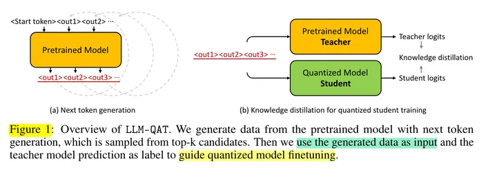
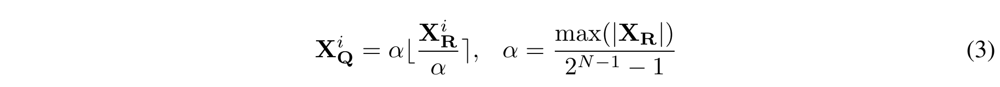
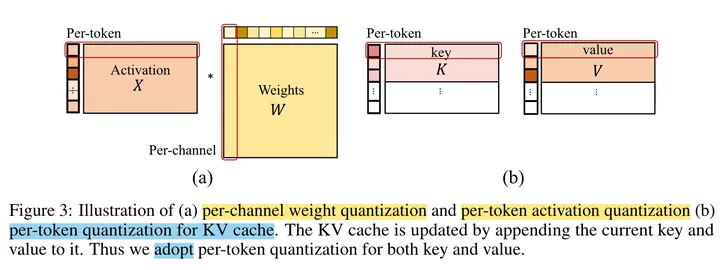
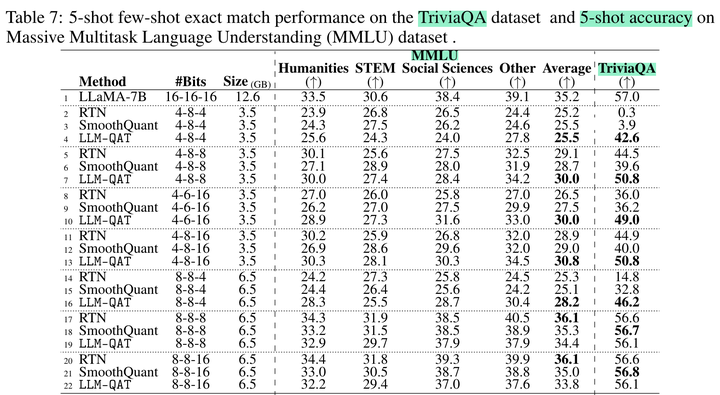

## LLM-QAT
当前最好的低于8比特的训练后量化方法会导致模型质量急剧下降。因此，对于更高的量化水平，作者发现**有必要使用量化感知训练（QAT）。**
针对大模型的量化感知训练并没有相关的研究，主要有两个原因：
- 第一，大模型的训练从技术上来说很困难，并且，对于算力资源要求比较集中。

- 第二，QAT需要训练数据，但是对于大模型来说，很难获取到这些训练数据。而预训练数据的庞大规模和多样性本身就是一个障碍。因此，数据的预处理也很困难；同时，由于法律的限制，有些数据可能根本不能使用。并且，多阶段的大模型训练（如：指令微调、RLHF）越来越普遍，这也导致在QAT过程中很难复现。

作者首次将 QAT 应用到 LLM，从而产生了第一个精确的 4 比特量化 LLM，我们还证实了在量化权重和激活时，同时量化 KV 缓存，这对于缓解长序列生成的吞吐量瓶颈至关重要。

## LLM-QAT
LLM-QAT 是一种量化感知训练方法，用于训练大模型。它通过在训练过程中引入量化噪声，使得模型能够更好地适应量化后的计算环境。LLM-QAT 的主要步骤如下：

### Data-free 蒸馏
为了将预训练数据的分布与有限数量的微调数据紧密的结合，本文提出了从原始预训练模型生成下一个 Token 数据的方法。

**从词汇表中随机化第一个Token：\<start>，并让预训练模型生成下一个Token：\<out1>，然后将生成的Token附加到起始Token以生成新的输出：\<out2>。 重复这个迭代过程，直到达到句子Token的结尾或最大生成长度。**

作者在下一个Token生成时测试三种不同的采样策略。 
最直接的方法是选择第 1 个候选者作为下一个Token。 然而，该策略生成的句子**缺乏多样性**，并且会循环重复几个Token。 为了解决这个问题，我们使用预训练模型的 SoftMax 输出作为概率，**从分布中随机采样下一个Token**。 这种采样策略会产生更加多样化的句子，并大大提高了微调学生模型的准确性。 此外，我们还发现最**初的几个Token在确定预测趋势方面起着至关重要的作用。 因此，对他们来说拥有更高的置信度很重要**。 在生成过程中，我们采用了混合采样策略，**针对前 3~5 个Token确定性地选择 top-1 预测，然后剩余的Token进行随机采样**。

### QAT
本文的作者研究了线性量化，即均匀量化。 根据实际值是否被截断（clipped），线性量化可以分为两类：**保留所有值范围的 MinMax 量化和基于截断（裁剪）的量化**。
过往研究发现，**在大语言模型（LLM）中，权重和激活都存在显著的异常值 。 这些异常值对量化过程有显著影响**，因为它们有助于增加量化步长，同时降低中间值的精度。
但事实证明，在量化过程中裁剪这些异常值不利于 LLM 的性能。
根据我们的分析和经验观察，我们为权重和激活选择对称 MinMax 量化，公式如下所示：

其中， XQ 表示量化后的权重或激活，XR 表示实际的权重或激活。 为了确保有效的量化，我们采用 per-token 激活量化和 per-channel 权重量化。

#### 键值缓存的量化感知训练：

在我们的研究中，我们证明了可以采用用于激活量化的类似量化感知训练方法来量化 KV 缓存。 如图 3 所示，我们在等式 3 中采用Per-token量化。 假设key和value是由token生成的。 在生成过程中，当前的key和value都会被量化，并存储它们对应的缩放因子。 在 QAT 的训练过程中，我们对 key 和 value 的整个激活张量进行量化，如图 2 所示。通过将量化函数集成到梯度计算中，确保使用量化的键值对进行有效的训练。

## 结果

