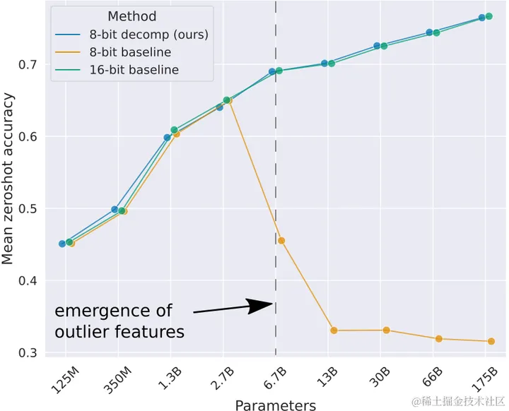

## LLM.int8()作用
作者发现激活中存在一些离群值，它们的绝对值明显更大；并且这些离群值分布在少量的几个特征中，称为**离群特征** (Emergent Features)。以激活$X \in R^{[T\times h]}$ 和权重$W \in R^{[h\times h_0]}$的矩阵相乘为例，特征维度就是指h这个维度。不论是 per-token（针对激活 x 而言：每行对应一个量化系数） 还是 per-channel （针对权重 w 而言：每列对应一个量化系数）量化，都会受到这些离群值的很大影响。**既然只有少量的特征包含离群值，LLM.in8() 的思路是把这些特征拿出来单独计算，只对剩余特征做量化。**

## LLM.int8()原理
LLM.int8()（论文：LLM.int8(): 8-bit Matrix Multiplication for Transformers at Scale）是一种采用混合精度分解的量化方法。该方案先做了一个矩阵分解，**对绝大部分权重和激活用8bit量化（vector-wise）。对离群特征的几个维度保留16bit，对其做高精度的矩阵乘法**。

LLM.int8() 通过三个步骤完成矩阵乘法计算:

1. 从输入的隐含状态中，按列提取异常值 (离群特征，即**大于某个阈值的值**)。
2. 对离群特征进行 FP16 矩阵运算，对非离群特征进行量化，做 INT8 矩阵运算；
3. 反量化非离群值的矩阵乘结果，并与离群值矩阵乘结果相加，获得最终的 FP16 结果。

## 结果

虽然 LLM.in8() 带来的**性能下降微乎其微**，但是这种分离计算的方式**拖慢了推理速度**。对于 BLOOM-176B，相比于 FP16，LLM.int8() 慢了大约 15% 到 23%；对于更小的模型（3B 和 11B），速度差距更为明显，LLM.int8() 慢了三倍以上。

离群值特征的数量相对于 C4 困惑度的降低严格单调增加，而与模型大小的关系是非单调的。 这表明模型的困惑度（perplexity）决定了相移，而不仅是模型的大小。 我们推测模型大小只是离散特征出现所需的众多协变量中的一个重要协变量。