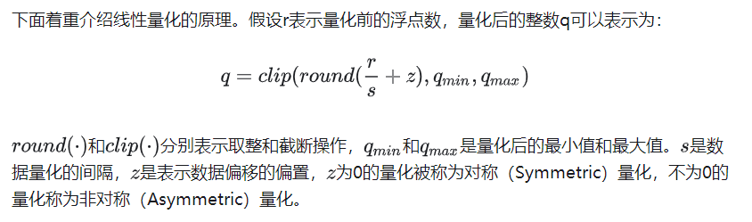
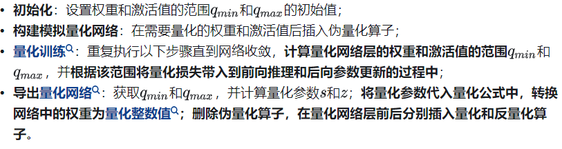
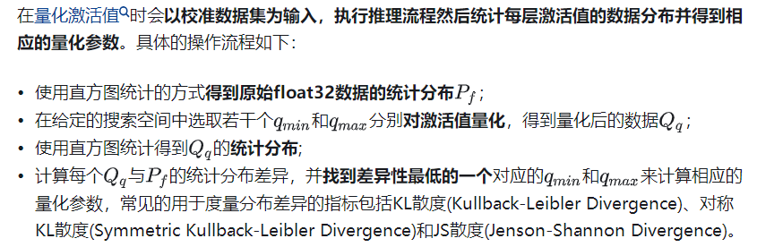

## 模型压缩
近年来，随着Transformer、MOE架构的提出，使得深度学习模型轻松突破上万亿规模参数，从而导致模型变得越来越大，因此，我们**需要一些大模型压缩技术来降低模型部署的成本，并提升模型的推理性能**。 模型压缩主要分为如下几类：  
- 剪枝（Pruning） 
- 知识蒸馏（Knowledge Distillation） 
- 量化Quantization）

## 量化比特 
计算机中不同数据类型的占用比特数及其表示的数据范围各不相同。可以根据实际业务需求将原模型量化成不同比特数的模型，**一般深度神经网络的模型用单精度浮点数(32 bit)表示**，如果能用有符号整数来近似原模型的参数，那么被量化的权重参数存储大小就可以降到原先的四分之一，用来量化的比特数越少，量化后的模型压缩率越高。  
工业界目前**最常用的量化位数是8比特**，低于8比特的量化被称为低比特量化。1比特是模型压缩的极限，可以将模型压缩为1/32，在推理时也可以使用高效的XNOR和BitCount位运算来提升推理速度。

## 量化对象 
模型量化的对象主要包括以下几个方面：  
- **权重（weight）**：weight的量化是最常规也是最常见的。量化weight可达到减少模型大小内存和占用空间。 
- **激活（activation）**：实际中激活值往往是占内存使用的大头，因此量化activation不仅可以大大减少内存占用。更重要的是，结合weight的量化可以充分利用整数计算获得性能提升。 
- **KV cache**：量化 KV 缓存对于提高长序列生成的吞吐量至关重要。 
- **梯度（Gradients）**：相对上面两者略微小众一些，因为主要用于训练。在训练深度学习模型时，梯度通常是浮点数，它主要作用是在分布式计算中减少通信开销，同时，也可以减少backward时的开销。

## 量化形式
根据量化数据表示的原始数据范围是否均匀，还可以将量化方法分为线性量化和非线性量化。实际的深度神经网络的权重和激活值通常是不均匀的，因此理论上使用非线性量化导致的精度损失更小，但**在实际推理中非线性量化的计算复杂度较高，通常使用线性量化**。
**线性量化：**

量化方法可以分为**逐层量化**、**逐通道量化**（per-token & per-channel 或者 vector-wise quantization ）和**逐组量化**（per-group、Group-wise）。  
- **逐层量化**（per-tensor），这是最简单的一种方式，也是范围最大的粒度。以一层网络为量化单位，**每层网络一组量化参数**；
- 逐通道量化，**以一层网络的每个量化通道为单位，每个通道单独使用一组量化参数**。逐通道量化由于量化粒度更细，能获得更高的量化精度，但计算也更复杂。 
  - per-token：针对激活 x 而言：**每行**对应一个量化系数。 
  - per-channel：针对权重 w 而言：**每列**对应一个量化系数。
- **逐组量化**以组为单位，每个group（比如：K 行（对于激活而言）或者 K 列（对于权重而言））使用一组s和z；**它的粒度处于 per-tensor 和 per-channel 之间**。比如：group_size=128对应一个量化系数，共有 ⌊T/group_size⌋ * ⌊C0/group_size⌋ 个。当 group_size=1 时，逐组量化与逐层量化等价；当 group_size=num_filters（如：dw（Depthwise）将卷积核变成单通道）时，逐组量化与逐通道量化等价。

权重和激活可以选择不同的量化粒度。譬如权重用 per-tensor，激活用 per-token。并且对于激活还有动态量化与静态量化之分。

## 量化分类
根据应用量化压缩模型的阶段，可以将模型量化分为：  
- **量化感知训练（Quantization Aware Training, QAT）**：在模型训练过程中加入伪量化算子，通过训练时统计输入输出的数据范围可以提升量化后模型的精度，适用于对模型精度要求较高的场景；其量化目标无缝地集成到模型的训练过程中。**这种方法使LLM在训练过程中适应低精度表示，增强其处理由量化引起的精度损失的能力**。这种适应旨在量化过程之后保持更高性能。 
- 量化感知微调（Quantization-Aware Fine-tuning，QAF）：在微调过程中对LLM进行量化。**主要目标是确保经过微调的LLM在量化为较低位宽后仍保持性能**。通过将量化感知整合到微调中，以在模型压缩和保持性能之间取得平衡。 
- 训练后量化（Post Training Quantization, PTQ）：在LLM训练完成后对其参数进行量化，**只需要少量校准数据，适用于追求高易用性和缺乏训练资源的场景**。主要目标是减少LLM的存储和计算复杂性，而无需对LLM架构进行修改或进行重新训练。PTQ的**主要优势在于其简单性和高效性**。但PTQ可能会在量化过程中引入一定程度的精度损失。

### 量化感知训练
量化感知训练是在训练过程中模拟量化，利用伪量化算子将量化带来的精度损失计入训练误差，使得优化器能在训练过程中尽量减少量化误差，得到更高的模型精度。量化感知训练的**具体流程如下**：

### 训练后量化
训练后量化也可以分成两种，权重量化和全量化。  
- 权重量化**仅量化模型的权重以压缩模型的大小**，在推理时将权重反量化为原始的float32数据，后续推理流程与普通的float32模型一致。**权重量化的好处是不需要校准数据集**，不需要实现量化算子，且模型的精度误差较小，由于实际推理使用的仍然是float32算子，所以推理性能不会提高。 
- **全量化不仅会量化模型的权重，还会量化模型的激活值，在模型推理时执行量化算子来加快模型的推理速度**。为了量化激活值，**需要用户提供一定数量的校准数据集用于统计每一层激活值的分布，并对量化后的算子做校准**。校准数据集可以来自训练数据集或者真实场景的输入数据，需要数量通常非常小。

## 大模型量化相关的一些工作。  
### 量化感知训练方法
- LLM-QAT

### 量化感知微调方法
- PEQA
- QLoRA

### 训练后量化方法
- 权重量化
  - LUT-GEMM
  - LLM.int8()
  - ZeroQuant
  - GPTQ
  - AWQ
  - OWQ
  - SpQR
- 全量化（权重和激活量化）
  - SmoothQuant
  - RPTQ
  - OliVe
  - Outlier Suppression+
  - ZeroQuant-FP