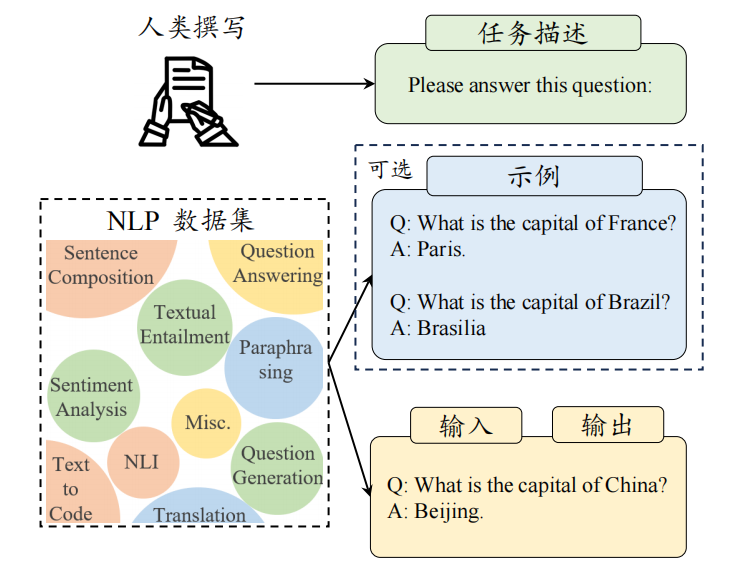
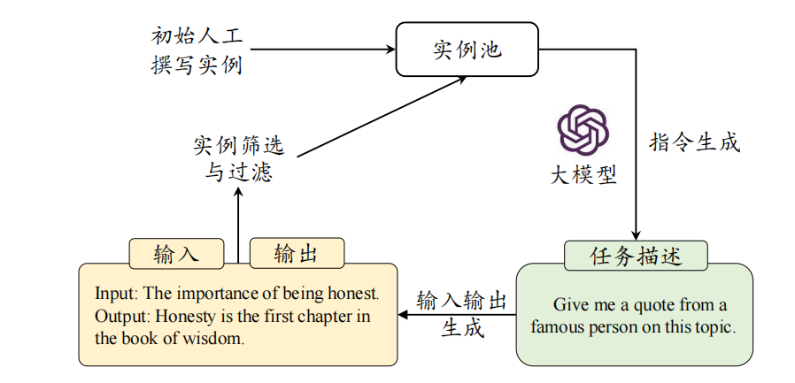
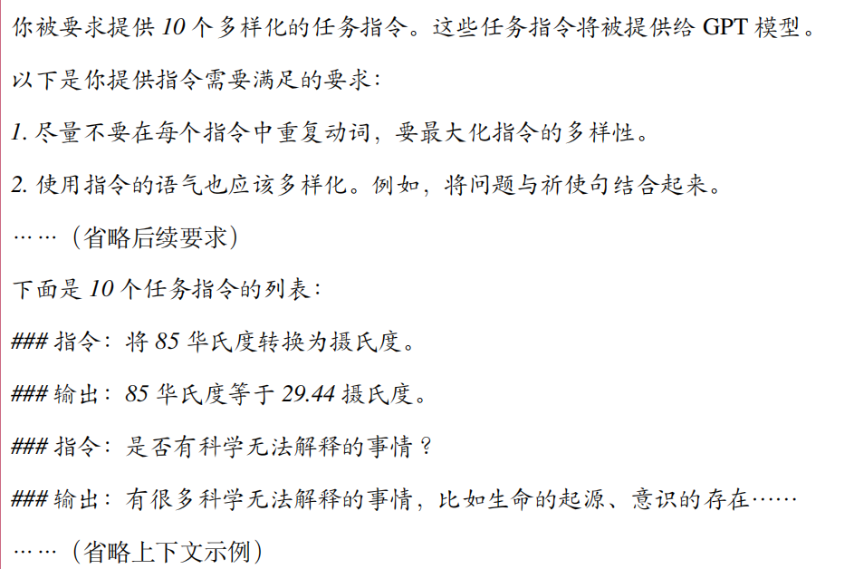
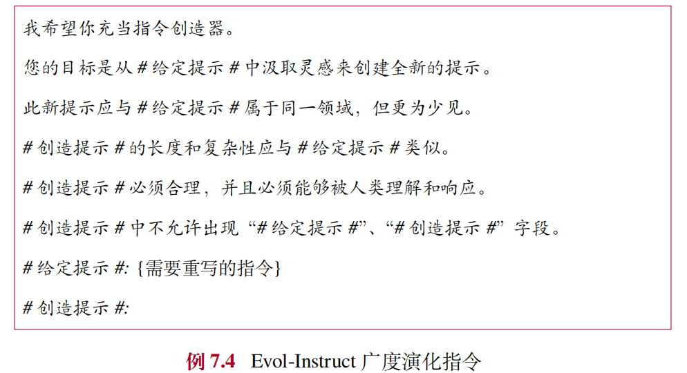

## SFT
指令微调（Instruction Tuning）是指使用**自然语言形式的数据对预训练后的大语言模型进行参数微调**,指令微调也被称为有监督微调（**Supervised Fine-tuning**）或多任务提示训练（Multitask Prompted Training）

指令微调过程需要首先**收集或构建指令化的实例**，然后通过有监督的方式对大语言模型的参数进行微调。

### SFT数据集
一般来说，一个经过指令格式化的数据实例包括**任务描述（也称为指令）**、**任务输入-任务输出**以及**可选的示例**。

#### 三种构建格式化指令数据的方法
1. 基于现有的 NLP 任务数据集构建
   在现有NLP数据集基础上，通过添加任务描述来构建指令数据集。
   
    经过 NLP 指令数据微调后，大语言模型可以学习到**指令遵循（Instruction Following）的能力**，进而能够解决其他未见过的 NLP 任务 。
    相关研究表明在现有 NLP 数据集的输入-输出数据中添加合适的任务描述是提升大模型指令跟随能力的关键因素；**如果去除了这些任务描述，仅使用输入-输出数据对模型进行微调，模型的性能会出现显著下降**
    谷歌的研究人员按照一定的比例混合了 FLAN、P3、Super Natural Instructions这三个数据集合和思维链数据，推出了包含约 **20M 条实例的指令微调数据集合 FLAN v2**，该数据集合目前是**面向 NLP 任务微调大模型的首选指令集合**。

2. 基于日常对话数据构建
   尽管通过指令格式化已有的 NLP 数据集能够获得大量的指令数据实例，但是这些数据的**多样性比较局限，与人类的真实需求也不能很好匹配**。为此，研究人员开始使用**用户在日常对话中的实际需求作为任务描述**。
   例如，InstructGPT将用户提交给 OpenAI API 的查询作为任务描述。由于这些用户查询源自于真实应用场景，均采用自然语言形式进行表达，因此特别适合大模型学习指令跟随能力。为了进一步增加任务的多样性，OpenAI 还雇佣标注者创作更多的真实生活任务，包括开放式生成、开放式问答、头脑风暴等任务，然后**由另一组标注者来回答这些问题作为输出**。
   为了推动指令微调数据集的开放共享，最近研究人员创建并且开源了一些常见的日常对话任务指令集，例如**Dolly和OpenAssistant** ，这些数据均由**人工精心标注**，因此具有较高的质量。此外，研究人员还尝试通过自行构建的开放平台收集大量的用户对话请求作为输入数据，并**使用 ChatGPT 或 GPT-4 生成回复作为输出数据**。其中，一个代表性的数据集是来自于 **ShareGPT**的多轮对话数据。

3. 基于合成数据构建
   为了减轻人工收集与标注数据的负担，研究人员进一步提出半自动化的数据合成方法。他们**借助已有的高质量指令数据作为上下文学习示例输入大语言模型，进而生成大量多样化的任务描述和输入-输出数据**。
   - Self-Instruct
   Self-Instruct方法借助大语言模型（例如 ChatGPT）所具备的数据合成能力，通过迭代的方法高效地生成大量的指令微调数据。作为初始任务池，该方法首先构建了 175 条高质量且多样的指令数据，之后经由两个主要步骤生成指令微调数据。
   
   指令数据生成. 从任务池中**随机选取少量指令数据作为示例，并针对 ChatGPT 设计精细指令来提示模型生成新的微调数据**。
   输入提示词模版：
   
   得到结果后需要进行过滤与后处理. 该步骤的主要目的是**剔除低质量或者重复的生成实例，从而保证指令数据的多样性与有效性**。常见的过滤方法包括：去除与任务池中指令相似度过高的指令、语言模型难以生成回复的指令、过长或过短的指令以及输入或输出存在重复的实例。
   Self-Instruct 目前已经成为一种合成指令的基础方法，原始论文使用 GPT-3 合成了 Self-Instruct-52K 数据集，Alpaca 进一步使用了能力更强的 text-davinci-003 合成了 **Alpaca-52K** 数据集，之后研究人员陆续采用了更强大的模型（例如GPT-4）来合成各种语言、各种领域的指令数据。
   - Evol-Instruct
   Evol-Instruct基于初始指令数据集（例如，Alpaca 指令数据集）进行扩展，主要包含两个步骤：
   （1）**指令演化**. 在该步骤中，大语言模型作为指令演化器，针对两个不同的方向进行指令的拓展，分别为**深度演化和广度演化**。深度演化通过五种特定类型的提示（**添加约束、深化、具体化、增加推理步骤以及使输入复杂化**）使得指令变得更加复杂与困难；而**广度演化旨在扩充指令主题范围、指令涉及的能力范围以及整体数据集的多样性**。
   
   （2）数据后处理. 该阶段将**去除部分实例数据以保证数据集合的整体质量和多样性**。主要使用了如下的规则进行处理：使用 ChatGPT 比较演化前后的指令，移除 ChatGPT 认为差异很小的指令；移除大模型难以响应的指令，如响应中包含“sorry”或响应长度过短；移除仅包含标点符号和连词的指令或回复。

### 指令微调的作用
- 整体任务性能改进：
  指令微调旨在使用人工构建的指令数据对于大语言模型进一步训练，从而增强或解锁大语言模型的能力 。相关研究表明，**不同规模（参数量规模从 77M 到 540B）、不同架构、不同预训练目标、不同模型微调方法的语言模型都可以从指令微调中受益**。同时，与预训练相比，指令微调的成本显著降低，大模型**所需的指令数据量仅为预训练阶段的约万分之一甚至更少**。
- 任务求解能力增强
  通过指令微调，大模型能够获得较好的指令遵循与任务求解能力，**无需下游任务的训练样本或者示例就可以解决训练中未见过的任务**。指令微调还可以缓解预训练阶段大模型会出现的一些常见问题，例如生成重复内容或者仅仅补全输入而不解决相关任务。
- 领域专业化适配
  通用的大语言模型在特定领域中（如医学、法律和金融等）的表现与领域专用模型的效果仍有一定差距。在实际应用中，**可以针对大语言模型进行面向特定领域的指令微调，从而使之能够适配下游的任务**。以医学领域为例，研究人员提出使用医学数据集对 FLAN-PaLM 进行微调，得到了医学知识助手模型 Med-PaLM ，其性能水平可与专业临床医生相媲美。

### 指令微调的训练策略
#### 优化设置
- 目标函数
  指令微调可以被视为一个有监督的训练过程，通常采用的目标函数为序列到序列损失，**仅在输出部分计算损失，而不计算输入部分的损失**。
- 批次大小和学习率
  指令微调阶段通常**只需要使用较小的批次大小和学习率对模型进行小幅度的调整**。例如 InstructGPT (175B) 微调的批次大小为 8，学习率恒定为 $5.03×10^{−6}$；Alpaca (7B) 微调的批次大小为 128，学习率预热到 $2 × 10^{−5}$，然后采用余弦衰减策略。
- 多轮对话数据的高效训练
  在因果解码器架构中，由于输入输出没有明显的分界，可以将所有一个对话的多轮内容一次性输入模型，**通过设计损失掩码来实现仅针对每轮对话的模型输出部分进行损失计算，从而显著减少重复前缀计算的开销**。如例 7.1 所示，多轮对话涉及多次用户输入和模型的输出，但是训练中仅需要在模型的输出上计算损失。

#### 数据组织策略
三种常用的数据组织策略如下：
1. 平衡数据分布
   现有的单一指令数据集通常只能增强大语言模型某些方面的能力，而无法提升模型的全方位能力。因此，研究者通常建议混合使用现有的多个指令数据集，以此来实现模型能力的综合改进。**最常见的方法是样本比例混合策略，即把所有数据集进行合并，然后从混合数据集中等概率采样每个实例**。
   研究者建议**混合使用 NLP 任务数据（如 FLAN v2）、对话数据（如ShareGPT）和合成数据（如 GPT4-Alpaca）**，来进行大模型的指令微调。

2. 多阶段指令数据微调
   **首先使用大规模 NLP 任务指令数据对模型进行微调，然后再使用相对多样的日常对话指令和合成指令进一步微调**。为了避免能力遗忘问题，可以在第二阶段中添加一些 NLP 指令数据。

3. 结合预训练数据与指令微调数据
   为了使得微调过程更加有效和稳定，可以**在指令微调期间引入了预训练数据和任务**，这可以看作是对于指令微调的**正则化**。
   OPT-IML 在指令微调阶段引入了 **5%** 的预训练数据，在分类和生成任务上都能取得增益；
   GLM-130B 的预训练过程**由 95% 的传统自监督预训练和 5% 的指令微调任务混合组成**。
   MiniCPM 提出在预训练阶段和指令微调阶段之间**添加一个“退火阶段”，该阶段混合使用高质量的预训练数据和指令微调数据**，其实验结果表明该策略优于先预训练再指令微调的两阶段策略。

