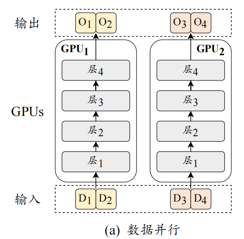
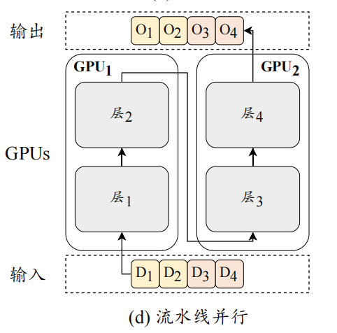
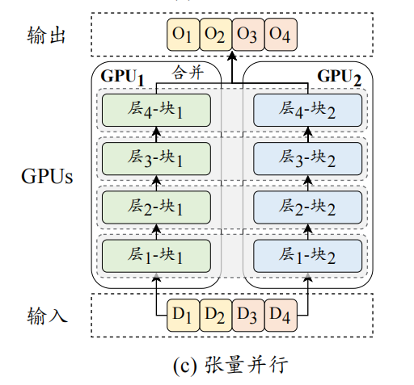
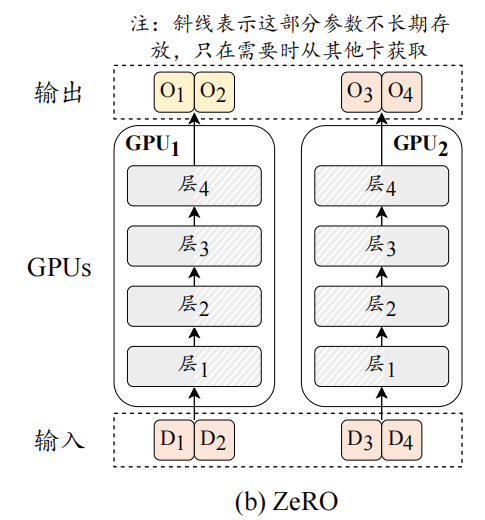

## 3D 并行
3D 并行策略实际上是三种常用的并行训练技术的组合，即**数据并行（Data Parallelism）、流水线并行（Pipeline Parallelism）和张量并行（Tensor Parallelism）**。
有的工作也会使用模型并行一词，通常有两种类型的模型并行：张量并行和流水线并行。
- 张量并行是在一个操作中进行并行计算，如：矩阵-矩阵乘法。
- 流水线并行是在各层之间进行并行计算。
因此，从另一个角度来看，张量并行可以被看作是层内并行，流水线并行可以被看作是层间并行。

### 数据并行

数据并行是一种提高训练吞吐量的方法，它**将模型参数和优化器状态复制到多个 GPU 上，然后将训练数据平均分配到这些 GPU 上**。这样，每个GPU 只需要处理分配给它的数据，然后执行前向传播和反向传播以获取梯度。当所有 GPU 都执行完毕后，该策略会将不同 GPU 的梯度进行平均，以得到整体的梯度来统一更新所有 GPU 上的模型参数。

鉴于梯度计算在不同 GPU 上的独立性，数据并行机制展现出高度的可扩展性，可以通过增加 GPU 数量来提高训练效率。数据并行技术的实现相对简便，目前多数深度学习库均已内置了对数据并行策略的支持，例如 TensorFlow 和 PyTorch。

### 流水线并行

流水线并行旨在将大语言模型不同层的参数分配到不同的GPU 上。在实践中，可以将 Transformer 连续的层加载到同一 GPU 上，以减少GPU 之间传输隐藏状态或梯度的成本。
朴素的流水线调度并不能达到真正的并行效果。以上图为例，1 号 GPU 在前向传播后需要等待 2 号 GPU反向传播的结果才能进行梯度传播，因此整个流程是“1 号前向-2 号前向-2 号反向-1 号反向”的串行操作，大大降低了 GPU 的利用率。为了解决这一问题，**流水线并行通常需要配合梯度累积（Gradient Accumulation）技术进行优化**。在流水线并行中使用了梯度累积后，1 号卡前向传播完第一个批次后，便可以不用等待，继续传播第二个和后续的批次，从而提高了流水线的效率。

### 张量并行

张量并行与流水线并行是两种将大模型参数加载到多个 GPU 上的训练技术。流水线并行侧重于将模型的不同层分配到不同的 GPU 上。相较之下，**张量并行的分配粒度更细，它进一步分解了模型的参数张量（即参数矩阵）**，以便更高效地利用多个 GPU 的并行计算能力。

具体地，**对于大语言模型中的某个矩阵乘法操作 𝑾𝑯，参数矩阵 𝑾 可以按列分成两个子矩阵 $𝑾_1$ 和 $𝑾_2$，进而原式可以表示为$[𝑾_1𝑯, 𝑾_2𝑯]$**。然后，可以将参数矩阵 $𝑾_1$ 和 $𝑾_2$ 放置在两张不同的 GPU上，然后并行地执行两个矩阵乘法操作，最后通过跨 GPU 通信将两个 GPU 的输出组合成最终结果。
常见的张量并行策略是分解模型注意力层的 $𝑾_𝑄，𝑾_𝐾，𝑾_𝑉，
𝑾_𝑂 $矩阵参数和前馈网络层的 $𝑾_𝑈，𝑾_𝐷$ 矩阵参数。
目前，张量并行已经在多个开源库中得到支持，例如 **Megatron-LM** 支持对参数矩阵按行按列分块进行张量并行。

## 零冗余优化器

零冗余优化器（**Zero Redundancy Optimizer, ZeRO**）技术由 DeepSpeed 代码库提出，**主要用于解决数据并行中的模型冗余问题**，即每张 GPU 均需要复制一份模型参数。在上图中可以看到，数据并行时每个 GPU 都需要存储大语言模型的相同副本，包括模型参数和优化器参数等。**对于每个 GPU，在模型传播到某一层时，其他层的模型和优化器参数并不参数计算，这导致了严重的显存冗余现象，同时也限制了每个 GPU 可以支持的前向传播数据量，降低了训练效率**。
为了解决这个问题，**ZeRO 技术仅在每个 GPU 上保留部分模型参数和优化器参数，当需要时再从其它 GPU 中读取**。如图上所示，模型被均分在两张 GPU 上，当需要使用第一层计算时，两张卡分别从对方获取相应的模型参数进行计算，**使用完之后便可以释放相应显存，从而降低了显存冗余度**。
ZeRO 有三种划分模型参数和优化器参数的方案，
- ZeRO-1 : 对优化器状态分片（Optimizer States Sharding）
- ZeRO-2 : 对优化器状态和梯度分片（Optimizer States & Gradients Sharding）
- ZeRO-3 : 对优化器状态、梯度分片以及模型权重参数分片（Optimizer States & Gradients & Parameters Sharding）
PyTorch 中也实现了与 ZeRO 相似的技术，称为完全分片数据并行（Fully Sharded Data Parallel, FSDP）。

## 激活重计算
激活重计算（Activation Recomputation），也称为**梯度检查点**（Gradient Check-pointing），是一种用于优化反向传播时显存占用的技术。
具体来说，给定一个待优化函数 𝒀 = 𝑿𝑾，在反向传播时需要 𝑿 的值才能计算 𝑾 的导数，所以在前向传播时需要保留这些 𝑿（通常被称为激活值）。然而，保存每一层所有的激活值需要占用大量的显存资源。因此，**激活重计算技术在前向传播期间仅保留部分的激活值，然后在反向传播时重新计算这些激活值，以达到节约显存的目的，但是同时也会引入额外的计算开销**。
在大语言模型的训练过程中，激活重计算的常见方法是**将Transformer 的每一层的输入保存下来，然后在反向传播时计算对应层内的激活值**.

