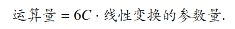
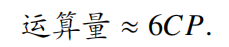
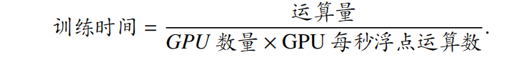

## 1.参数量计算
以LLaMA为例：
假设词表大小为 𝑉，模型包含 𝐿 层解码器，中间状态的维度大小为 𝐻，前馈网络层的中间状态维度大小为 𝐻′。我们主要关注计算以下几个部分的参数量：
- **输入嵌入层.** 首先，输入嵌入层（$𝑬 ∈ R^{𝑉×𝐻}$）将词表中的每个单词映射到一个 𝐻 维的向量，因此输入编码层有 𝑉𝐻 个参数。
- **多头注意力层.** 传统的注意力机制部分包含查询（$𝑾_𝑄 ∈ R^{𝐻×𝐻}$）、键（$𝑾_K ∈ R^{𝐻×𝐻}$）和值（$𝑾_V ∈ R^{𝐻×𝐻}$）的线性变换矩阵，每个变换矩阵都包含 $𝐻^2$ 个参数，所以这部分需要 $3 × 𝐻^2$ 个参数。同时还需要一个额外的线性变换来将多头注意力机制的输出拼接后映射成最终输出（$𝑾_𝑂 ∈ R^{𝐻×𝐻}$），这又需要 $𝐻^2$ 个参数。因此，多头注意力层总共需要 $4 × 𝐻^2$ 个参数。
- **前馈网络层**. LLaMA 的前馈网络层由三个线性变换组成，中间有一个非线性激活函数。前两个线性变换（$𝑾_𝑈 ∈ R^{𝐻×𝐻^′}$ 和 $𝑾_𝐺 ∈ R^{𝐻×𝐻^′}$）将输入从 𝐻 维映射到 𝐻′ 维，需要 $2×𝐻𝐻^′$ 个参数；最后一个线性变换（$𝑾_𝐷 ∈ R^{𝐻^′×𝐻}$）将输出从 𝐻′维映射回 𝐻 维，需要 𝐻𝐻′ 个参数。因此，前馈网络层总共需要 $3 × 𝐻𝐻^′$ 个参数。
- **归一化层**. 每一层解码器还包含两个 RMS Norm 操作，分别用于对多头注意力层和前馈网络层的输入进行归一化处理，共需要 $2 × 𝐻$ 个参数。此外，最后一层的输出也需要进行归一化处理，这又需要额外的 𝐻 个参数。
- **输出层**. 最后，LLaMA 的输出层包含一个线性变换（$𝑾_𝐿 ∈ R^{𝐻×𝑉}$），将解码器的输出映射到词表大小 𝑉 的维度上，使用 softmax 归一化后预测下一个单词的概率分布。这个线性变换需要 **𝑉𝐻**个参数。

综上所述，累积输入嵌入层、输出层和 𝐿 层解码器每层的多头注意力层、前馈网络层和归一化层，LLaMA 模型的参数量计算公式为：
$$参数量 = 2𝑉𝐻 + 𝐻 + 𝐿 · (4𝐻^2 + 3𝐻𝐻^′ + 2𝐻)$$

以 LLaMA (7B) 为例计算其参数量，给定 $𝑉 = 32000, 𝐿 = 32, 𝐻 = 4096, 𝐻′ = 11008.$
将这些值代入上述公式中：
$参数量 = 2 × 32000 × 4096 + 4096 + 32 × (4 × 40962 + 3 × 4096 × 11008 + 2 × 4096)= 6, 738, 415, 616.$
计算得到的参数量与 LLaMA (7B) 模型的实际参数量完全一致。

## 训练运算量估计
模型训练运算量指的是模型在训练过程中，需要进行的**浮点运算次数（FloatingPoint Operations, FLOP）**。这里的浮点运算包括浮点数的加减乘除运算，以及浮点数的指数函数，对数函数，三角函数等运算操作。

注：**矩阵 $𝑨 ∈ R^{𝑛×𝑚}$ 和矩阵 $𝑩 ∈ R^{𝑚×𝑝}$ 相乘所需的运算量为 2𝑛𝑚𝑝**.

**使用 Transformer 架构进行训练的运算量主要集中在多头注意力计算和线性变换计算**。相比之下，归一化、输出映射和旋转位置编码计算所需的运算量较少，而输入编码层则无需计算，因此后续的分析中省略了这些部分。

设定以下参数：模型总参数量为 𝑃，批处理大小为 𝐵，层数$L$,输入序列长度为 𝑇，因此训练词元总数为 𝐶 = 𝐵𝑇；多头注意力机制包含 𝑁 个头，每个头的维度为 𝐷，因此和中间状态维度 𝐻 满足关系 𝐻 = 𝑁𝐷。

### 多头注意力:
1. $𝑸^′𝑲^{′⊺}$: 
   $𝑸, 𝑲,𝑽 ∈ R^{𝐵×𝑇×H}$,拆分转置后， $Q',K',V'\in R^{B\times N \times T\times D}$,  $𝑸^′𝑲^{′⊺}$ 的计算量为 $2𝐵𝑁𝑇^2𝐷$.
2. 进行标准化操作（$\sqrt{D}$ 放缩）:
$Q^′K^{'T}\in R^{B\times N\times T\times T}$,故计算量为 $𝐵𝑁𝑇^2$.
3. $softmax(\frac{Q^′K^{'T}}{\sqrt{D}})$:
softmax 操作需要进行指数、加和、归一化操作，总计 $3𝐵𝑇^2𝑁$ 次浮点运算。
4. $softmax(Q^′K^{'T})V'$:
$softmax(\frac{Q^′K^{'T}}{\sqrt{D}}) \in R^{B\times N\times T\times T},V'\in R^{B\times N \times T\times D}$,相乘需要$2BNT^2D$
因此，一次多头注意力计算总的浮点运算量为:
$$4𝐵𝑇^2𝑁D+4𝐵𝑇^2𝑁$$
考虑到 Transformer 结构中大多数运算为二元运算（如两个矩阵相乘），需要分别计算损失对两个矩阵的梯度，因此后向传播的运算量大致为前向传播的两倍，整个模型中多头注意力运算量可表达为:
$$运算量 = 12·(𝐵𝑇^2𝑁𝐷+𝐵𝑇^2𝑁)·𝐿= 12𝐶𝑇𝐿·(𝐻 + 𝑁)$$.

### 线性变换:
前馈网络层中的上映射操作 $𝑿^′𝑾^𝑈$ 为例，中间状态 $𝑿^′ ∈ R^{𝐵×𝑇×𝐻}$，上映射矩阵 $𝑾^𝑈 ∈ R^{𝐻×𝐻^′}$，因此其前向传播需要 2𝐵𝑇𝐻𝐻′ 次浮点运算，反向传播则需要 4𝐵𝑇𝐻𝐻′次浮点运算，**总计需要 6𝐶𝐻𝐻′ 次浮点运算**。
下映射操作也需要 6𝐶𝐻𝐻′ 次浮点运算。
**$Q,K,V,O$映射各需要$6CHH$次浮点运算.**
一般情况下H'=4H.
故总计需要$12C(HH'+2HH)L≈12CLH*(4H+2H)$
可以发现多头注意力的运算量约为线性变换运算量的$\frac{T}{6H}$倍。考虑到大模型训练场景下序列长度 𝑇 小于等于中间状态维度𝐻，因此多头注意力运算量最多为线性变换运算量的$\frac{1}{6}$，其影响相对较小。

另外线性变换的运算量与矩阵参数量相关，因此 Transformer
中所有线性变换部分的运算量公式可表达为：

线性变换的参数量通常占总参数量的 95% 以上。因此，可以直接用参数量 𝑃 替换上式中的线性变换的参数量。**在这种情况下，参数量为 𝑃 的模型在𝐶 个词元上进行预训练的总体运算量可以按照下式进行估计**：
**若训练过程中采用了激活重计算技术,则反向传播时需要额外进行一次前向传播，则总运算量将变为：则运算总量约为 $8𝐶𝑃$**。

以 LLaMA (7B) 的训练为例介绍运算总量的计算方法。其参数量$𝑃 ≈6.74×10^9$。这里假设训练数据的词元总数均为 $𝐶 = 1×10^9$，不使用激活重计算技术，
那么 LLaMA (7B) 的训练过程中浮点运算总量为$ 6 × 6.74 × 10^9 × 10^9 ≈ 4.04 × 10^19$

## 训练时间估计
在训练过程中，训练时间的计算涉及多个部分，主要包括浮点数运算、数据读写以及多进程同步等。其中，**浮点数运算的耗时是训练过程中最主要的部分。因此，可以根据训练运算量的估计公式以及 GPU 的浮点运算能力来大致估算训练时间**。具体的估计公式如下：

在这个公式中，GPU 每秒浮点运算数通常是 GPU 理论浮点运算能力的 30% 到70%，而这一比例通常会受到多种实际因素的影响。以 LLaMA (65B) 的预训练为例，其参数量 $𝑃 = 6.5 × 10^10$，词元数 $𝐶 = 1.4 × 10^12$，由于采用了激活重计算技术，其运算量大致为 $8𝐶𝑃 = 7.28 × 10^23$。它在预训练过程中使用了 2,048 张 A100 GPU，而每张 A100 GPU 每秒最多能进行 $3.12 × 10^14$ 次 BF16 浮点数运算。
我们假设在训练过程中，每张 GPU 能达到每秒 $2 × 10^14$ 次 BF16 浮点数运算的实际性能。根据上述公式，可以计算出 LLaMA (65B) 使用 2,048 张 A100 GPU 在 1.4T 个词元上的训练时间大致为 $1.78 × 10^6$ 秒，即大约为 20.6 天。这个估算结果与论文中公布的 21 天基本一致。

## 训练显存估计
在现有的大模型训练方案中，通常会采用混合精度训练，**模型参数和模型梯度通常以 16 位浮点数存储**，而 **Adam 或 AdamW优化器则需要额外存储 32 位浮点数的模型参数、动量参数以及动量二阶矩参数**。假设模型的参数量为 𝑃，训练中配备有 𝐺 张 GPU，训练的数据并行数为 𝑁𝐷，流水线并行数为 𝑁𝑃，张量并行数为 𝑁𝑇。基于上述定义，模型参数与优化器的显存占用情况分析如下：

- 不使用 ZeRO 优化技术:
  在这种情况下，由于一个 16 位浮点数需要 2 字节，一个 32 位浮点数需要 4 字节，因此模型参数和模型梯度各需要 2𝑃 字节的显存，Adam 优化器的模型参数、动量参数以及动量二阶矩参数则各需要 4𝑃 字节的显存。通过对于这些显存占用进行累和，**每张 GPU 上会需要使用 (2+2+4+4+4) ·𝑃 = 16𝑃字节的显存用于存储模型参数与优化器**。
- 使用 ZeRO-1 优化技术:
  在此方案下，会将优化器的参数进行平摊到每张 GPU 上，而**模型参数和模型梯度需要每张显卡各自保留**。在这种情况下，**每张 GPU 上会需要 $(2 + 2) · 𝑃 + (4 + 4 + 4) · 𝑃/𝑁𝐷 = 4𝑃+ 12𝑃/𝑁𝐷$字节**的显存用于存储模型参数与优化器。在 GPU 数量足够多的情况下（即 𝑁𝐷 足够大），相比于不使用 ZeRO 的方案，存储模型参数与优化器的显存会减少至原来的$\frac{1}{4}$.
- 使用 ZeRO-2 优化技术:
  ZeRO-2 方案是在 ZeRO-1 方案的基础上，**进一步将模型梯度也平摊到每张 GPU 上**。所以，**每张 GPU 上会需要使用$2𝑃 + (2 + 4 + 4 + 4) · 𝑃/𝑁_𝐷 = 2𝑃 + 14𝑃/𝑁_𝐷$ 字节**的显存用于存储模型参数与优化器。与 ZeRO-1 的推导方式类似，在 GPU 数量足够多的情况下，用于存储模型参数与优化器的显存会减少至原来的$\frac{1}{8}$
- 使用 ZeRO-3 优化技术:
  ZeRO-3 方案是在 ZeRO-2 方案的基础上，更进一步地将模型参数也平摊到每张 GPU 上。在这种情况下，**每张 GPU需要使用 $16𝑃/𝑁_𝐷$ 字节**的显存用于存储模型参数与优化器。相比于不使用的方案，用于存储模型参数与优化器的显存会减少至原来的$\frac{1}{N_D}$。
- 使用了张量并行和流水线并行的方案: 
  张量并行和流水线并行与上述四种方案全部兼容，在这种情况下存储模型参数与优化器的显存，**只需要在上文对应情况的公式的基础上，额外除以 $𝑁_𝑃 × 𝑁_𝑇$ 即可得到单张 GPU 上的显存开销**。

## 训练激活值的显存占用
(TODO)

