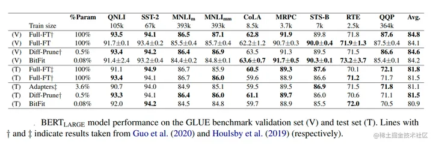
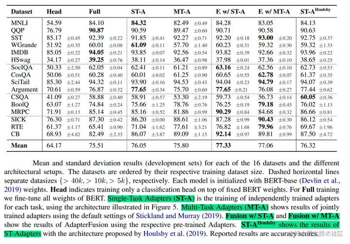

##
我们确定了三大类方法：基于加法的方法，基于选择的方法，以及基于重分解的方法。在加法运算方法中，我们将其分为两大类：类适配器方法和软提示。

### Additive methods
添加法的主要思想是在现有的预训练模型上添加额外的参数或层，然后只训练新添加的参数。到目前为止，这是 PEFT 方法中规模最大、应用最广泛的一类。在这一类别中，出现了两大子类别：类似适配器的方法和软提示。

### 1.Adapter Tuning
谷歌的研究人员于2019年在论文《Parameter-Efficient Transfer Learning for NLP》提出针对 BERT 的 PEFT 微调方式，拉开了 PEFT 研究的序幕。他们指出

- 在面对特定的下游任务时，如果进行 Full-fintuning（即预训练模型中的所有参数都进行微调），太过低效
- 而如果采用固定预训练模型的某些层，只微调接近下游任务的那几层参数，又难以达到较好的效果

#### Adapter 结构：

首先是一个 **down-project 层将高维度特征映射到低维特征，然后过一个非线形层之后，再用一个 up-project 结构将低维特征映射回原来的高维特征**；
同时也设计了 skip-connection 结构，确保了在最差的情况下能够退化为 identity

### 2.BitFit
BitFit（论文：BitFit: Simple Parameter-efficient Fine-tuning or Transformer-based Masked Language-models）是一种稀疏的微调方法，**它训练时只更新bias的参数或者部分bias参数**。

在Bert-Base/Bert-Large这种模型里，bias参数仅占模型全部参数量的0.08%～0.09%。但是通过在Bert-Large模型上基于GLUE数据集进行了 BitFit、Adapter和Diff-Pruning的效果对比发现，BitFit在参数量远小于Adapter、Diff-Pruning的情况下，效果与Adapter、Diff-Pruning想当，甚至在某些任务上略优于Adapter、Diff-Pruning。

### 3.Prefix Tuning

该方法是在输入token之前**构造一段任务相关的virtual tokens**作为Prefix.
相当于对于**transformer的每一层** (不只是输入层，且每一层transformer的输入不是从上一层输出，而是随机初始化的embedding作为输入)，都在真实的句子表征前面插入若干个连续的可训练的"virtual token" embedding，这些伪token不必是词表中真实的词，而只是若干个可调的自由参数

- 对于自回归(Autoregressive)模型，在句子前面添加前缀，得到$z=[P R E F I X ; x ; y]$这是因为**合适的上文能够在fixed LM的情况下去引导生成下文**（比如GPT3的 in-context learning）
- 对Encoder-Decoder模型来说，Encoder和Decoder都增加了前缀，得到这是因为**Encoder端增加前缀是为了引导输入部分的编码**(guiding what to extract from )，**Decoder 端增加前缀是为了引导后续token的生成** (influence the generation of  by steering the next token distribution)

#### 实现

1. **为了防止直接更新Prefix的参数导致训练不稳定的情况，特在Prefix层前面加了MLP结构**(相当于将Prefix分解为更小维度的Input与MLP的组合后输出的结果)，训练完成后，只保留Prefix的参数
2. Prefix Tuning提出固定预训练LM，为LM添加可训练，任务特定的前缀，这样就可以**为不同任务保存不同的前缀，微调成本也小**；
#### 结果
prefix-prompt的效果优于adapter tuning 和 finetune最上面的两层，最终和全参数finetune差不多，且在低资源情况下，效果优于finetune。

只调整embedding层的表现力不够，将导致性能显著下降，因此，在每层都加了prompt的参数，改动较大。

### 4.Prompt Tuning

Prompt tuning只需要为每个任务存储一个小的特定于任务的提示，**并使用原始的预训练模型支持混合任务推理**.

Prompt Tuning（论文：The Power of Scale for Parameter-Efficient Prompt Tuning），该方法可以看作是Prefix Tuning的简化版本，它给每个任务定义了自己的Prompt，然后拼接到数据上作为输入，但只在输入层加入prompt tokens，并且不需要加入 MLP 进行调整来解决难训练的问题。

通过实验发现，随着预训练模型参数量的增加，Prompt Tuning的方法会逼近全参数微调的结果。

同时，Prompt Tuning 还提出了 Prompt Ensembling，也就是在一个批次（Batch）里同时训练同一个任务的不同 prompt，**这样相当于训练了不同模型，比模型集成的成本小多了**。

Prompt token 的长度在20左右时的表现已经不错（超过20之后，提升Prompt token长度，对模型的性能提升不明显了），同样的，这个gap也会随着模型参数规模的提升而减小（即对于超大规模模型而言，即使 Prompt token 长度很短，对性能也不会有太大的影响）

### 5.P-Tuning

P-Tuning（论文：P-tuning: Prompt Tuning Can Be Comparable to Fine-tuning Universally Across Scales and Tasks）是Prompt Tuning的改进版，它将Prompt也作为可训练的参数，而不是固定的。

相比Prefix Tuning，P-Tuning加入的可微的virtual token，但仅限于输入层，没有在每一层都加；另外，virtual token的位置也不一定是前缀，插入的位置是可选的。这里的出发点实际是把传统人工设计模版中的真实token替换成可微的virtual token。

经过预训练的LM的词嵌入已经变得高度离散，如果随机初始化virtual token，容易优化到局部最优值，而这些virtual token理论是应该有相关关联的。因此，作者通过实验发现用一个提示编码器（即用一个LSTM+MLP去编码这些virtual token以后，再输入到模型）来编码会收敛更快，效果更好。

### 6.P-Tuning v2
#### Prompt Tuning和P-Tuning等方法存在两个主要的问题：

1.第一，缺乏模型参数规模和任务通用性。
- 缺乏**规模通用性**：Prompt Tuning论文中表明当模型规模超过100亿个参数时，提示优化可以与全量微调相媲美。但是**对于那些较小的模型（从100M到1B），提示优化和全量微调的表现有很大差异**，这大大限制了提示优化的适用性。
- 缺乏**任务普遍性**：尽管Prompt Tuning和P-tuning在一些 NLU 基准测试中表现出优势，但提示调优**对硬序列标记任务（即序列标注）的有效性尚未得到验证**。
2.第二，**缺少深度提示优化**，在Prompt Tuning和P-tuning中，连续提示只被插入transformer第一层的输入embedding序列中，在接下来的transformer层中，插入连续提示的位置的embedding是由之前的transformer层计算出来的，这可能导致两个可能的优化挑战。
- 由于序列长度的限制，可调参数的数量是有限的。
- 输入embedding对模型预测只有相对间接的影响。

考虑到这些问题，作者提出了Ptuning v2，它利用**深度提示优化**（如：Prefix Tuning），对Prompt Tuning和P-Tuning进行改进，作为一个跨规模和NLU任务的通用解决方案。
#### 方法

具体做法基本同Prefix Tuning，可以看作是将文本生成的Prefix Tuning技术适配到NLU任务中，然后做了一些改进：

- **移除重参数化的编码器**。以前的方法利用重参数化功能来提高训练速度和鲁棒性（如：Prefix Tuning中的MLP、P-Tuning中的LSTM））。在 P-tuning v2 中，作者发现**重参数化的改进很小，尤其是对于较小的模型，同时还会影响模型的表现**。
- 针对**不同任务采用不同的提示长度**。提示长度在提示优化方法的超参数搜索中起着核心作用。在实验中，我们发现不同的理解任务通常用不同的提示长度来实现其最佳性能，这与Prefix-Tuning中的发现一致，不同的文本生成任务可能有不同的最佳提示长度。
- 引入多任务学习。先在多任务的Prompt上进行预训练，然后再适配下游任务。多任务学习对我们的方法来说是可选的，但可能是相当有帮助的。一方面，连续提示的随机惯性给优化带来了困难，这可以通过更多的训练数据或与任务相关的无监督预训练来缓解；另一方面，连续提示是跨任务和数据集的特定任务知识的完美载体。我们的实验表明，在一些困难的序列任务中，多任务学习可以作为P-tuning v2的有益补充。
- **回归传统的分类标签范式，而不是映射器**。标签词映射器（Label Word Verbalizer）一直是提示优化的核心组成部分，它将one-hot类标签变成有意义的词，以利用预训练语言模型头。尽管它在few-shot设置中具有潜在的必要性，但在全数据监督设置中，Verbalizer并不是必须的。它阻碍了提示调优在我们需要无实际意义的标签和句子嵌入的场景中的应用。因此，P-Tuning v2回归传统的CLS标签分类范式，采用随机初始化的分类头（Classification Head）应用于tokens之上，以增强通用性，可以适配到序列标注任务。

#### 结果

总之，P-Tuning v2是一种在不同规模和任务中都可与微调相媲美的提示方法。P-Tuning v2对从330M到10B的模型显示出一致的改进，并在序列标注等困难的序列任务上以很大的幅度超过了Prompt Tuning和P-Tuning。

论文还通过消融实验研究了不同任务上Prompt Length的影响：
- 针对简单任务：如情感分析，较短的Prompt（~20）即可取得不错的效果。
- 针对复杂任务：如阅读理解，需要更长的Prompt（~100）。

### 7.AdapterFusion
#### 作用
传统整合多任务方法:
- 1.按一定顺序微调（**Sequential fine-tuning**）
  **缺点**：需要先验知识来确定顺序，且模型容易遗忘之前任务学到的知识
- 2.多任务学习（**Multi-task learning**）
  **缺点**：不同任务之间会互相影响，难以平衡数据集大小差距很大的任务

Adapter Tuning不用更新预训练模型的参数，而是插入比较少的新的参数就可以很好地学会一个任务。此时，Adapter 的参数某种程度上就表达了解决这个任务需要的知识。作者受此启发，如果想要把来自多个任务的知识结合起来，是否可以考虑**把多个任务的Adapter的参数结合起来**？基于此，作者提出了 AdapterFusion，这是一种新的两阶段学习算法，可以利用来自多个任务的知识。

#### 模型结构

两阶段学习：
- 知识提取阶段：**在不同任务下引入各自的Adapter模块**，用于学习特定任务的信息。
- 知识组合阶段：**将预训练模型参数与特定于任务的Adapter参数固定，引入新参数（AdapterFusion）来学习组合多个Adapter中的知识**，以提高模型在目标任务中的表现。

AdapterFusion具体结构就是一个Attention，它的参数包括query，key, value的矩阵参数，**在transformer的每一层都存在**，它的**query是transformer每个子模块的输出结果，它的key跟value则是N个任务的adapter的输出**。通过AdapterFusion，模型可以**为不同的任务对应的adapter分配不同的权重**，聚合N个任务的信息，从而为特定任务输出更合适的结果。

#### 训练
对于第一阶段，有两种训练方式，分别如下：
- Single-Task Adapters(ST-A)：对于N个任务，模型都分别独立进行优化，各个任务之间互不干扰，互不影响。
- Multi-Task Adapters(MT-A)：N个任务通过多任务学习的方式，进行联合优化。

对于第二阶段，为了避免通过引入特定任务参数而带来的灾难性遗忘问题，AdapterFusion提出了一个共享多任务信息的结构。针对特定任务m，AdapterFusion联合了第一阶段训练得到的N个Adapter信息。固定语言模型的参数跟N个Adapter的参数，**新引入AdapterFusion的参数**，目标函数也是学习针对特定任务m的AdapterFusion的参数。

#### 结果

可以看到第一阶段采用**ST-A+第二阶段AdapterFusion是最有效的方法**，在多个数据集上的平均效果达到了最佳。而第一阶段采用MT-A+第二阶段AdapterFusion没有取得最佳的效果，在于第一阶段其实已经联合了多个任务的信息了，所以AdapterFusion的作用没有那么明显，

同时MT-A这种多任务联合训练的方式需要投入较多的成本，并不算一种高效的参数更新方式。另外，ST-A的方法在多个任务上都有提升，但是MT-A的方法则不然，这也表明了MT-A虽然可以学习到一个通用的表征，但是由于不同任务的差异性，很难保证在所有任务上都取得最优的效果。

### 8.AdapterDrop
#### 作用
Adapter 的训练和推理速度。作者们在两种不同的 GPU 上测量了两种 adapter 结构和整个模型微调相比的训练和推理速度。发现Adapter 的训练会比整个模型微调快 60% 左右，推理会比使用原模型慢 4%-6%。
作者提出了剪枝整个 adapter 层的方法 AdapterDrop，加快了多任务同时推理的速度；建立了对 AdapterFusion 进行剪枝的结果。

#### 模型结构
为了加快推理速度，在推理时可以对某几层的 adapter 进行剪枝。根据以往研究的结论，**靠近输入的 adapter 被剪掉后对性能影响更小**。因此，AdapterDrop 的作者提出，推理时可以剪掉最下方 n 层的 adapter，也就是最靠近输入的前 n 层。
为了尽可能地减小掉点，作者设计了两种训练方案：
（1）specialized AdapterDrop：训练时固定 n，训练后的模型推理时也固定剪掉前 n 层；
（2）robust AdapterDrop：训练时**每个 batch 都随机选取 n 的大小，训练后的模型可以适应多个 n**。由于原有模型其他参数是不训练的，在训练时梯度就可以只回传到保留 adapter 的最早一层即可（见下图）。

实验结果：在 GLUE 的多个任务上，两种 AdapterDrop 可以做到推理时 n=5 以下掉点都不太严重，而传统的 adapter 在 n>1 时性能下降就很快了。当去除掉五层的 adapter 时，训练速度可以加快 26%，多任务同时推理的速度可以加快 21%-42%，超过了原模型的推理速度。要注意为了更凸显 AdapterDrop 的优势，作者测量速度的场景是多任务同时推理，也就是说输入文本，模型生成多个任务的输出。

#### 对 AdapterFusion 进行剪枝
作者首先测量了 AdapterFusion的训练和推理时间，发现和原模型整体微调和推理相比，每层 8 个adapter 的 AF 的训练速度大约慢 47%，推理速度大约慢 62%，主要是因为 adapter 需要逐个推理。作者用 8 个 GLUE 的任务（去除 WNLI）训练了一个 AF 模型，在上面实验了两种加速 AdapterFusion 的思路：

去除掉前几个 AF 层，对性能的影响不同的任务有所不同。例如对 RTE 的影响不大，但是 CoLA 十分敏感。这说明直接去除 AF 层并不是一个通用的好方法。

**剪掉每层中对输出贡献较小的 adapter**。作者用训练集测量了每个 adapter 的平均激活水平（应该是加权之后的输出），**每层只保留两个贡献最高的 adapter，模型的性能和原来基本持平**，推理速度可以提高 68%。

### 9.MAM Adapter
#### 以前的参数高效调优方法概述
##### 1.Adapters
适配器方法在变压器层之间插入小模块（适配器）。适配器层通常使用下投影 with $𝑾_{down}$将输入 $𝒉$ 投影到由瓶颈维度指定的低维空间$r$，然后是非线性激活函数f以及上投影。$𝑾_{up}$这些适配器被残余连接包围， 导致最终形式：

Houlsby等人将两个适配器依次放置在变压器的一层内，一个在多头注意之后，另一个在FFN子层之后。Pfeiffer提出了一种更有效的适配器变体，该变体仅在**FFN “add & layer norm”子层之后**插入。
##### 2.Prefix Tuning

前缀调优机制等价形式：

可以看做是通过线性插值对原始头部注意力输出𝒉进行位置修改。

##### 3.LoRA
LoRA 将可训练的低秩矩阵注入 transformer 层以近似权重更新.对于预训练的权重矩阵𝑾，LoRA用低秩分解$W+ΔW=W+W_{down}W_{up}$表示其更新，其中$𝑾_{down}∈ℝ^{d×r}$,$𝑾_{up}∈ℝ^{r×k}$是可调参数。 LoRA 将此更新应用于多头注意力子层$(𝑾q,𝑾v)$中的查询和值投影矩阵，如图 1 所示。对于多头注意力中线性投影的特定输入 
𝒙,LoRA 将投影输出𝒉修改为：

#### 统一不同微调方式视图

a,b,c为现有方法，de为新提出变体，另外有多头并联适配器没放在图上。

- 1.$Δh$函数形式：在所有方法中，计算$Δh$的函数形式都与
**$proj_{down}$ →非线性 →$proj_{up}$架构**相似，而 LoRA 中的“非线性”退化为恒等函数。
- 2.插入形式: 是**添加的模块插入网络的方式**。传统上适配器以顺序方式插入到某个位置，其中输入和输出均为𝒉。前缀微调和 LoRA虽然最初没有以这种方式描述,但结果等同于并行插入。
- 成分函数：是修改后的向量Δ𝒉如何与原始的隐藏表示𝒉组成，以形成新的隐藏表示。**适配器执行简单的加法组合，前缀调谐使用门控加法组合，而 LoRA Δ𝒉按常数因子缩放并将其添加到原始隐藏表示中**。

**统一框架使我们能够沿着这些设计维度研究参数高效的调优方法，确定关键的设计选择，并可能在方法之间转移设计元素**。

#### 转移设计元素
- **并行适配器**是通过将前缀调谐的并行插入转移到适配器中的变体。
- **多头并行适配器**是使适配器更类似于前缀调谐的进一步步骤：我们应用并行适配器来修改磁头注意力输出作为前缀调谐。这样，该变体通过利用多头投影免费提高了容量。
- **Scaled Parallel Adapter**是通过将 LoRA 的组成和插入形式转移到适配器中的变体。

#### MAMAdapter
（1）缩放并行适配器是修改FFN的最佳变体;
（2）FFN能在更大容量下更好地提高性能;
（3）修改头部注意力，如前缀调谐，只需0.1%的参数就可以获得强大的性能。受他们的启发，我们混合搭配了这些发现背后的有利设计： 具体来说，我们在注意力子层使用具有小瓶颈维度(l=30)的前缀调优，并分配更多的参数预算来使用缩放的并行适配器（r=512）修改 FFN 表示 。由于在我们的统一框架中，前缀调优可以看作是适配器的一种形式，因此我们将此变体命名为混搭适配器（Mix-And-Match adapter）

#### 结果

### 10.UniPELT
#### story
UNIPELT:  Unified Framework for **Parameter-Efficient Language Model Tuning**
不同的PELT方法在同一任务上执行的结果会大相径庭，所以需要为特定任务选取特定的PELT方法，但是**种类繁多的PELT方法和任务使得选择成为一个难题**.
所以引入UniPELT框架，**通过门机制来集成adapter，prefix-tuning，LoRA方法，使得模型自动激活合适的PELT方法**.

#### 模型

在transformer架构中**集成prefix-tuning、adapter，LoRA三种方法并分别通过门控来控制激活程度**。

- 可以观察到**不同的PELT方法适配的任务不同**，比如prefix-tuning在NLI任务表现良好并且与训练数据大小无关
- 并且**不同的PELT方法集成在模型的不同位置**，比如prefix-tuning在MHA之前，adapter在FFN之后，方便组合
- 值得注意的是LoRA自带了缩放因子α，所以使得其**可学习**即可

图中蓝色部分为可学习参数。

#### 结果

UniPELT 仅用 100 个示例就在低数据场景中展示了相对于单个 LoRA、Adapter 和 Prefix Tuning 方法的显著改进。在更高数据的场景中，UniPELT 的性能与这些方法相当或更好。

#### 训练时间和推理时间
- 从训练速度来看，UniPELT比之前微调的方法多一些，但是还在能接受的范围，
- 从推理时间来看，BitFit方法增加的最少，UniPELT方法时间增加了27%。
- 从训练参数量来看，LoRA，BitFit，Prefix-tuning都比较小，UniPELT参数量相对会多一些。

