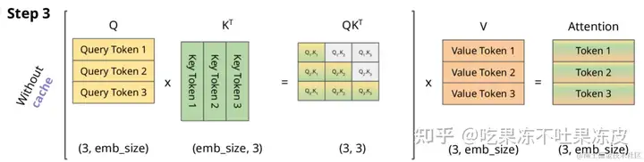
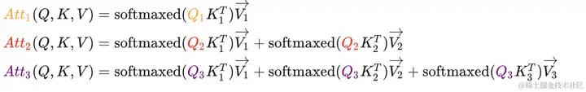
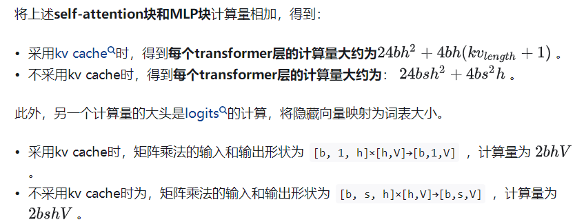
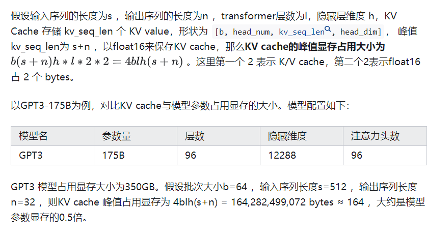

## KV-cache作用
KV Cache 是大模型推理性能优化的一个常用技术，该技术可以**在不影响任何计算精度的前提下，通过空间换时间的思想，提高推理性能**。


## KV-cache原理

从上图不难得到Attention每行结果：


看上面图和公式，可以得出以下结论：  
- 一般的计算方式存在大量冗余计算，**每一次生成新的Token都需要计算之前的KV**。 
- $Att_k(Q,K,V)$的计算过程中，主要与 $Q_k$ 有关。$V_k$ 参与计算Attention时也仅仅依赖于 $Q_k$。 
- **每一步中，其实只需要根据$Q_k$ 计算 $Att_k(Q,K,V)$ 就可以，之前已经计算的Attention完全不需要重新计算。但是 K 和 V 是全程参与计算的，所以这里我们需要把每一步的 K、V缓存起来**。


### 效果
有 KV Cache 和没有 KV Cache的情况下，GPT-2的生成速度：


### 使用 KV Cache 解码阶段计算量分析


### KV Cache 显存占用分析


## code
```
class Attention(nn.Module):
    def __init__(self, args: ModelArgs):
        super().__init__()
        self.n_kv_heads = args.n_heads if args.n_kv_heads is None else args.n_kv_heads
        model_parallel_size = fs_init.get_model_parallel_world_size()
        self.n_local_heads = args.n_heads // model_parallel_size
        self.n_local_kv_heads = self.n_kv_heads // model_parallel_size
        self.n_rep = self.n_local_heads // self.n_local_kv_heads
        self.head_dim = args.dim // args.n_heads

       ...
       
        self.cache_k = torch.zeros(
            (
                args.max_batch_size,
                args.max_seq_len,
                self.n_local_kv_heads,
                self.head_dim,
            )
        ).cuda()
        self.cache_v = torch.zeros(
            (
                args.max_batch_size,
                args.max_seq_len,
                self.n_local_kv_heads,
                self.head_dim,
            )
        ).cuda()

    def forward(
        self,
        x: torch.Tensor,
        start_pos: int,
        freqs_cis: torch.Tensor,
        mask: Optional[torch.Tensor],
    ):
        bsz, seqlen, _ = x.shape
        xq, xk, xv = self.wq(x), self.wk(x), self.wv(x)

        xq = xq.view(bsz, seqlen, self.n_local_heads, self.head_dim)
        xk = xk.view(bsz, seqlen, self.n_local_kv_heads, self.head_dim)
        xv = xv.view(bsz, seqlen, self.n_local_kv_heads, self.head_dim)

        xq, xk = apply_rotary_emb(xq, xk, freqs_cis=freqs_cis)

        self.cache_k = self.cache_k.to(xq)
        self.cache_v = self.cache_v.to(xq)

        self.cache_k[:bsz, start_pos : start_pos + seqlen] = xk
        self.cache_v[:bsz, start_pos : start_pos + seqlen] = xv

        keys = self.cache_k[:bsz, : start_pos + seqlen]
        values = self.cache_v[:bsz, : start_pos + seqlen]

        ...
        
```