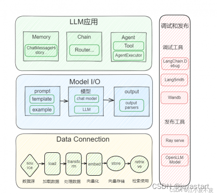

## LangChain components
LangChain 是 AI 大模型应用开发框架，**由6个模块组成**，分别为：Model IO、Retrieval、Chains、Memory、Agents 和 Callbacks。

- **Model IO**：AI 应用的核心部分，其中包括输入、Model和输出。

- **Retrieval**：该功能与向量数据库密切相关，是在向量数据库中搜索与问题相关的文档内容。

- **Memory**：为对话形式的模型存储历史对话记录，在长对话过程中随时将这些历史对话记录重新加载，以保证对话的准确度。

- **Chains**：虽然通过 Model IO、Retrieval 和 Memory 这三大模块可以初步完成应用搭建，但是若想实现一个强大且复杂的应用，还是需要将各模块组合起来，这时就可以利用 Chains 将其连接起来，从而丰富功能。

- **Agents**：它可以通过用户的输入，理解用户的意图，返回一个特定的动作类型和参数，从而自主调用相关的工具来满足用户的需求，将应用更加智能化。

- **Callbacks**: 回调机制可以调用链路追踪、记录日志，帮助开发者更好的调试大模型。

