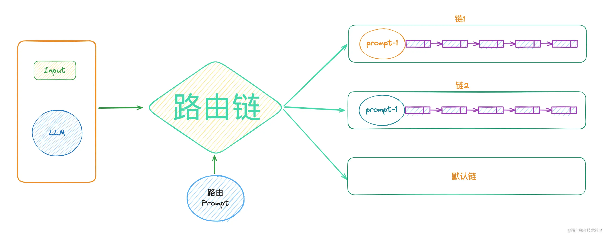

## RouterChain
**路由链（RouterChain**）是由LLM根据输入的Prompt去选择具体的某个链。路由链中一般会存在多个Prompt，**Prompt结合LLM决定下一步选择哪个链**。它主要用在不确定性的场景下，根据提示词，选择具体的某个链去执行。

一般使用路由链时，有固定的几个步骤：
- 准备多个链的Prompt提示词，然后各自封装成链。
- 将可能路由到的链封装到destination_chains里。
- 构建多提示词和RouterChain ，负责选择下一个要调用的链。
- 构建默认链。
- 使用MultiPromptChain选择某个链，然后再去执行此链。

LLMRouterChain：使用LLM路由到可能的选项中。
MultiPromptChain：该链可用于在多个提示词之间路由输入，当你有多个提示词并且只想路由到其中一个时，可以用这个链。
