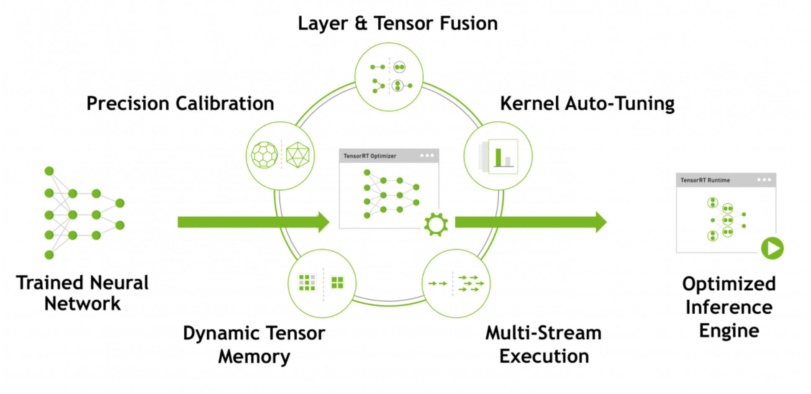
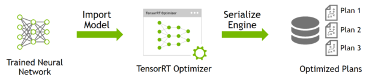
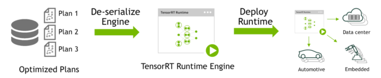

## TensorRT作用
TensorRT是一个高性能的**深度学习推理（Inference）优化器**，可以为深度学习应用提供低延迟、高吞吐率的部署推理。
TensorRT可用于对超大规模数据中心、嵌入式平台或自动驾驶平台进行推理加速。TensorRT现已能支持TensorFlow、Caffe、Mxnet、Pytorch等几乎所有的深度学习框架，将TensorRT和NVIDIA的GPU结合起来，能在几乎所有的框架中进行快速和高效的部署推理。

## TensorRT原理

TensorRT 主要通过以下几个方式来优化模型：
- 权重与激活**精度校准**：在保证准确率的情况下，通过将模型量化到INT8来更大限度地提高吞吐量
- **层与张量结合**：通过结合内核中的节点，优化使用GPU内存和带宽
- 内核自动调整：基于目标GPU平台，选择**最优数据层和算法**
- **动态张量**显存：最小化内存占用并且有效地重新使用张量内存
- **多数据流**执行：并行处理多个输入流的扩展设计

### 工作流程
TensorRT包含两个阶段：**编译**build和**部署**deploy。
- 编译阶段对网络配置进行优化，并生成一个plan文件，用于通过深度神经网络计算前向传递。plan文件是一个优化的目标代码，可以序列化并且可存储在内存和硬盘中。
  
- 部署阶段通常采用长时间运行的服务或者用户应用程序的形式。它们接收批量输入数据，通过执行plan文件在输入数据上进行推理，并且返回批量的输出数据（分类、目标检测等）

编译阶段在图层中执行如下优化：
- 消除输出未被使用的层
- 消除等价于no-op的运算
- 卷积层，偏差和ReLu操作的融合
- 聚合具有足够相似参数和相同目标张量的操作（例如，Googlenet v5 inception 模型的1*1卷积）
- 通过直接将层输出定向到正确最终目的来合并concatenation 层

### TensorRT部署
将一个训练好的模型部署到TensorRT上的流程为：
- 从模型创建一个TensorRT网络定义
- 调用TensorRT生成器从网络创建一个优化的运行引擎
- 序列化和反序列化引，以便于运行时快速重新创建
- 向引擎提供数据以执行推断

## resources
https://github.com/NVIDIA/TensorRT/blob/main/quickstart/IntroNotebooks/4.%20Using%20PyTorch%20through%20ONNX.ipynb